[Volver al menu principal](README.md)

# CLIENTE DE DESARROLLO
|  DAW/DWES Tema2 |
|:-----------:|
||
| INSTALACIÓN, CONFIGURACIÓN Y DOCUMENTACIÓN DEL CLIENTE DE DESARROLLO |


- [CLIENTE DE DESARROLLO](#cliente-de-desarrollo)
  - [Windows 11](#windows-11)
    - [2.1 **Configuración inicial**](#21-configuración-inicial)
    - [2.2 **Navegadores**](#22-navegadores)
    - [2.3 **MobaXterm**](#23-mobaxterm)
      - [Instalación](#instalación)
      - [Crear una sessión SSH](#crear-una-sessión-ssh)
      - [Crear una sessión SFTP](#crear-una-sessión-sftp)
    - [2.4 **Netbeans**](#24-netbeans)
      - [Creación de un proyecto de PHP](#creación-de-un-proyecto-de-php)
      - [Abrir un proyecto de PHP](#abrir-un-proyecto-de-php)
      - [Depurar un fichero en Netbeans](#depurar-un-fichero-en-netbeans)
      - [Instalación y Configuración de phpDocumentor en Windows con NetBeans](#instalación-y-configuración-de-phpdocumentor-en-windows-con-netbeans)
      - [Requisitos Mínimos](#requisitos-mínimos)
      - [1. Instalación de PHP en Windows](#1-instalación-de-php-en-windows)
      - [2. Descargar phpDocumentor](#2-descargar-phpdocumentor)
      - [3. Configuración de NetBeans](#3-configuración-de-netbeans)
      - [4. Generar Documentación desde NetBeans](#4-generar-documentación-desde-netbeans)
  - [](#)
      - [5. Solución de Problemas](#5-solución-de-problemas)
      - [Uso de Git con Netbeans](#uso-de-git-con-netbeans)
    - [2.5 **Visual Studio Code**](#25-visual-studio-code)
      - [Uso de Git con Visual](#uso-de-git-con-visual)
      - [Instalación y Configuración de phpDocumentor en Windows](#instalación-y-configuración-de-phpdocumentor-en-windows)
      - [Requisitos Mínimos](#requisitos-mínimos-1)
      - [Instalación de PHP en Windows](#instalación-de-php-en-windows)
      - [Ejecutar phpDocumentor en Visual](#ejecutar-phpdocumentor-en-visual)
    - [2.6 **Complementos de phpDocumentor**](#26-complementos-de-phpdocumentor)
      - [Instalación de Graphviz](#instalación-de-graphviz)
      - [Alternativa: Doxygen](#alternativa-doxygen)


## Windows 11
### 2.1 **Configuración inicial**
* Despues de instalar el ubuntu server en la maquina virtual se prueba la conexion con el anfitrion.
para ello se abre la terminal de windows


* En la terminal de windows se hace ping con la ip de la maquina virtual.
```bash
ping ipDelServidor
```


Si todos los paquetes se han recibido es que las maquinas están conectadas.

* Nos podemos conectar al servidor desde la terminal de windows con este comando
```bash
ssh usuario@ipServidor
```
Nos pedira la contraseña ya se podrá trabajar en el servidor.


* Para salir del Servidor
* 


### 2.2 **Navegadores**
Se puede utilizar cualquier navegador para visualizar el proyecto que está en el Servidor.
* Para poder visualizar el proyecto, se deberá de indicar la url del proyecto.
* 
  


### 2.3 **MobaXterm**
#### Instalación 
Descargar MobaXterm en este enlace : https://mobaxterm.mobatek.net/download.html

#### Crear una sessión SSH
* Para crear una sesión ssh, hacer clic en el botón de session arriba a la izquierda. 


* Cuando aparezca la ventana, hacer clic en SSH


* Se rellena. El host, es la IP del servidor y se puede indicar el usuario si se quiere, y se le da a OK
* 


* Se hace clic en la conexión, que se encuentra  en la parte izquierda.


* Aparece la terminal con el usuario, si se ha indicado en la creación, sino habrá que indicar el usuario y la contraseña.


#### Crear una sessión SFTP
* Para crear una sesión sftp, hacer clic en el botón de session arriba a la izquierda. 


* Cuando aparezca la ventana, hacer clic en SFTP


* Se rellena. El host, es la IP del servidor y se puede indicar el usuario si se quiere, y se le da a OK


* Nos pide la contraseña


* Se abre la terminal con el usuario.


### 2.4 **Netbeans**

#### Creación de un proyecto de PHP
Se hace clic en File -> New Project o se hace clic en el pestaña del cuadrado naranja con un más  

  


  

En el primer paso de la creación de proyecto, se selecciona PHP en Categories, y PHP Aplicación from Remote Server y se hace clic en Next

  

En el paso 2 se indica el nombre del proyecto, y la ubicación en local
y se hace clic en Next  

  


En el paso 3 se indica la IP del servidor...
  

 y se hace clic en Manage...
 para configurar la conexion al servidor remoto, donde se indicará el nombre del servidor, la IP , el puerto, el nombre del usuario con permisos para actuar en las carpetas del proyecto, la contraseña....  


 se hace un test de conexión y saldrá un mensaje de confirmación  

   

   hacer clic en Yes,  si el test es ok, hacer clic en OK...(el servidor remoto tiene que estar encendido sino no hace la conexion)

    

   se cierra la ventana de conexion se indica la ubicación de la carpeta del proyecto en el servidor y se hace clic en Next en la ventana del paso 3.

  

Sale de nuevo el mensaje de Confirmación de conexión y se hace clic en Yes.  

  

Se checkea que la carpeta del proyecto tenga todos los elementos necesarios y se hace clic en finish.  

  

Sale de nuevo el mensaje de Confirmación de conexión y se hace clic en Yes.  

  

El proyecto aparecerá en la parte izquierda del IDE.  


#### Abrir un proyecto de PHP
* Se hace clic en el icono de abrir, o en File - Open Project.  

   

* Aparece una ventana con los proyecto y se elije el que se quiera abrir y se hace clic en open Proyect  

   

#### Depurar un fichero en Netbeans
Depurar  sirve para identificar y corregir errores en el código, lo que mejora la estabilidad, fiabilidad y rendimiento del software. Permite ejecutar el código paso a paso, inspeccionar variables y comprender el flujo de ejecución para encontrar la causa raíz de los problemas. 

* Despues de haber elegido el fichero y de haber puesto el o los break point en las lineas de codigo deseadas. 
Para poner los break point hay que hacer clic en la parte izquierda del codido, donde aparecen los cuadraditos rosas en la imagen.  
  
  

* Se hace clic en Debug-Debug File  

  

* Inicia la depuración y se situa el "cursor" de depuración al principio del codigo . Para que pase al primer break point se hace clic en "play".  
 
  

* A cada vez que se para en los break points, en la pestaña de variables, se pueden ver el contenido de las variable en ese momento.  

  

* Para salir del debug se hace clic en "stop".  

  


#### Instalación y Configuración de phpDocumentor en Windows con NetBeans

#### Requisitos Mínimos

- **Sistema Operativo**: Windows 10 o superior
- **PHP**: Versión 8.1 o superior (en este manual se usa PHP 8.3.29)
- **NetBeans IDE**: Versión 12 o superior
- **Extensiones PHP requeridas**:
  - php-xml (DOM, XMLWriter, SimpleXML)
  - php-mbstring
- **Espacio en disco**: Al menos 100 MB para PHP y phpDocumentor
- **Opcional**: Graphviz (para generar diagramas de clases)

---

#### 1. Instalación de PHP en Windows

- **Descargar PHP**

1. Ir la página oficial: [https://windows.php.net/download/](https://windows.php.net/download/)
2. Descargar la versión **Thread Safe** (TS) en formato ZIP
   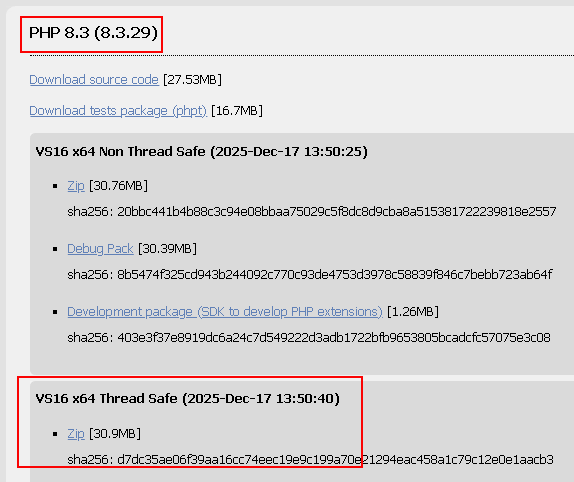
3. Extraer el contenido en una carpeta.

 - **Configurar Variables de Entorno**

1. Abrir **Variables de entorno del sistema**:
   - Clic derecho en "Este equipo" → Propiedades → Configuración avanzada del sistema → Variables de entorno
2. En **Variables del sistema**, buscar la variable `Path` y hacer clic en **Editar**
3. Añadir la ruta donde se encuentra `php.exe`:
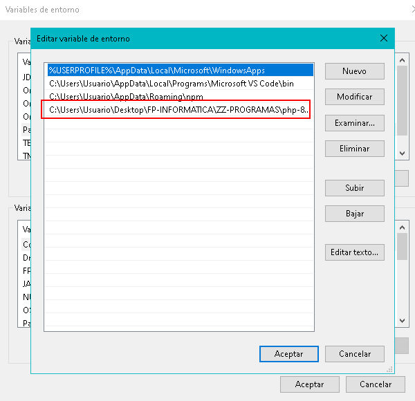
4. Aceptar y cerrar

 - Verificar la instalación de PHP

Abrir una terminal (CMD o PowerShell) y ejecutar:
```cmd
php -v
```  

  

---

#### 2. Descargar phpDocumentor

1. Visitar la página oficial: [https://docs.phpdoc.org/guide/getting-started/installing.html](https://docs.phpdoc.org/guide/getting-started/installing.html)
2. Descargar el archivo **phpDocumentor.phar**:
```
   https://phpdoc.org/phpDocumentor.phar
```  
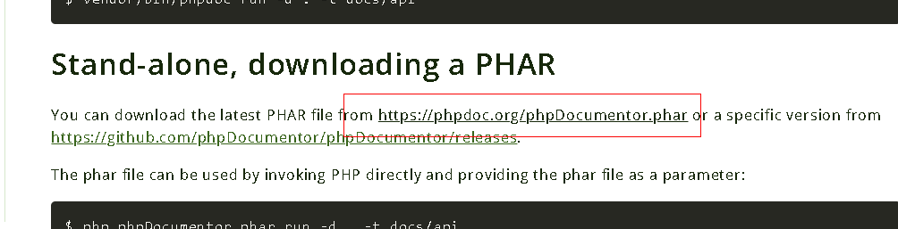  
3. Guardar el archivo en una ubicación accesible:
```
   D:\Software\phpdoc\phpDocumentor.phar
```

---

#### 3. Configuración de NetBeans

- **Configurar PHP en NetBeans**

1. Abrir NetBeans
2. Ir a **Tools** (Herramientas) → **Options** (Opciones)
3. Seleccionar la pestaña **PHP**
4. En **PHP**, hacer clic en **Browse** y seleccionar la ubicación del ejecutable de PHP:
```
   D:\Software\phpdoc\php-8.3.29\php-8.3.29-Win32-vs16-x64\php.exe
```  
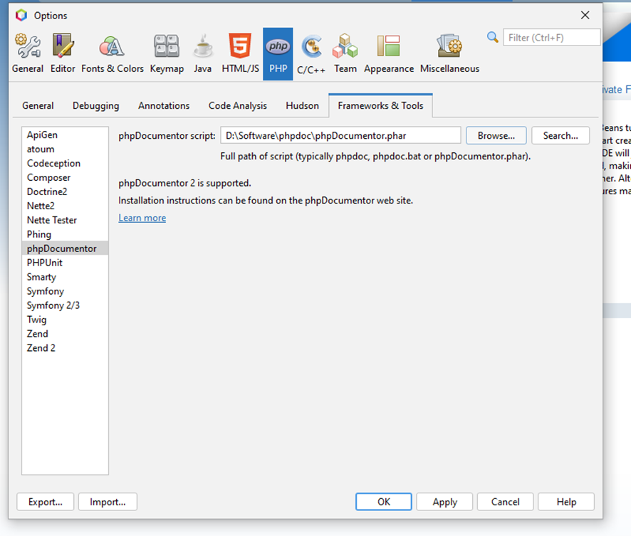  

5. Aplicar los cambios

- **Configurar phpDocumentor en NetBeans**

1. En **Options** → **PHP** → **Frameworks & Tools**
2. Seleccionar la pestaña **PHPDoc**
3. Hacer clic en **Browse** y seleccionar la ubicación de `phpDocumentor.phar`:
```
   D:\Software\phpdoc\phpDocumentor.phar
```
4. Aplicar y aceptar

---

#### 4. Generar Documentación desde NetBeans

- **Abrir el Proyecto**

1. Abrir el proyecto PHP en NetBeans
2. Ejemplo: `D:\ProyectosNetbeans\DAW2LibreriaValidacion`

- **Ejecutar phpDocumentor**

**Opción 1: Desde el menú de NetBeans**
1. Clic derecho sobre el proyecto
2. Seleccionar **Generate Documentation** (Generar documentación)

Para que no salga el error, ir a **Properties** - **Documentación** e indicar la carpeta Target
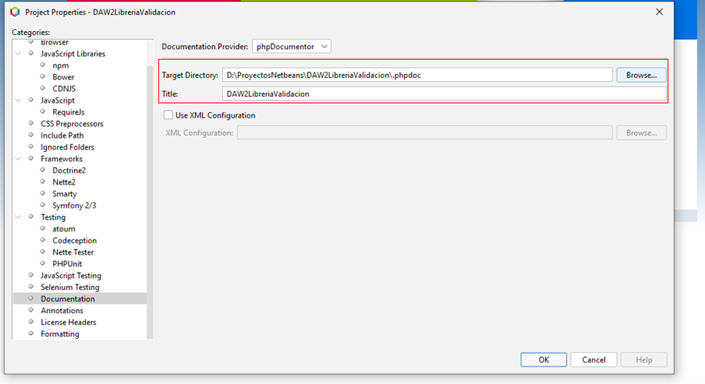

**Opción 2: Desde la línea de comandos**

1. Copiar el comando generado por NetBeans (aparece en la ventana de salida)
2. Ejecutar en CMD:
```cmd
"D:\Software\phpdoc\php-8.3.29\php-8.3.29-Win32-vs16-x64\php.exe" "D:\Software\phpdoc\phpDocumentor.phar" "run" "--ansi" "--directory" "D:/ProyectosNetbeans/DAW2LibreriaValidacion" "--target" "D:/ProyectosNetbeans/DAW2LibreriaValidacion/doc" "--title" "DAW2LibreriaValidacion"
```
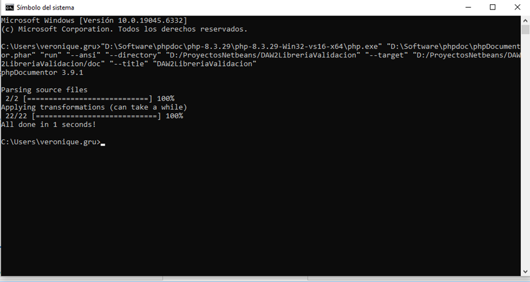
---

#### 5. Solución de Problemas

Si aparece un error relacionado con espacios o rutas en `Program Files\`, la solución es:

1. Crear una carpeta `.phpdoc` en la raíz del proyecto
2. Crear un archivo de configuración XML (`phpdoc.xml`) dentro de `.phpdoc`

3. Ejecutar nuevamente el comando

---

#### Uso de Git con Netbeans
- **Inicializar un proyecto en git**
Estando selecionado el proyecto:
Teams - Git - Initialize Repository  
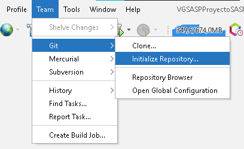  

o tambien se puede hacer desde el proyecto
Botón derecho - Versionnig - Initialize Git Repository  
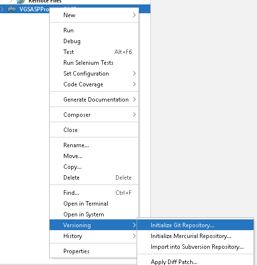

Se selecciona la carpeta del proyecto y OK  
 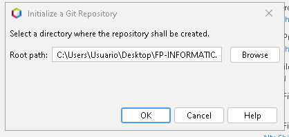

- **Hacer un commit**
* Primero se añade lo que hay que commitear
Team - Add  
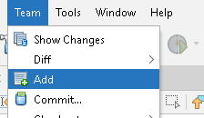
o botón derecho en el proyecto - Git - Add  
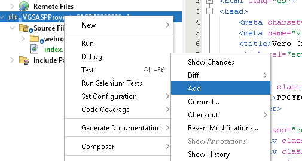

* Se hace el commit
Team - Commit   
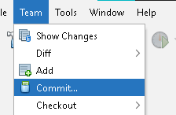  
o en botón derecho en el proyecto - Git - Commit  
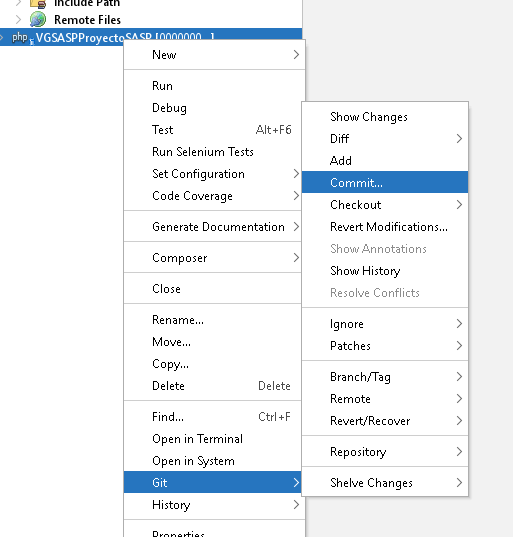  
Se escribe el mensaje del commit, se comprueban los fichero que se han añadido
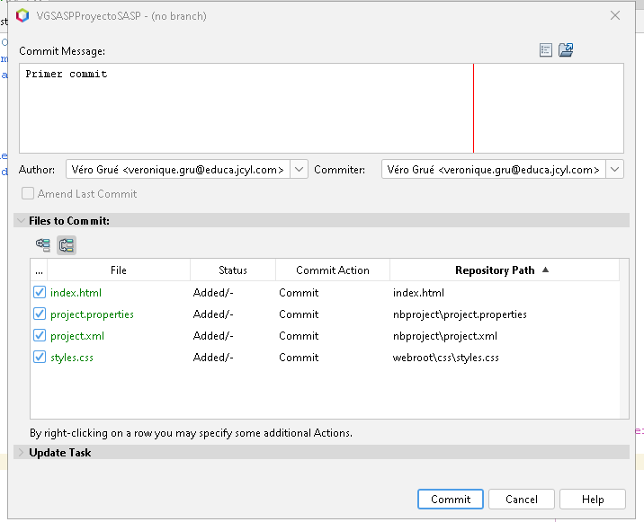

- **Ver los Commit**
Team - Show History  
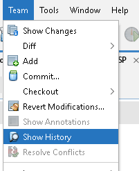  
o botón derecho - Git - Show History  
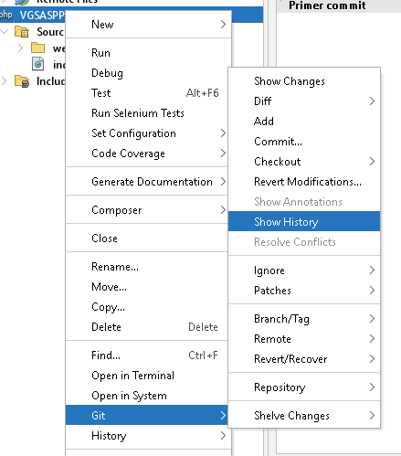  
Se ve el listado de commit  
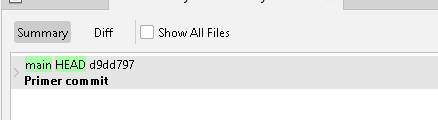  

- **Crear una rama nueva**
Team - Branch/Tag - Create Branch
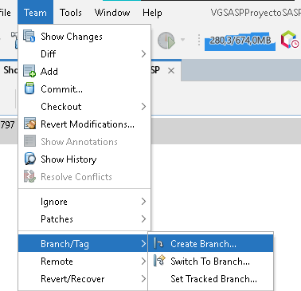
o botón derecho en el proyecto - Git - Branch/Tag - Create Branch    
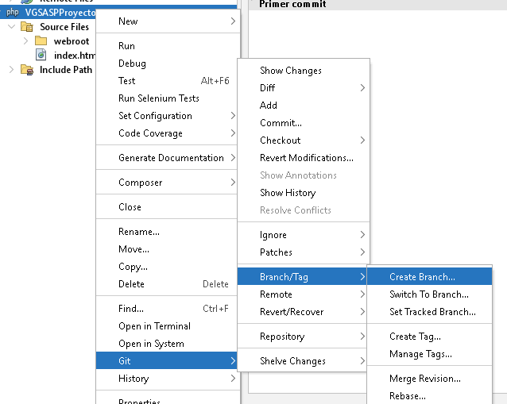 

Se indica el nombre de la rama y se puede elegir que se cambie de rama al crearla o no   
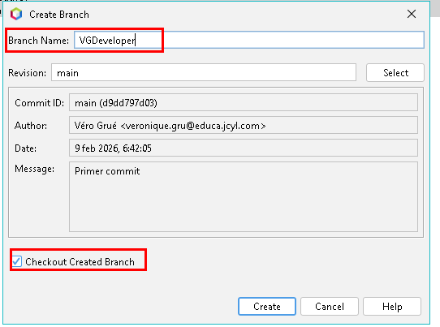  
En este caso se cambiará de rama

- **Cambiar de rama**
Botón derecho - Git - Branch/Tag - Switch To Branch...
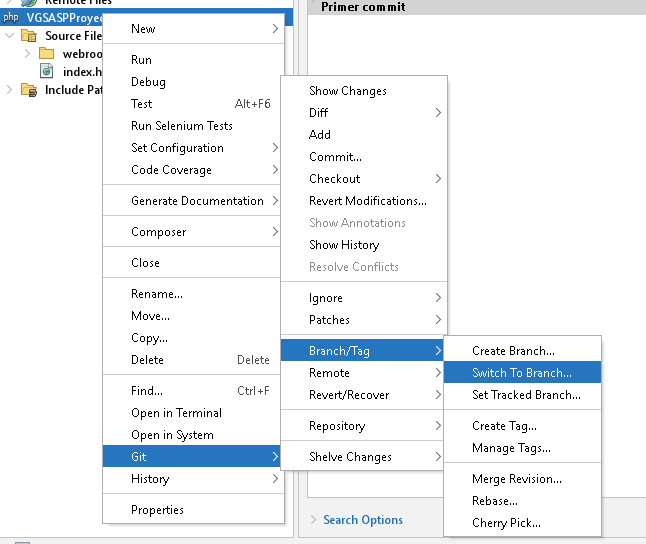  
Se elige la rama y OK   
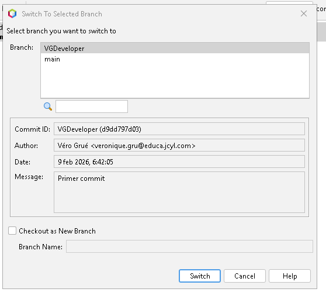

- **Abrir el navegador de repositorios**
Botón derecho - Git - Repository - Repository Browser  
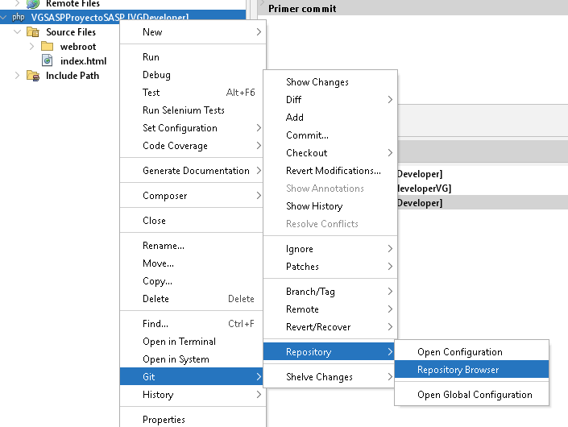  
Se ve el navegador  
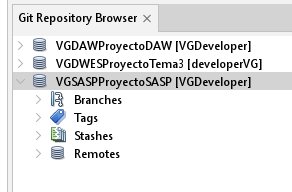  

### 2.5 **Visual Studio Code**

#### Uso de Git con Visual  
- **Inicializar un repositorio**  
Icono de Git en la parte izquierda - Initialize Repository  
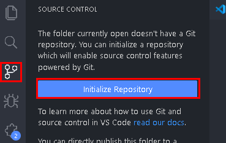

- **Hacer un commit**
Icono de Git en la parte izquierda, en la pantalla de Git, se hace clic en los 3 puntitos en la linea de CHANGES
changes - Stages All changes(si se quieren pasar todos los cambios)  
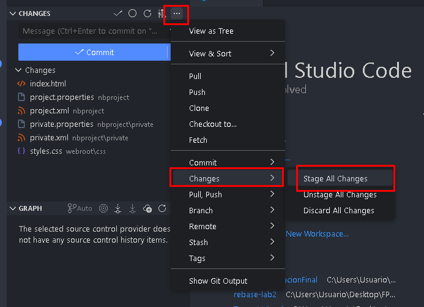
Sino se pasan los archivos que se quieran con el + que se encuentra al lado del nombre del archivo   
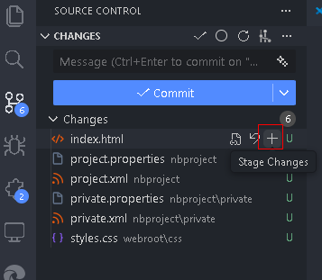
Se escribe el mensaje de Commit y se hace clic en commit  
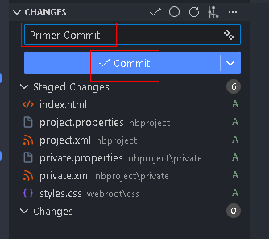  

- **Crear Una rama**
Los tres puntitos de CHANGES - Branch - Create Branch  
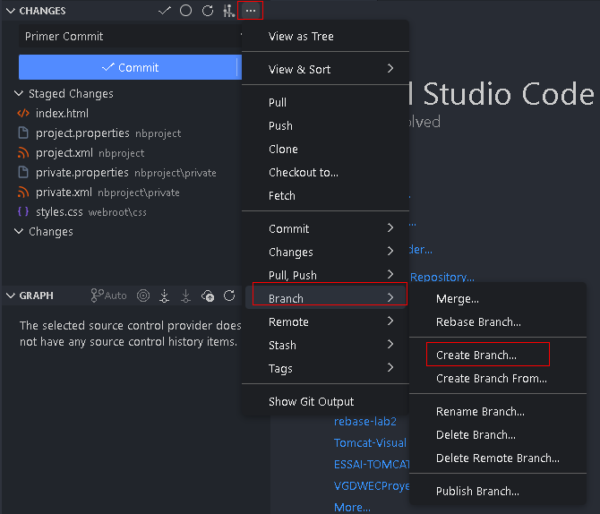  
Aparece un cuadro de texto para indicar el nombre de la rama  y enter
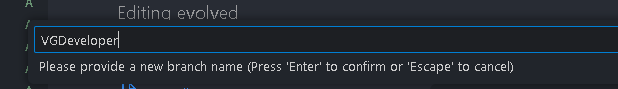  
Se cambia automaticamente y se puede ver el nombre de la rama en la que estamos abajo a la izquierda  
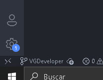  

- **Cambiar de Rama**
Hacer clic en el nombre de la rama y aparece un menu  y se elige la rama a la que se quiere ir
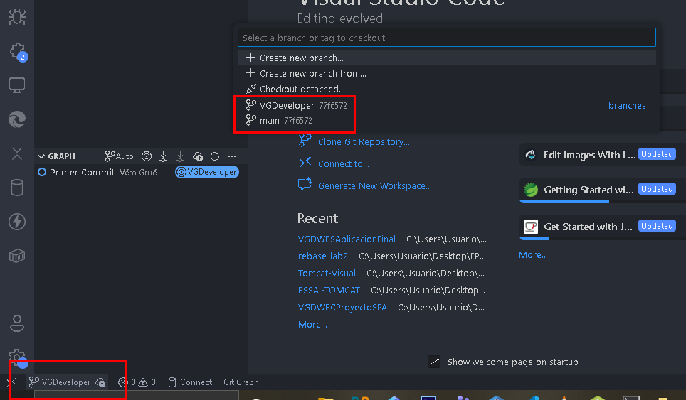

#### Instalación y Configuración de phpDocumentor en Windows

#### Requisitos Mínimos

- **Sistema Operativo**: Windows 10 o superior
- **PHP**: Versión 8.1 o superior (en este manual se usa PHP 8.3.29)
- **NetBeans IDE**: Versión 12 o superior
- **Extensiones PHP requeridas**:
  - php-xml (DOM, XMLWriter, SimpleXML)
  - php-mbstring
- **Espacio en disco**: Al menos 100 MB para PHP y phpDocumentor
- **Opcional**: Graphviz (para generar diagramas de clases)

---

#### Instalación de PHP en Windows

- Descargar PHP

1. Ir la página oficial: [https://windows.php.net/download/](https://windows.php.net/download/)  
2. Descargar la versión **Thread Safe** (TS) en formato ZIP  
     
3. Extraer el contenido en una carpeta.

 - Configurar Variables de Entorno

1. Abrir **Variables de entorno del sistema**:
   - Clic derecho en "Este equipo" → Propiedades → Configuración avanzada del sistema → Variables de entorno
2. En **Variables del sistema**, buscar la variable `Path` y hacer clic en **Editar**
3. Añadir la ruta donde se encuentra `php.exe`:  
  
4. Aceptar y cerrar

 - Verificar la instalación de PHP

Abrir una terminal (CMD o PowerShell) y ejecutar:
```cmd
php -v
```  

  

---
#### Ejecutar phpDocumentor en Visual
1. Abrir la terminal integrada en VS Code
2. Navegar a la carpeta del proyecto
3. Ejecutar el comando:
```cmd
php D:\Software\phpdoc\phpDocumentor.phar run -d . -t .\doc
```

Donde:
- `-d .`: Directorio actual (código fuente)
- `-t .\doc`: Carpeta de destino para la documentación

---


### 2.6 **Complementos de phpDocumentor**
#### Instalación de Graphviz

Graphviz permite generar diagramas de clases y relaciones entre componentes.

- **Descargar e Instalar**

1. Visitar: [https://graphviz.org/](https://graphviz.org/)
2. Descargar el instalador para Windows
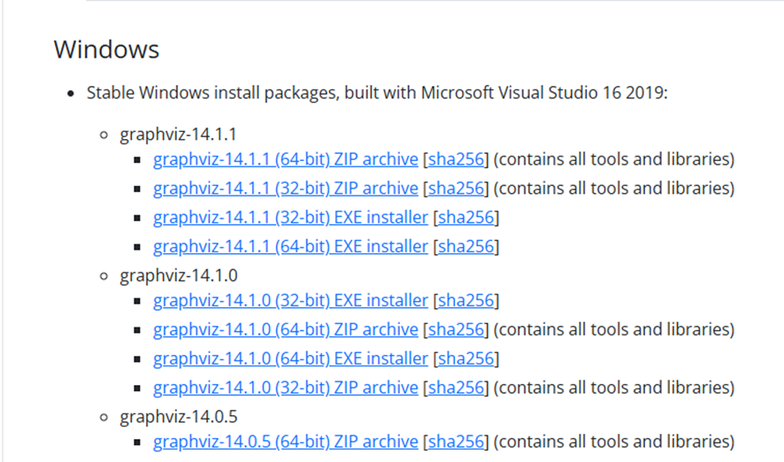

- **Configurar Variables de Entorno**

1. Añadir a la variables de entornos `Path` la ruta de los binarios de Graphviz:  
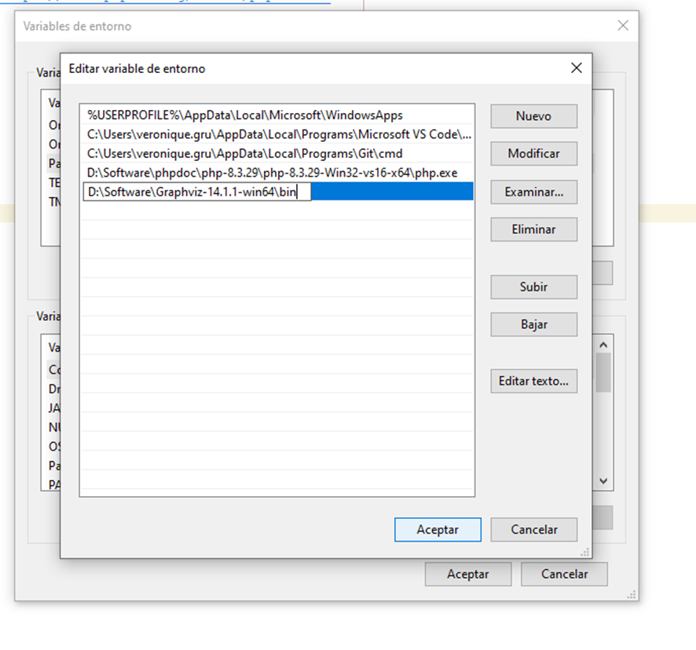
2. **Importante**: Cerrar sesión y volver a iniciar para que los cambios surtan efecto  

- **Verificar la instalación**
```cmd
dot -v
```  

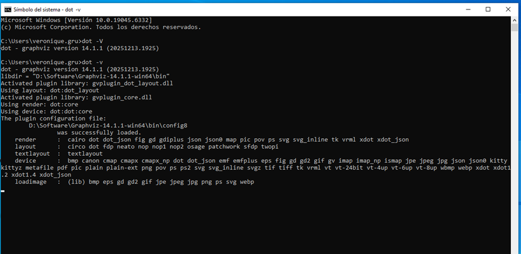

---

#### Alternativa: Doxygen

Otra herramienta popular para documentación es Doxygen:

- **Sitio web**: [https://www.doxygen.nl/](https://www.doxygen.nl/)
- **Ventajas**: Soporte para múltiples lenguajes (C++, Java, Python, PHP, etc.)
- **Instalación de Doxygen**: 
  
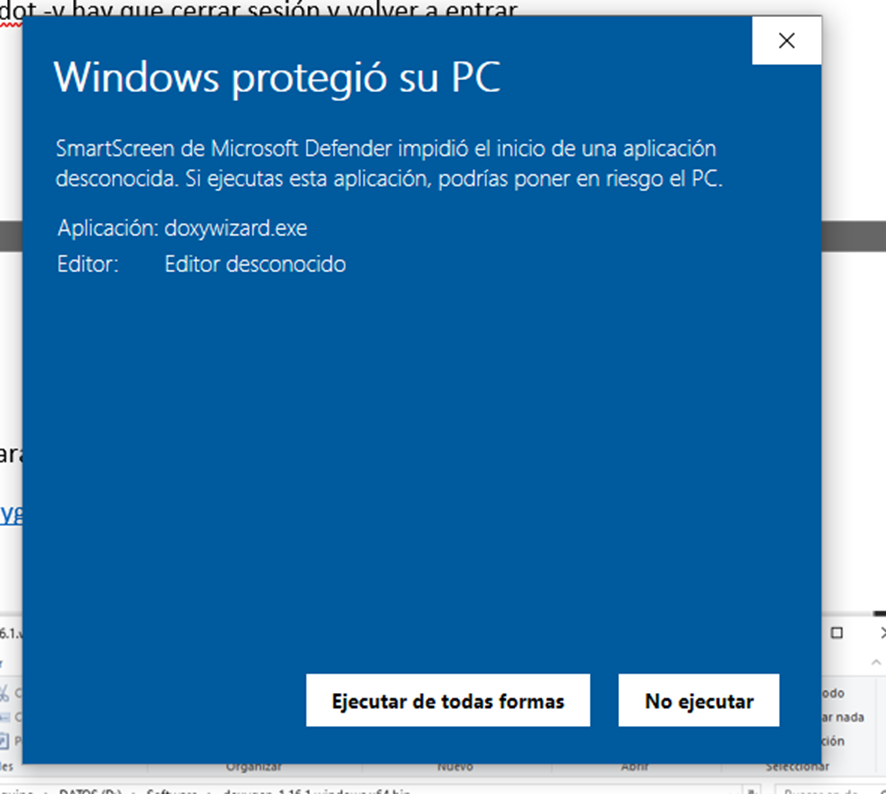  
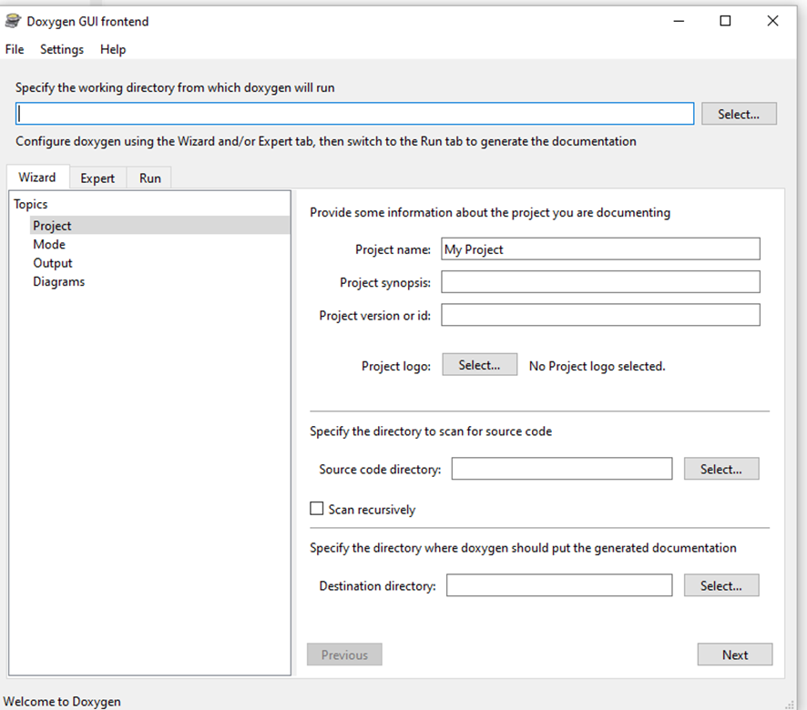  
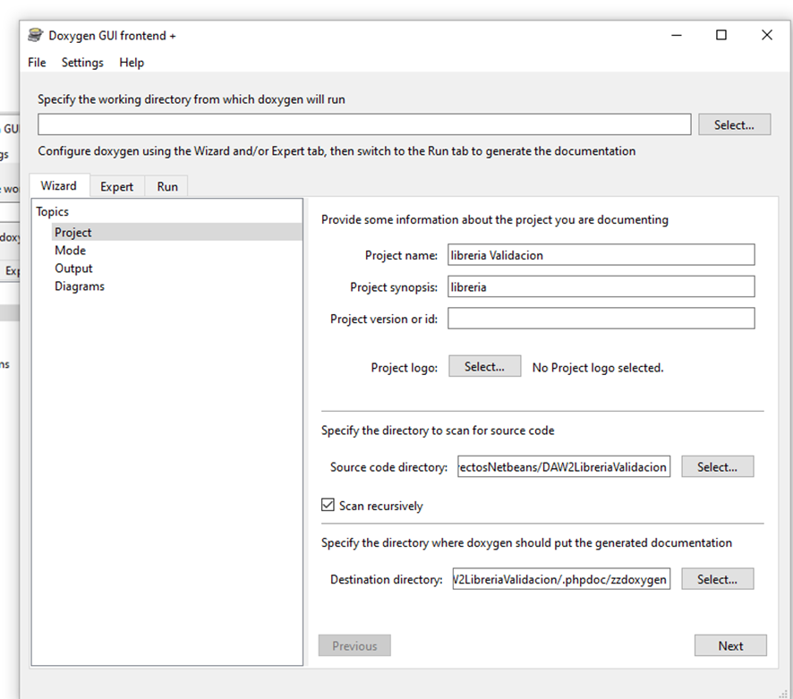  
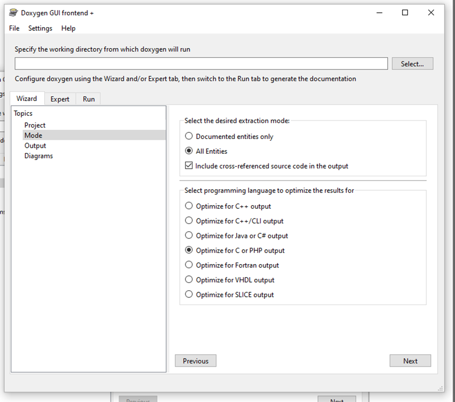  
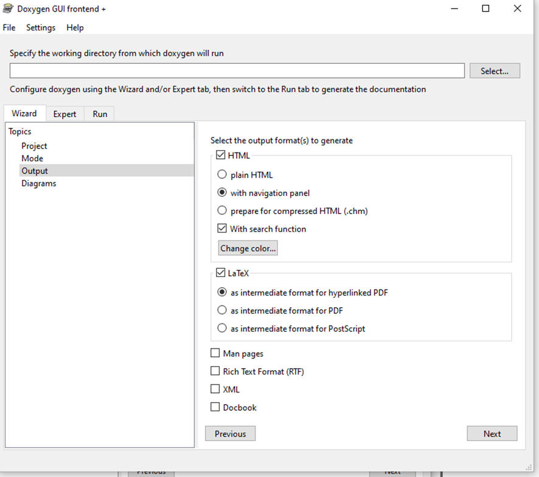  
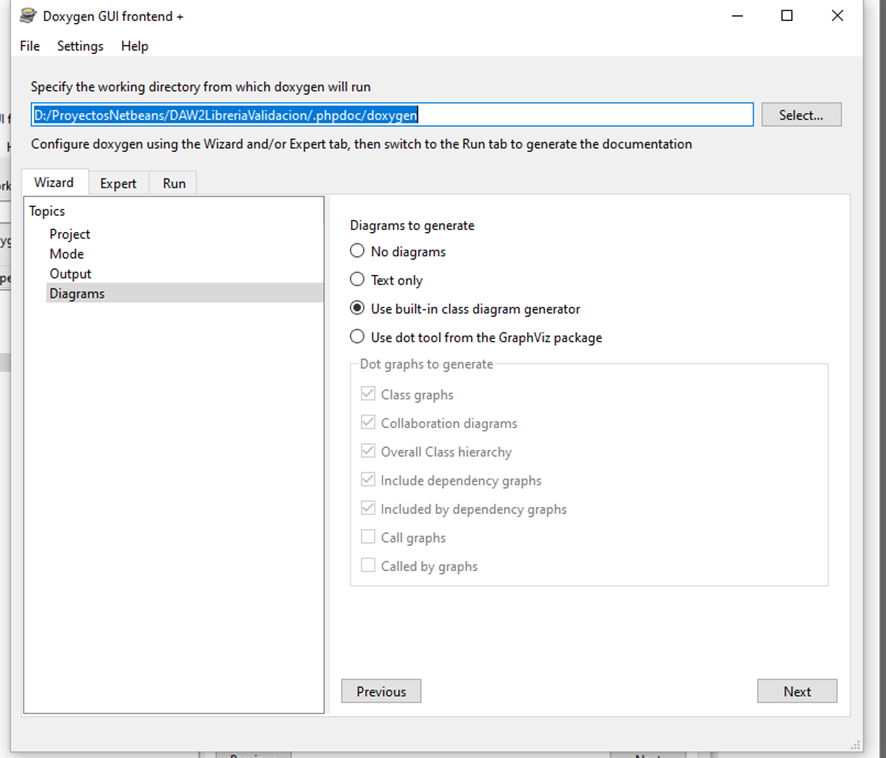  

---

