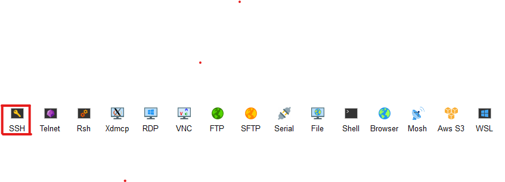
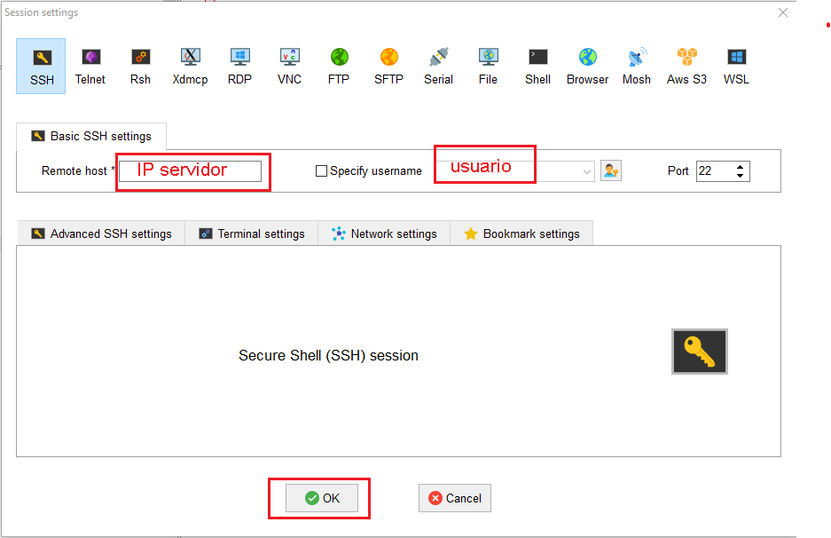
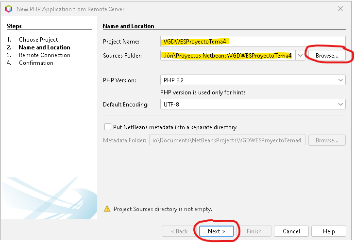
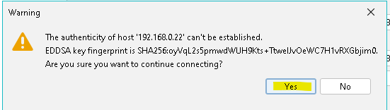
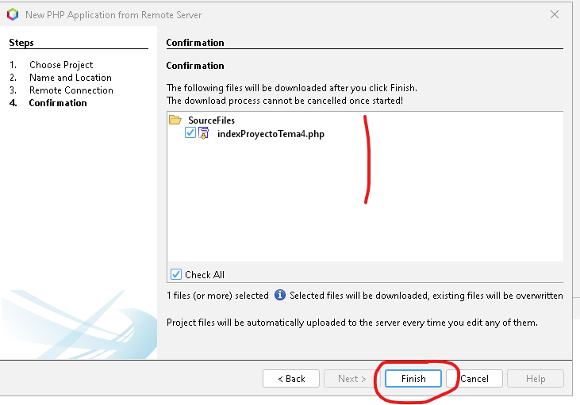
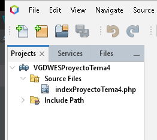

[Volver al menu principal](README.md)

# CLIENTE DE DESARROLLO
|  DAW/DWES Tema2 |
|:-----------:|
||
| INSTALACIÓN, CONFIGURACIÓN Y DOCUMENTACIÓN DEL CLIENTE DE DESARROLLO |


- [CLIENTE DE DESARROLLO](#cliente-de-desarrollo)
  - [Windows 11](#windows-11)
    - [2.1 **Configuración inicial**](#21-configuración-inicial)
    - [2.2 **Navegadores**](#22-navegadores)
    - [2.3 **MobaXterm**](#23-mobaxterm)
      - [Instalación](#instalación)
      - [Crear una sessión SSH](#crear-una-sessión-ssh)
      - [Crear una sessión SFTP](#crear-una-sessión-sftp)
    - [2.4 **Netbeans**](#24-netbeans)
      - [Creación de un proyecto de PHP](#creación-de-un-proyecto-de-php)
      - [Abrir un proyecto de PHP](#abrir-un-proyecto-de-php)
      - [Depurar un fichero en Netbeans](#depurar-un-fichero-en-netbeans)
    - [2.5 **Visual Studio Code**](#25-visual-studio-code)

## Windows 11
### 2.1 **Configuración inicial**
* Despues de instalar el ubuntu server en la maquina virtual se prueba la conexion con el anfitrion.
para ello se abre la terminal de windows


* En la terminal de windows se hace ping con la ip de la maquina virtual.
```bash
ping ipDelServidor
```


Si todos los paquetes se han recibido es que las maquinas están conectadas.

* Nos podemos conectar al servidor desde la terminal de windows con este comando
```bash
ssh usuario@ipServidor
```
Nos pedira la contraseña ya se podrá trabajar en el servidor.


* Para salir del Servidor
* 


### 2.2 **Navegadores**
Se puede utilizar cualquier navegador para visualizar el proyecto que está en el Servidor.
* Para poder visualizar el proyecto, se deberá de indicar la url del proyecto.
* 
  


### 2.3 **MobaXterm**
#### Instalación 
Descargar MobaXterm en este enlace : https://mobaxterm.mobatek.net/download.html

#### Crear una sessión SSH
* Para crear una sesión ssh, hacer clic en el botón de session arriba a la izquierda. 


* Cuando aparezca la ventana, hacer clic en SSH



* Se rellena. El host, es la IP del servidor y se puede indicar el usuario si se quiere, y se le da a OK
* 


* Se hace clic en la conexión, que se encuentra  en la parte izquierda.


* Aparece la terminal con el usuario, si se ha indicado en la creación, sino habrá que indicar el usuario y la contraseña.


#### Crear una sessión SFTP
* Para crear una sesión sftp, hacer clic en el botón de session arriba a la izquierda. 


* Cuando aparezca la ventana, hacer clic en SFTP


* Se rellena. El host, es la IP del servidor y se puede indicar el usuario si se quiere, y se le da a OK


* Nos pide la contraseña


* Se abre la terminal con el usuario.


### 2.4 **Netbeans**

#### Creación de un proyecto de PHP
Se hace clic en File -> New Project o se hace clic en el pestaña del cuadrado naranja con un más


En el primer paso de la creación de proyecto, se selecciona PHP en Categories, y PHP Aplicación from Remote Server y se hace clic en Next


En el paso 2 se indica el nombre del proyecto, y la ubicación en local
y se hace clic en Next




En el paso 3 se indica la IP del servidor...


 y se hace clic en Manage...
 para configurar la conexion al servidor remoto, donde se indicará el nombre del servidor, la IP , el puerto, el nombre del usuario con permisos para actuar en las carpetas del proyecto, la contraseña....


 se hace un test de conexión y saldrá un mensaje de confirmación

 

   hacer clic en Yes,  si el test es ok, hacer clic en OK...(el servidor remoto tiene que estar encendido sino no hace la conexion)

  

   se cierra la ventana de conexion se indica la ubicación de la carpeta del proyecto en el servidor y se hace clic en Next en la ventana del paso 3.


Sale de nuevo el mensaje de Confirmación de conexión y se hace clic en Yes.


Se checkea que la carpeta del proyecto tenga todos los elementos necesarios y se hace clic en finish.



Sale de nuevo el mensaje de Confirmación de conexión y se hace clic en Yes.


El proyecto aparecerá en la parte izquierda del IDE.



#### Abrir un proyecto de PHP
* Se hace clic en el icono de abrir, o en File - Open Project.

 

* Aparece una ventana con los proyecto y se elije el que se quiera abrir y se hace clic en open Proyect


#### Depurar un fichero en Netbeans
Depurar  sirve para identificar y corregir errores en el código, lo que mejora la estabilidad, fiabilidad y rendimiento del software. Permite ejecutar el código paso a paso, inspeccionar variables y comprender el flujo de ejecución para encontrar la causa raíz de los problemas. 

* Despues de haber elegido el fichero y de haber puesto el o los break point en las lineas de codigo deseadas. 
Para poner los break point hay que hacer clic en la parte izquierda del codido, donde aparecen los cuadraditos rosas en la imagen.
  


* Se hace clic en Debug-Debug File


* Inicia la depuración y se situa el "cursor" de depuración al principio del codigo . Para que pase al primer break point se hace clic en "play".


* A cada vez que se para en los break points, en la pestaña de variables, se pueden ver el contenido de las variable en ese momento.


* Para salir del debug se hace clic en "stop".


### 2.5 **Visual Studio Code**
