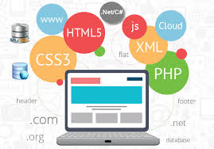
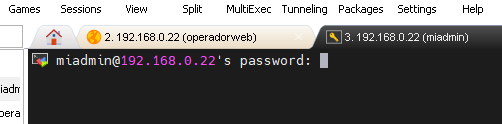
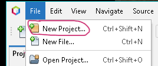
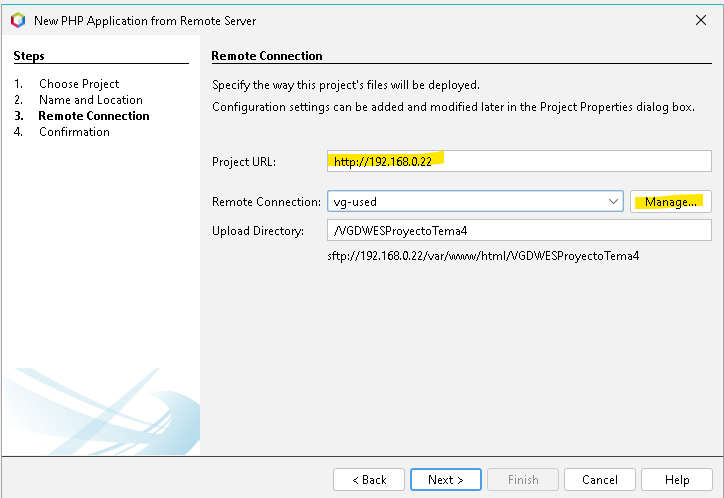
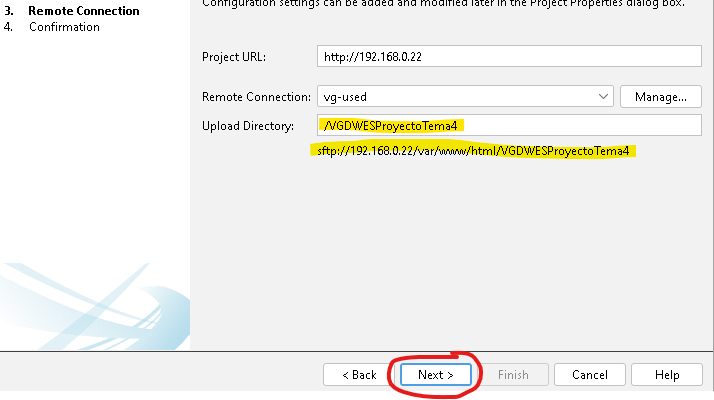

# CLIENTE DE DESARROLLO
|  DAW/DWES Tema2 |
|:-----------:|
||
| INSTALACIÓN, CONFIGURACIÓN Y DOCUMENTACIÓN DEL CLIENTE DE DESARROLLO |

- [CLIENTE DE DESARROLLO](#cliente-de-desarrollo)
    - [Windows 11](#windows-11)
      - [2.1 **Configuración inicial**](#21-configuración-inicial)
      - [2.2 **Navegadores**](#22-navegadores)
      - [2.3 **MobaXterm**](#23-mobaxterm)
      - [2.4 **Netbeans**](#24-netbeans)
      - [2.5 **Visual Studio Code**](#25-visual-studio-code)

### Windows 11
#### 2.1 **Configuración inicial**

#### 2.2 **Navegadores**

#### 2.3 **MobaXterm**
Descargar MobaXterm en este enlace : https://mobaxterm.mobatek.net/download.html
Para crear una sesión ssh, hacer clic en el botón de session arriba a la izquierda. 

Cuando aparezca la ventana, hacer clic en SSH

Se rellena. El host, es la IP del servidor y se puede indicar el usuario si se quiere, y se le da a OK

Se hace clic en la conexión, que se encuentra  en la parte izquierda.

Aparece la terminal con el usuario, si se ha indicado en la creación, sino habrá que indicar el usuario y la contraseña.

#### 2.4 **Netbeans**
* Crear un proyecto PHP en Netbeans
Se hace clic en File -> New Project o se hace clic en el pestaña del cuadrado naranja con un más

En el primer paso de la creación de proyecto, se selecciona PHP en Categories, y PHP Aplicación from Remote Server y se hace clic en Next

En el paso 2 se indica el nombre del proyecto, y la ubicación en local
y se hace clic en Next

En el paso 3 se indica la IP del servidor...

 y se hace clic en Manage...
 para configurar la conexion al servidor remoto, donde se indicará el nombre del servidor, la IP , el puerto, el nombre del usuario con permisos para actuar en las carpetas del proyecto, la contraseña....

 se hace un test de conexión y saldrá un mensaje de confirmación
 
   hacer clic en Yes,  si el test es ok, hacer clic en OK...(el servidor remoto tiene que estar encendido sino no hace la conexion)
  
   se cierra la ventana de conexion se indica la ubicación de la carpeta del proyecto en el servidor y se hace clic en Next en la ventana del paso 3.

Sale de nuevo el mensaje de Confirmación de conexión y se hace clic en Yes.

Se checkea que la carpeta del proyecto tenga todos los elementos necesarios y se hace clic en finish.

Sale de nuevo el mensaje de Confirmación de conexión y se hace clic en Yes.

El proyecto aparecerá en la parte izquierda del IDE.

#### 2.5 **Visual Studio Code**
