[Volver al menu principal](README.md)

# ENTORNO DE EXPLOTACIÓN
|  DAW/DWES Tema2 |
|:-----------:|
||
| INSTALACIÓN, CONFIGURACIÓN Y DOCUMENTACIÓN DE ENTORNO DE DESARROLLO Y DEL ENTORNO DE EXPLOTACIÓN |

- [ENTORNO DE EXPLOTACIÓN](#entorno-de-explotación)
  - [PLESK](#plesk)
    - [Acceso a la cuenta del usuario](#acceso-a-la-cuenta-del-usuario)
    - [Creación de los subdominios si se necesita](#creación-de-los-subdominios-si-se-necesita)
    - [Subida de los archivos a Plesk](#subida-de-los-archivos-a-plesk)
    - [Importar una base de datos](#importar-una-base-de-datos)
    - [Conexión con la base de datos](#conexión-con-la-base-de-datos)
    - [Conexión sftp a Plesk](#conexión-sftp-a-plesk)
  


## PLESK
Para el entorno de explotación se utiliza el hosting PLESK.


### Acceso a la cuenta del usuario
* Se accede al enlace : https://ieslossauces.es:8443/login_up.php    
Aparece el formulario para registrarse y se indican el usuario y la contraseña.  
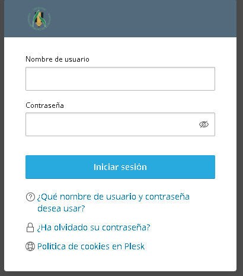
Y se llega a la pagina principal de gestion del hosting


### Creación de los subdominios si se necesita
* Para crear un subdominio se va al apartado sitios web y dominios del menu.  

* Se hace clic en añadir subdominio en la parte de arriba  
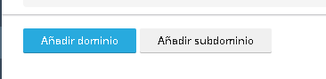

* Se indica el nombre del subdominio  
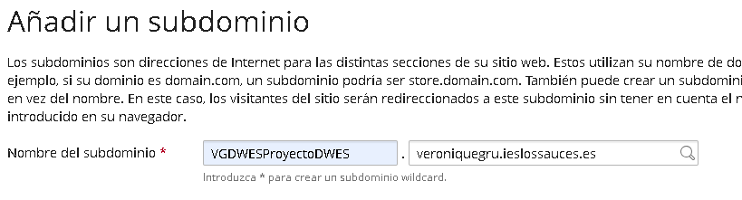


y la carpeta en la que queramos que esté, en este caso httpdocs.  
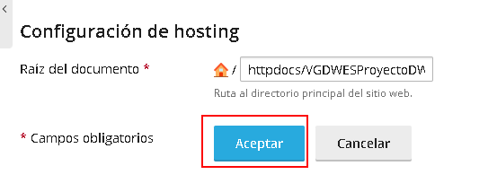

Si el index principal, no se llamara solo index, hay que añadir esta linea en el archivo .htaccess
```bash
DirectoryIndex indexProyectoTema5.php
``` 
"indexProyectoTema5.php" es el nombre del index principal en este caso, se sustituira por el nombre que corresponda.


### Subida de los archivos a Plesk
* Se entra en archivos en el menu de la izquierda  

* Se entra en la carpeta httpdocs del directorio principal  
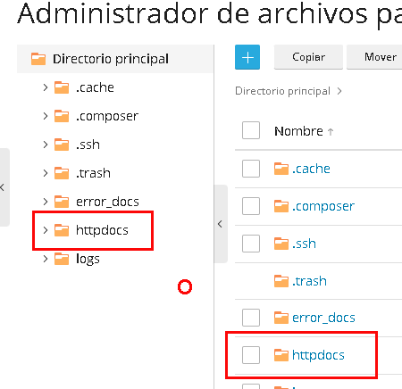
y en esa carpeta se arrastran las carpetas desde la carpeta del proyecto local  
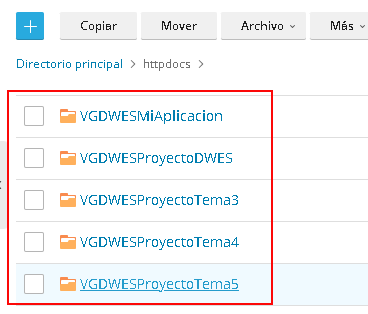

### Importar una base de datos
* Se crea el archivo .sql con la creación y la carga inicial si la .
Se entra en Plesk, se va a la sección Base de datos  
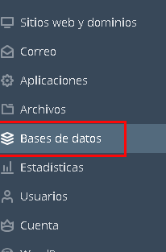

* Se hace clic en Añadir base de datos  
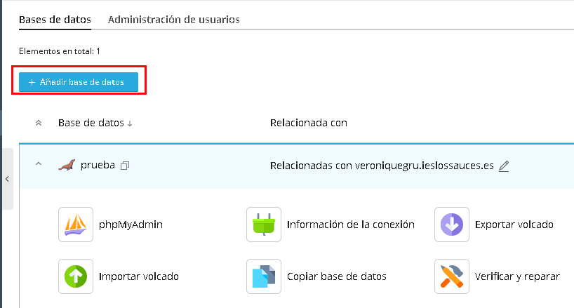

* Hay que completar los datos de la base de datos, el nombre de la base de datos, el sitio relacionado(no es obligatorio), y el usuario de la base de datos  
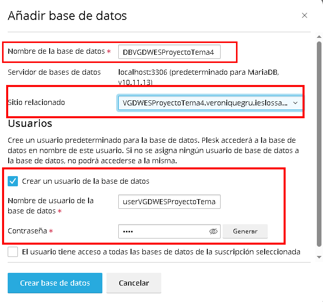

* Se importa la base de datos. Se hace clic en importar volcado.  
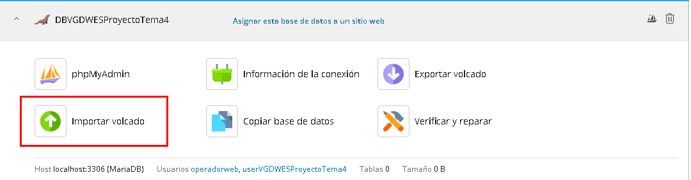

* Se elige desde donde se quiere importar, se elije desde el ordenador local, se hace clic en Selecinar un archivo sql .zip y se hace clic en importar volcado.  
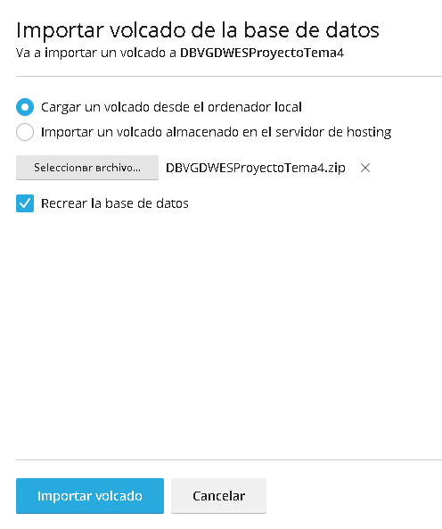

* Para comprobar que está importada se hace clic en phpMyadmin.   
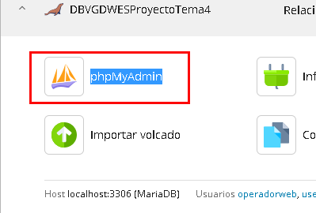

Y aparecerá la base de datos en la parte izquierda.  
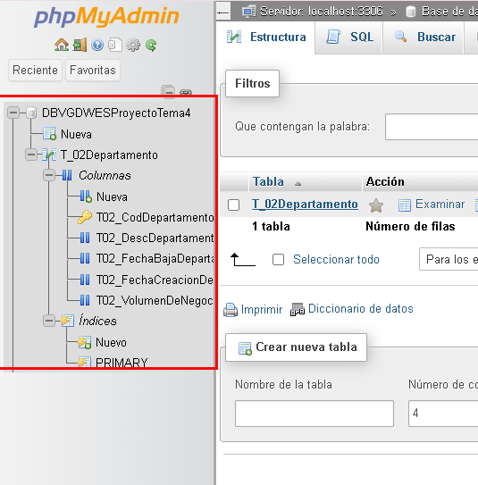

Para que funcione bien la base de datos, se deben  añadir estas lineas en el archivo .htacces 
```bash
<IfModule mod_rewrite.c>
    RewriteEngine on
    RewriteRule .* - [E=HTTP_AUTHORIZATION:%{HTTP:Authorization}]
</IfModule>
```

### Conexión con la base de datos
Para poder conectar con la base de datos importada, se deberá utilizar en los datos de conexión :
* **localhost** como host 
* **el usuario y la contraseña que se ha indicado al crear la base de datos en Plesk**  
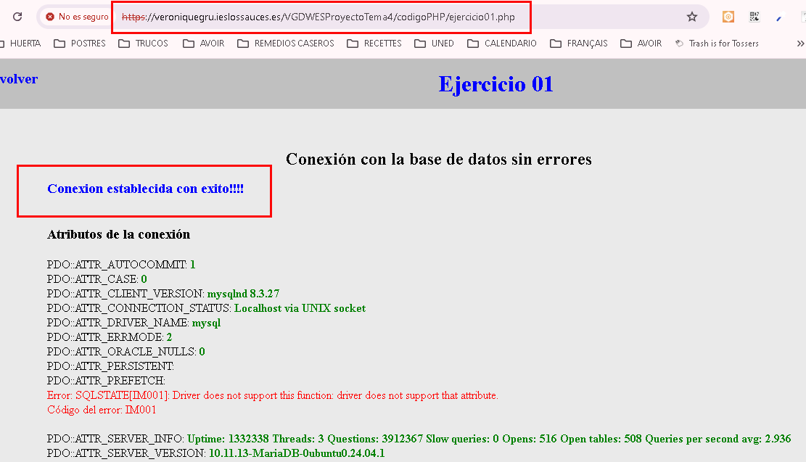

### Conexión sftp a Plesk
Primero se necesita la ip de plesk que se encuentra en la configuración de hosting.
Se selecciona Sitios web y dominios en la parte izquierda  

Se entra en la configuración principal de la cuenta
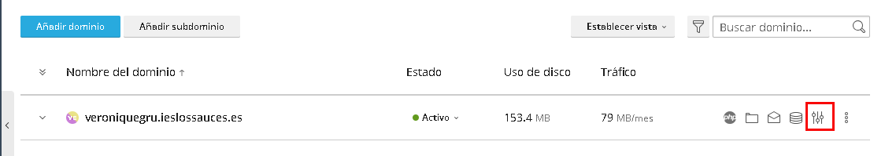
la ip se encuentra abajo del todo.  
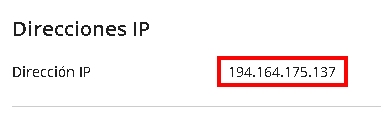
y se configura de la misma manera que en local, con la ip y el usuario y contraseña de plesk.
 Ver [Crear una sessión SFTP](#crear-una-sessión-sftp)
