[Volver al menu principal](README.md)

# ENTORNO DE EXPLOTACIÓN IONOS con PLESK
|  DAW/DWES Tema2 |
|:-----------:|
||
| INSTALACIÓN, CONFIGURACIÓN Y DOCUMENTACIÓN DE ENTORNO DE DESARROLLO Y DEL ENTORNO DE EXPLOTACIÓN |

- [ENTORNO DE EXPLOTACIÓN IONOS con PLESK](#entorno-de-explotación-ionos-con-plesk)
  - [Acceso a la cuenta del usuario](#acceso-a-la-cuenta-del-usuario)
  - [Creación de los subdominios si se necesita](#creación-de-los-subdominios-si-se-necesita)
  - [Subida de los archivos a Plesk](#subida-de-los-archivos-a-plesk)
  - [Importar una base de datos](#importar-una-base-de-datos)
  - [Conexión con la base de datos](#conexión-con-la-base-de-datos)
  - [Despliegue Automático desde Github a Ionos/Plesk](#despliegue-automático-desde-github-a-ionosplesk)
    - [Opción 1: Git en Plesk (Método Recomendado)](#opción-1-git-en-plesk-método-recomendado)
      - [Requisitos Previos](#requisitos-previos)
      - [Paso 2: Configurar Git en Plesk](#paso-2-configurar-git-en-plesk)
      - [Paso 3: Conectar el Repositorio y se hace el despliegue](#paso-3-conectar-el-repositorio-y-se-hace-el-despliegue)
      - [Paso 4. Configuración en Github](#paso-4-configuración-en-github)
  

Para el entorno de explotación se utiliza el hosting de IONOS con el panel de Control de Plesk.

## Acceso a la cuenta del usuario
* Se accede al enlace : https://ieslossauces.es:8443/login_up.php    
Aparece el formulario para registrarse y se indican el usuario y la contraseña.  

Y se llega a la pagina principal de gestion del hosting

## Creación de los subdominios si se necesita
* Para crear un subdominio se va al apartado sitios web y dominios del menu.  

* Se hace clic en añadir subdominio en la parte de arriba  


* Se indica el nombre del subdominio  


y la carpeta en la que queramos que esté, en este caso httpdocs  


## Subida de los archivos a Plesk
* Se entra en archivos en el menu de la izquierda  

* Se entra en la carpeta httpdocs del directorio principal  

y en esa carpeta se arrastran las carpetas desde la carpeta del proyecto local  


## Importar una base de datos
* Se crea el archivo .sql con la creación y la carga inicial si la .
Se entra en Plesk, se va a la sección Base de datos  


* Se hace clic en Añadir base de datos  


* Hay que completar los datos de la base de datos, el nombre de la base de datos, el sitio relacionado(no es obligatorio), y el usuario de la base de datos  


* Se importa la base de datos. Se hace clic en importar volcado.  


* Se elige desde donde se quiere importar, se elije desde el ordenador local, se hace clic en Selecinar un archivo sql .zip y se hace clic en importar volcado.  


* Para comprobar que está importada se hace clic en phpMyadmin.   


Y aparecerá la base de datos en la parte izquierda.  


## Conexión con la base de datos
Para poder conectar con la base de datos importada, se deberá utilizar en los datos de conexión :
* **localhost** como host 
* **el usuario y la contraseña que se ha indicado al crear la base de datos en Plesk**  


## Despliegue Automático desde Github a Ionos/Plesk
Existen varias opciones para implementar esta integración.

### Opción 1: Git en Plesk (Método Recomendado)

Plesk incluye soporte nativo para Git que facilita el despliegue desde repositorios remotos.

#### Requisitos Previos

- Acceso a Plesk
- Repositorio en GitHub
- Token de acceso personal de GitHub.

* Si no se tiene Token de Acceso en GitHub, se crea

1. Ve a GitHub → **Settings** → **Developer settings** → **Personal access tokens** → **Tokens (classic)**  
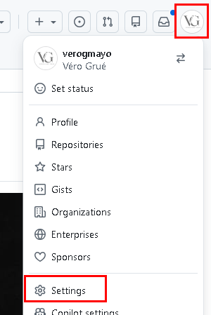 
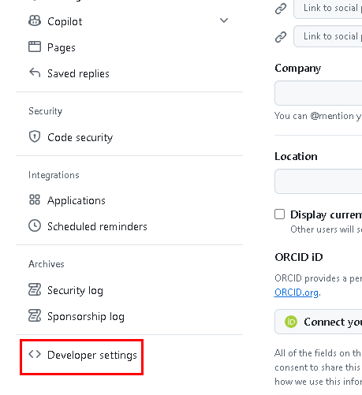  
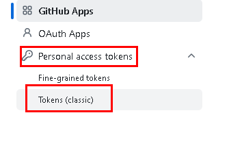 

1. Click en **Generate new token (classic)**. Este Token (classic) es más antiguo que el de la otra opción pero funciona para toda las cuenta. Sus permisos son muy amplios. El otro(Fine-grained Personal) es más nuevo y tiene mayor seguridad, pero suele ser para Repositorios especificos. Para este caso utilizaremos el (classic)
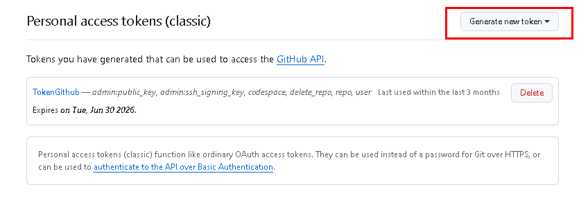  
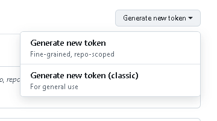  
Para crear el token, hay que indentificarse. Se puede hacer con una Passkey, a traves del móvil(para eso hay que tener la aplicación de Github instalada en el móvil), el authenticator, o la contraseña.
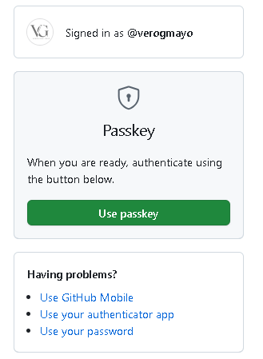

2. Se le asigna un nombre descriptivo, una fecha, y se selecciona los permisos:
   - `repo` (acceso completo a repositorios)
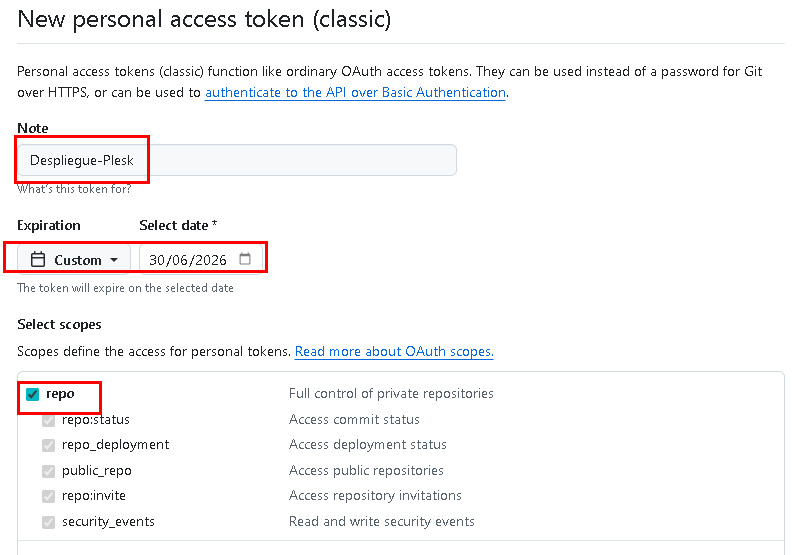

3. Genera el token y **cópialo** (solo se muestra una vez)  
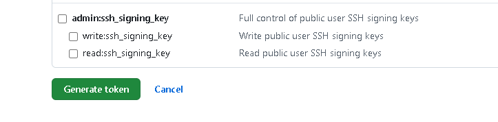  
Se genera un codigo que empieza por ghp_

#### Paso 2: Configurar Git en Plesk

1. Se accede a Plesk
2. Ve a **Websites & Domains(Sitios webs y dominos)**  
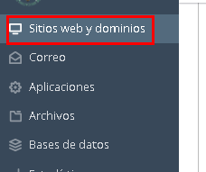  
3. Selecciona tu dominio  
Click en **Git** en la sección de **herramientas de desarrollo**,   
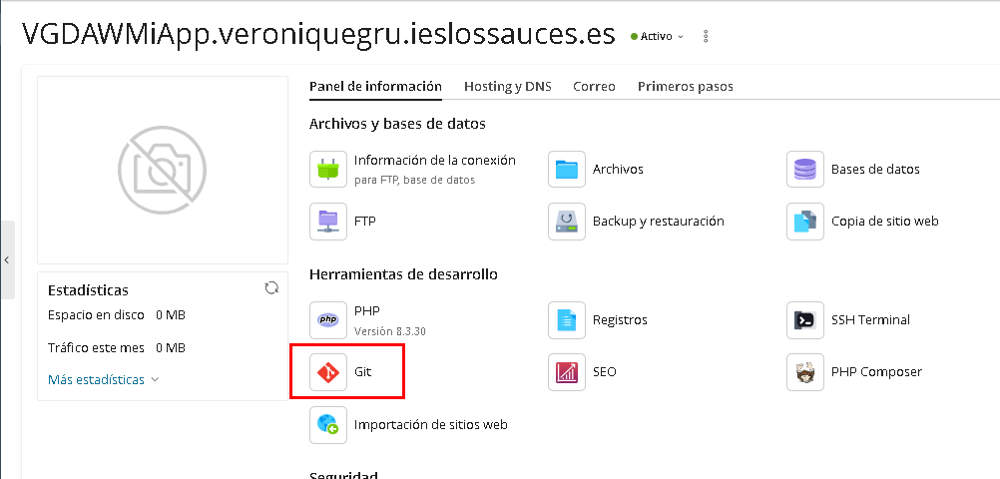  
o en **primeros pasos** - **Desplegar Mediante Git**  
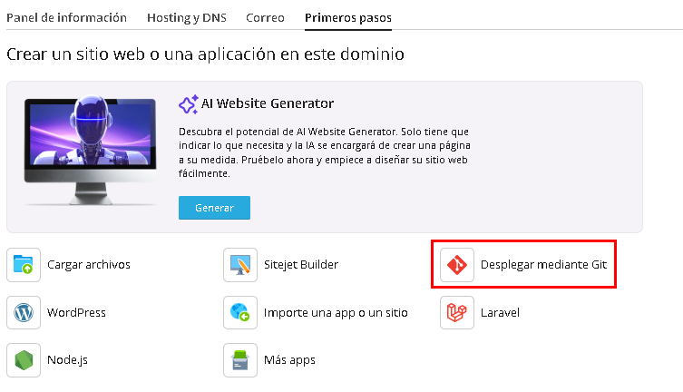  
4. Click en **Add Repository** 
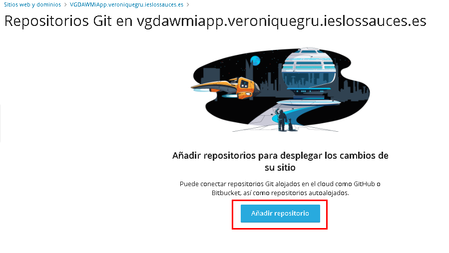 


#### Paso 3: Conectar el Repositorio y se hace el despliegue

1. **Repository name**: Nombre descriptivo
2. **Repository URL**: 
   ```
   https://github.com/tu-usuario/tu-repositorio.git
   ```
3. **Repository path**: Directorio donde se clonará (ej: `/repository`)
4. **Username**: Tu usuario de GitHub
5. **Personal Access Token**: Pega el token generado anteriormente
6. Click en **OK** 
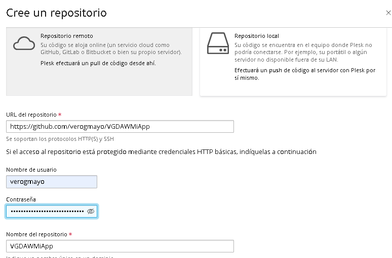  
y se hace el despligue de lo que hay en la rama master por defecto.
Se abre entonces una página con los datos del despliegue  
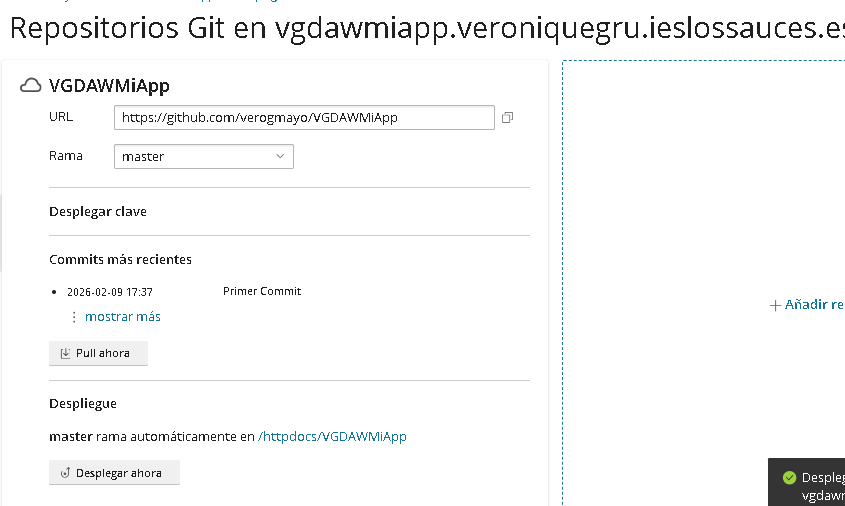  
Se puede ver el index del proyecto desplegado  
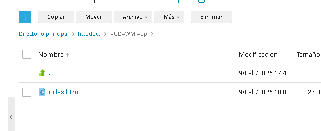
En este panel se puede hacer el despliegue manual si se quiere. Se puede elegir la rama, hacer pull, o desplegar  
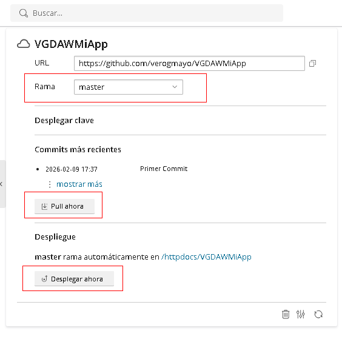  
También se puede cambiar la configuración del despliegue automatico  
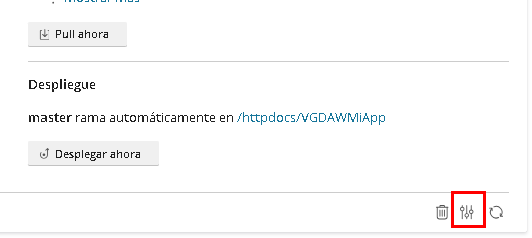  
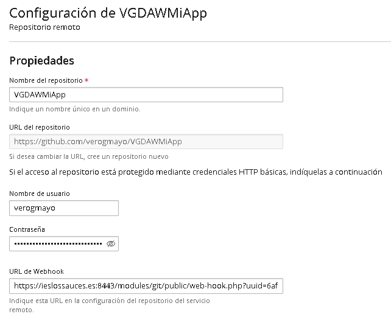
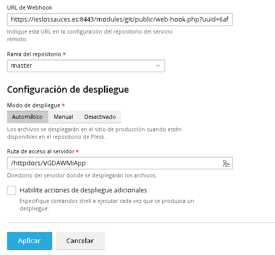

#### Paso 4. Configuración en Github
En el repositorio del proyecto - Settings - Webhooks - add webhook 
En Playload se pone la URL del Webhook que se encuentra en la configuración de git de la aplicaión en plesk.  
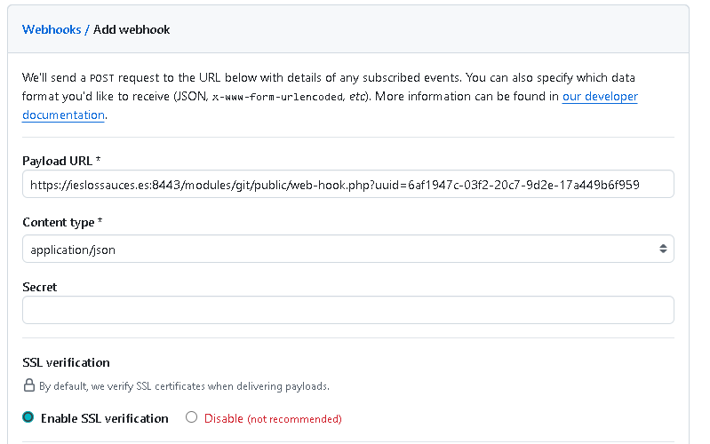  
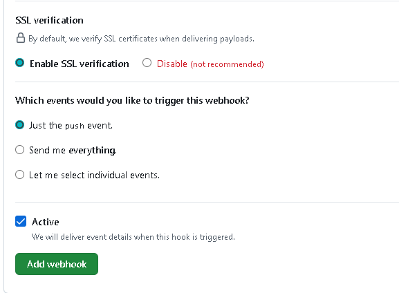  
URL en plesk  
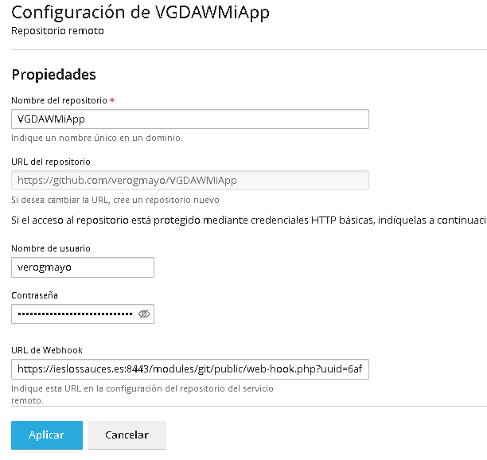
Se ve en Plesk los commit que se han hecho  
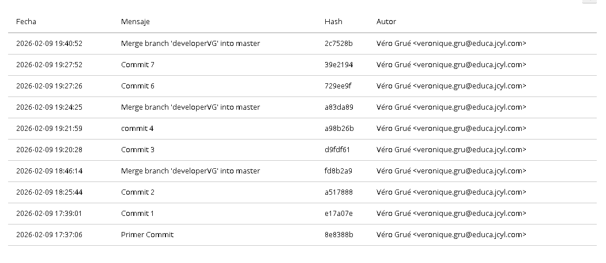  