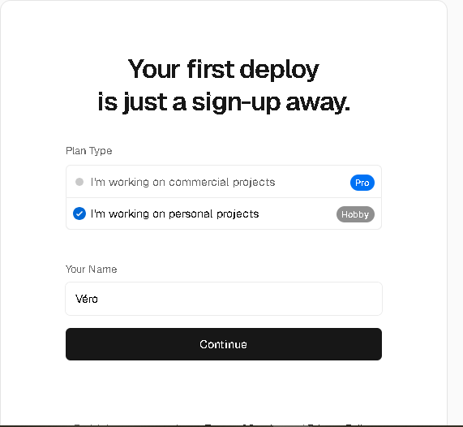

[Volver al menu principal](README.md)

# ENTORNOS DE EXPLOTACIÓN EXTERNOS
|  |
|:-----------:|
||
| INSTALACIÓN, CONFIGURACIÓN Y DOCUMENTACIÓN DEL SERVIDOR DE DESARROLLO |

[ENTORNOS DE EXPLOTACIÓN](#entorno-de-explotación)
  - [VERCEL](#11-ubuntu-server-24043-lts)
    - [**Configuración inicial**](#configuración-inicial)

## VERCEL
Vercel es una plataforma basada en la nube para sitios estáticos y funciones sin servidor que se adapta con fluidez al flujo de trabajo. Permite a los desarrolladores alojar sitios web y servicios web que se implementan al instante, escalan automáticamente y no requieren supervisión, todo sin necesidad de configuración.

 ### Login
 * Despues de loguearse en la pagina de inicio da la opcion de descargar un proyecto directamente de github
 
