[Volver al menu principal](README.md)

# 3 GIT Y GITHUB

- [3 GIT Y GITHUB](#3-git-y-github)
  - [3.1 **Git**](#31-git)
    - [**Descarga e Instalación**](#descarga-e-instalación)
      - [1. Descargar Git](#1-descargar-git)
      - [2. Instalar Git](#2-instalar-git)
      - [3. Verificar la instalación](#3-verificar-la-instalación)
      - [**Inicialización y Configuración**](#inicialización-y-configuración)
      - [4. Comandos Básicos](#4-comandos-básicos)
      - [Gestión de Ramas](#gestión-de-ramas)
      - [Ver ramas](#ver-ramas)
      - [Integración de Cambios](#integración-de-cambios)
      - [Comandos de Historial](#comandos-de-historial)
      - [1. **Lightweight tag** (simple referencia)](#1-lightweight-tag-simple-referencia)
      - [2. **Annotated tag** (recomendado, con metadata)](#2-annotated-tag-recomendado-con-metadata)
  - [](#)
      - [Comandos de Sincronización](#comandos-de-sincronización)
      - [Comandos Avanzados](#comandos-avanzados)
      - [**Merge con "ola"**](#merge-con-ola)
  - [3.2  **GitHub**](#32--github)
    - [Crear un repositorio](#crear-un-repositorio)
  - [Generación de una clave ssh](#generación-de-una-clave-ssh)

## 3.1 **Git**
    Git es un sistema de control de versiones distribuido gratuito y de código abierto que se utiliza para rastrear los cambios en el código fuente durante el desarrollo de las aplicaciones.
### **Descarga e Instalación**
 
#### 1. Descargar Git

1. Se accede al sitio oficial de Git:
    [https://git-scm.com/downloads](https://git-scm.com/downloads)
2. Se hace clic en **Windows**.
   Se descarga la versión acorde con su equipo. Existe una versión de escritorio y una portable.
    Al pinchar en el enlace de la versión, que se quiera, la descarga comenzará automaticamente.

---

#### 2. Instalar Git

1. Se ejecuta el instalador descargado.
2. Se acepta los términos de licencia y se siguen los pasos recomendados:
    * **Se elije la carpeta de instalación :** se puede dejar la que viene por defecto.
    * **Select Components:** se puede dejar las opciones por defecto.
    * **Start Menu Folder:** se puede dejar lo que viene por defecto.
    * **Editor por defecto:** se selecciona el editor de texto que se prefiera.
    * **Name of the initial branch:** se puede dejar la que viene por defecto o poner el nombre que se quiera.Es la rama que se creara por defecto al iniciar una repositorio nuevo.
    * **PATH environment:** se recomienda seleccionar :
     `Git from the command line and also from 3rd-party software`.
    * **SSH executable:** se puede dejar la que viene por defecto(bundle ssh) para poder utilizar openSSH. .
    * **HTTPS transport backend:** se puede dejar la que viene por defecto para poder utilizar la libreria de windows .
    * El resto de opciones puedes dejarlas por defecto.
3. Se empieza con la instalación haciendo clic en **Instalar**.
4. Finaliza la instalación haciendo clic en **Finish**.

---

#### 3. Verificar la instalación

 Se abre **Símbolo del sistema (CMD)**, **PowerShell**, **GitBash** o la **terminal de VS Code** y se ejecuta:

```bash
git --version
```

Deberías ver algo como:
```
git version 2.47.1.windows.1
```

---
#### **Inicialización y Configuración**

- 1. Inicialización 
Se abre el editor de texto dentro de la carpeta del proyecto y se inicializa git.
```bash
git init
```

Tambien se puede clonar de un repositorio de github
  ```bash
  git clone <URL>
  ```
- 2. Nombre y email 
Se debe de configurar git con un nombre y un correo
Estos datos se asocian a los *commits*:

```bash
git config --global user.name "Nombre"
git config --global user.email "email@ejemplo.com"
```


---

- 3. Configurar el editor de texto (opcional) 


```bash
git config --global core.editor "editorDeTexto"
```

---
- 4. Verificar la configuración 

```bash
git config --list
```
---

#### 4. Comandos Básicos
- `git status`

Muestra el estado actual del repositorio: archivos modificados, staged, untracked...

```bash
git status
```  
 

**Cuándo usar:**
- Antes de hacer commit para ver qué cambios hay
- Para verificar en qué rama estás  
  
- Para ver si hay archivos sin seguimiento

**Estados de archivos:**
- **Untracked**: Archivos nuevos que Git no está siguiendo  
- **Modified**: Archivos modificados pero no en staging
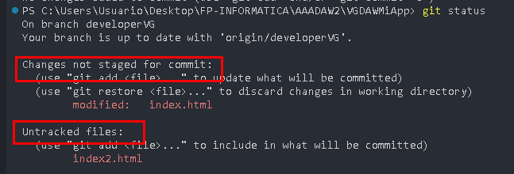
- **Staged**: Archivos listos para commit
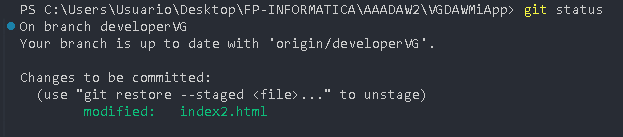
- **Committed**: Cambios guardados en el historial  


- `git log`

Muestra el historial de commits del repositorio.

**Sintaxis básica:**
```bash
git log
```

**Opciones útiles:**
```bash
# Formato compacto (una línea por commit)
git log --oneline

# Mostrar los últimos N commits
git log -n 5

# Ver historial con gráfico de ramas
git log --graph --oneline --all  
```
```bash
# Ver cambios de cada commit
git log -p  
```
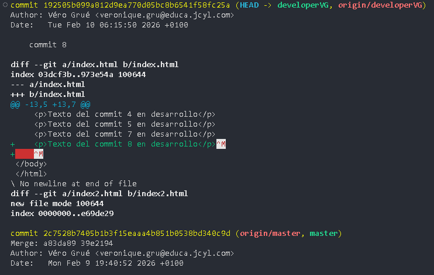

```bash
# Ver estadísticas de cada commit
git log --stat  
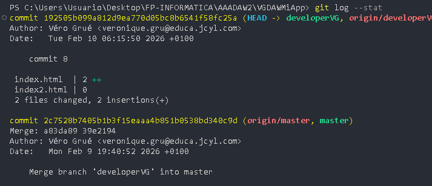
```
```bash
# Filtrar por autor
git log --author="Juan"

# Filtrar por fecha
git log --since="2 weeks ago"
git log --after="2024-01-01" --before="2024-12-31"
```
```bash
# Buscar en mensajes de commit
git log --grep="Primer"  
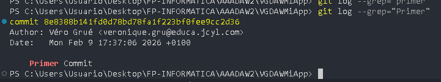  
```
```bash
# Ver commits que afectaron un archivo específico
git log -- c:\Users\Usuario\Desktop\FP-INFORMATICA\AAADAW2\VGDAWMiApp/index.html 
``` 
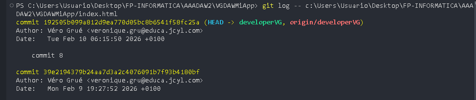  


**Formato personalizado:**
```bash
# Formato bonito y detallado
git log --pretty=format:"%h - %an, %ar : %s" --graph
# Explicación del formato:
# %h  = hash corto del commit
# %an = nombre del autor
# %ar = fecha relativa
# %s  = mensaje del commit
```  
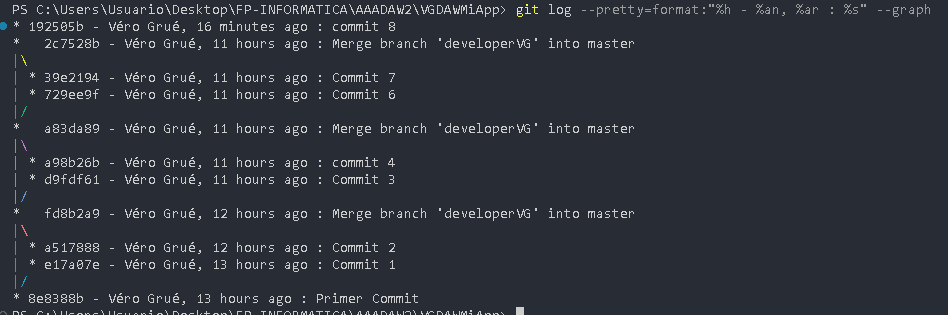


---

#### Gestión de Ramas

- Conceptos Básicos de Ramas

Una **rama** es una línea independiente de desarrollo. Te permite trabajar en nuevas características sin afectar el código principal.

```
master     A---B---C---F---G
              \         /
feature        D---E---
```

- Crear y cambiar de rama

```bash
# Crear nueva rama
git branch nombre-rama  
```  

  
```bash
# Cambiar a una rama
git checkout nombre-rama  
```  
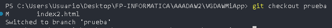  
```bash
# Crear y cambiar en un solo comando 
git checkout -b nombre-rama  
```  
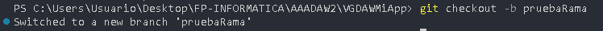  
```bash
# Forma moderna (Git 2.23+)
git switch nombre-rama  
git switch -c nombre-rama  # crear y cambiar  
```  
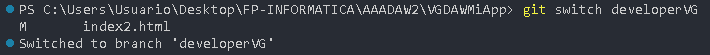  


#### Ver ramas

```bash
# Listar ramas locales
git branch
``` 
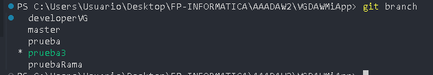  
```bash
# Listar todas las ramas (locales y remotas)
git branch -a
```  
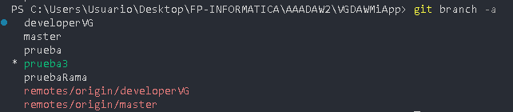  
```bash
# Ver última commit de cada rama
git branch -v
```  
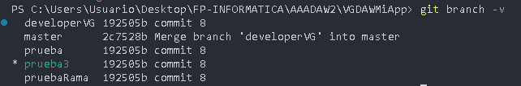
```bash
# Ver ramas fusionadas/no fusionadas
git branch --merged
git branch --no-merged
```

- Eliminar ramas

```bash
# Eliminar rama local (solo si está fusionada)
git branch -d nombre-rama

# Forzar eliminación (aunque no esté fusionada)
git branch -D nombre-rama

# Eliminar rama remota
git push origin --delete nombre-rama
```  
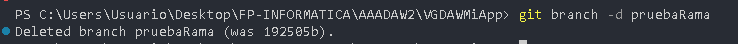

---

#### Integración de Cambios

- `git merge`

Fusiona cambios de una rama en otra, creando un **commit de merge**.

**Cómo funciona:**
```
Antes:
master     A---B---C
              \
developer      D---E

Después de: git merge develpoer (estando en master)
master     A---B---C-------F (merge commit)
              \         /
developer      D---E---
```


```bash
# Estar en la rama destino
git checkout master

# Fusionar otra rama
git merge developer

# Merge sin fast-forward (siempre crea commit de merge)
git merge --no-ff developer

# Merge solo si puede hacer fast-forward
git merge --ff-only developer
```

**Tipos de merge:**

1. **Fast-forward**: Cuando no hay commits divergentes
```
master     A---B
              \
developer      C---D

Después:
master     A---B---C---D
```

2. **Three-way merge**: Cuando hay commits en ambas ramas
```
master     A---B---C
              \
developer      D---E

Después (crea commit de merge):
master     A---B---C-------F
              \         /
developer      D---E---
```

**Resolver conflictos:**
```bash
# Si hay conflictos, Git te lo indicará
git merge developer
# Auto-merging archivo.js
# CONFLICT (content): Merge conflict in archivo.js

# Editar archivos con conflictos (verás marcadores como <<<<<<, ======, >>>>>>)
# Después de resolver:
git add archivo.js
git commit  # finaliza el merge
```

**Cuándo usar:**
- Para integrar features completadas
- Cuando quieres preservar el historial completo
- En flujos de trabajo tipo GitHub Flow

---

- `git rebase`

Reescribe el historial moviendo commits a una nueva base. Crea un historial **lineal**.

**Cómo funciona:**
```
Antes:
master     A---B---C
              \
developer      D---E

Después de: git rebase master (estando en feature)
master     A---B---C
                  \
developer          D'---E'
```

**Sintaxis:**
```bash
# Estar en la rama que quieres mover
git checkout developer

# Rebase sobre otra rama
git rebase master

# Rebase interactivo (para editar commits)
git rebase -i HEAD~3  # últimos 3 commits

# Continuar después de resolver conflictos
git rebase --continue

# Abortar rebase
git rebase --abort

# Saltar commit conflictivo
git rebase --skip
```
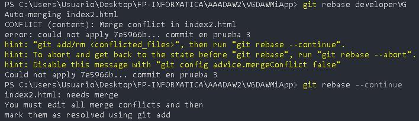
**Rebase Interactivo:**
```bash
git rebase -i HEAD~3

# Se abre un editor con:
pick a1b2c3d Commit 1
pick b2c3d4e Commit 2
pick c3d4e5f Commit 3

# Opciones disponibles:
# pick   = usar commit
# reword = usar commit pero editar mensaje
# edit   = usar commit pero pausar para modificar
# squash = fusionar con commit anterior
# fixup  = como squash pero descartar mensaje
# drop   = eliminar commit
```

**Cuándo usar:**
- Para mantener un historial limpio y lineal
- Antes de hacer merge de tu feature
- Para limpiar commits locales antes de push

** NUNCA se ha de hacer rebase de commits públicos** (ya pusheados y compartidos)

**Merge vs Rebase:**

| Aspecto | Merge | Rebase |
|---------|-------|--------|
| Historial | Preserva todo | Reescribe |
| Conflictos | Una sola vez | Posible por commit |
| Claridad | Muestra bifurcaciones | Lineal y limpio |
| Seguridad | Más seguro | Peligroso si es público |
| Uso | Features públicas | Limpieza local |

---

- `git cherry-pick`

Aplica cambios de commits específicos a la rama actual.

**Cómo funciona:**
```
master     A---B---C
              \
feature        D---E---F

# Quiero solo el commit E en master
git checkout master
git cherry-pick <hash-de-E>

master     A---B---C---E'
              \
feature        D---E---F
```


```bash
# Aplicar un commit específico
git cherry-pick a1b2c3d

# Aplicar múltiples commits
git cherry-pick a1b2c3d b2c3d4e c3d4e5f

# Aplicar rango de commits
git cherry-pick master~3..master~1

# Cherry-pick sin hacer commit automáticamente
git cherry-pick -n a1b2c3d

# Continuar después de resolver conflictos
git cherry-pick --continue

# Abortar
git cherry-pick --abort
```

**Cuándo usar:**
- Aplicar un hotfix a múltiples ramas
- Recuperar un commit de una rama eliminada
- Copiar commits específicos sin todo el historial

**Ejemplo práctico:**
```bash
# Hay un bugfix en develop que necesitas en master
git log develop --oneline
# a1b2c3d Fix: Corregir error crítico

git checkout master
git cherry-pick a1b2c3d
```

---

#### Comandos de Historial

- `git revert`

Crea un **nuevo commit** que deshace los cambios de un commit anterior, **sin reescribir historial**.

**Cómo funciona:**
```
Antes:
A---B---C (master)
        ↑
     mal commit

Después de: git revert C
A---B---C---C' (master)
            ↑
        deshace C
```


```bash
# Revertir último commit
git revert HEAD

# Revertir commit específico
git revert a1b2c3d

# Revertir múltiples commits
git revert HEAD~3..HEAD

# Revertir sin hacer commit inmediato
git revert -n a1b2c3d

# Revertir un merge commit
git revert -m 1 a1b2c3d  # -m 1 indica que quieres mantener la rama principal
```

**Cuándo usar:**
- Para deshacer cambios en historial público
- Cuando necesitas registro de la reversión
- Es la forma **segura** de deshacer en ramas compartidas

---

- `git reset`

Mueve el puntero HEAD y opcionalmente modifica staging area y working directory.

** Cuidado !!**: Se pueden perder cambios permanentemente.

**Tres modos:**

* 1. **Soft**: Solo mueve HEAD
```bash
git reset --soft HEAD~1

# Efecto:
# - Commits deshechos
# - Cambios quedan en staging
# - Working directory sin cambios
```

* 2. **Mixed** (por defecto): Mueve HEAD y unstage
```bash
git reset HEAD~1
# o
git reset --mixed HEAD~1

# Efecto:
# - Commits deshechos
# - Cambios quedan en working directory (sin staging)
# - Archivos modificados pero no staged
```

* 3. **Hard**: Elimina todo
```bash
git reset --hard HEAD~1

# Efecto:
# - Commits deshechos
# - Staging limpio
# - Working directory restaurado
# - ¡CAMBIOS PERDIDOS!
```

**Diagrama comparativo:**
```
Estado inicial:
A---B---C (HEAD, master)

git reset --soft HEAD~1:
A---B (HEAD, master)
Cambios de C en staging

git reset --mixed HEAD~1:
A---B (HEAD, master)
Cambios de C sin staging

git reset --hard HEAD~1:
A---B (HEAD, master)
Cambios de C eliminados
```

**Casos de uso:**

```bash
# Deshacer último commit pero mantener cambios
git reset --soft HEAD~1

# Unstage archivos (quitar de staging)
git reset archivo.js
# o todos:
git reset

# Deshacer cambios locales (¡PELIGROSO!)
git reset --hard HEAD

# Volver a un commit específico
git reset --hard a1b2c3d

# Deshacer un push accidental (si nadie ha pulleado)
git reset --hard HEAD~1
git push --force  
```

**Recuperar después de reset hard:**
```bash
# Git guarda referencias por ~30 días
git reflog

# Verás algo como:
# a1b2c3d HEAD@{0}: reset: moving to HEAD~1
# b2c3d4e HEAD@{1}: commit: Mi commit perdido

# Recuperar:
git reset --hard b2c3d4e
```

---

- `git tag`

Marca puntos específicos en el historial como importantes (releases, versiones).

**Tipos de tags:**

#### 1. **Lightweight tag** (simple referencia)
```bash
git tag v1.0.0
```

#### 2. **Annotated tag** (recomendado, con metadata)
```bash
git tag -a v1.0.0 -m "Versión 1.0.0 - Release inicial"
```

**Comandos comunes:**

```bash
# Listar tags
git tag
git tag -l "v1.*"  # filtrar

# Ver información de un tag
git show v1.0.0

# Crear tag en commit específico
git tag -a v1.0.0 a1b2c3d -m "Mensaje"

# Eliminar tag local
git tag -d v1.0.0

# Eliminar tag remoto
git push origin --delete v1.0.0

# Pushear tags al remoto
git push origin v1.0.0       # un tag específico
git push origin --tags       # todos los tags

# Checkout a un tag
git checkout v1.0.0  # entra en "detached HEAD state"
```  
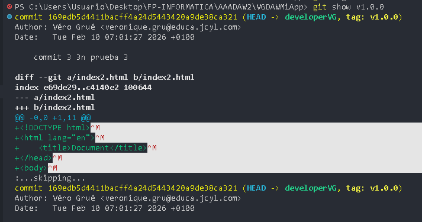
**Convención de nombres (Semantic Versioning):**
```
v1.2.3
│ │ │
│ │ └─ PATCH: Bug fixes
│ └─── MINOR: Nuevas features (compatible)
└───── MAJOR: Cambios incompatibles
```

**Cuándo usar:**
- Marcar releases (v1.0.0, v2.1.5)
- Puntos importantes del desarrollo
- Para poder volver a versiones específicas

**Ejemplo práctico:**
```bash
# Acabas de terminar la versión 1.0.0
git tag -a v2.0.0 -m "Release 2.0.0 - Primera versión estable"
git push origin v2.0.0

# Luego puedes hacer:
git checkout v2.0.0  # volver a esa versión
```  
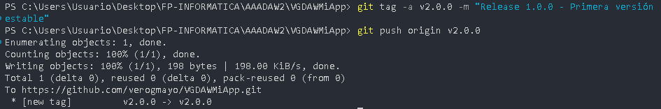
---

#### Comandos de Sincronización

- `git push`

Envía commits locales al repositorio remoto.

**Sintaxis básica:**
```bash
# Push a la rama actual
git push

# Push especificando remoto y rama
git push origin master

# Primera vez que pusheas una rama
git push -u origin feature-nueva
# -u establece tracking (luego solo necesitas: git push)
```

**Opciones importantes:**

```bash
# Forzar push (PELIGROSO - reescribe historial remoto)
git push --force
# o más seguro:
git push --force-with-lease  # solo fuerza si nadie más ha pusheado

# Pushear todos los tags
git push --tags

# Pushear y establecer upstream
git push -u origin master

# Eliminar rama remota
git push origin --delete nombre-rama

# Push de todas las ramas
git push --all
```

**Situaciones comunes:**

```bash
# Error: Updates were rejected
# Causa: El remoto tiene commits que tú no tienes
# Solución:
git pull --rebase  # o git pull
git push

# Error: No tienes permisos
# Solución: Verifica tus credenciales o token

# Primera vez en nuevo repo
git remote add origin https://github.com/usuario/repositorio.git
git push -u origin master
```

---

- `git fetch`

Descarga cambios del remoto **sin fusionarlos** (más seguro que pull).

**Sintaxis:**
```bash
# Fetch de todos los remotos
git fetch

# Fetch de un remoto específico
git fetch origin

# Fetch de una rama específica
git fetch origin master

# Fetch y eliminar referencias a ramas remotas eliminadas
git fetch --prune
```

**Qué hace:**
```
Remoto:  A---B---C---D (origin/master)
Local:   A---B---C (master)

Después de: git fetch
Remoto:  A---B---C---D (origin/master)
Local:   A---B---C (master)
         origin/master apunta a D (actualizado)
```

**Cuándo usar:**
- Para ver qué hay nuevo sin afectar tu trabajo
- Antes de hacer merge manual
- Para revisar cambios antes de integrarlos

**Workflow recomendado:**
```bash
# 1. Ver qué hay nuevo
git fetch origin

# 2. Comparar con tu rama
git log master..origin/master  # ver commits que no tienes
git diff master origin/master  # ver diferencias

# 3. Decidir qué hacer
git merge origin/master   # fusionar
# o
git rebase origin/master  # rebase
```

---

- `git pull`

Descarga cambios del remoto **y los fusiona** (fetch + merge).

**Sintaxis:**
```bash
# Pull con merge (por defecto)
git pull

# Pull con rebase (recomendado para historial limpio)
git pull --rebase

# Pull de remoto y rama específicos
git pull origin master
```

**Qué hace:**
```bash
git pull
# equivale a:
git fetch
git merge origin/master

git pull --rebase
# equivale a:
git fetch
git rebase origin/master
```

**Configurar pull por defecto:**
```bash
# Configurar para siempre usar rebase
git config --global pull.rebase true

# O solo para este repositorio
git config pull.rebase true
```

**Resolver conflictos en pull:**
```bash
git pull origin master
# CONFLICT (content): Merge conflict in archivo.js

# Editar archivos, resolver conflictos
git add archivo.js

# Si fue pull normal:
git commit

# Si fue pull --rebase:
git rebase --continue
```

---

- `git clone`

Copia un repositorio completo a tu máquina local.

**Sintaxis:**
```bash
# Clonar repositorio
git clone https://github.com/usuario/repositorio.git

# Clonar en carpeta específica
git clone https://github.com/usuario/repo.git mi-carpeta

# Clonar solo una rama específica
git clone -b develop https://github.com/usuario/repo.git

# Clonar con profundidad limitada (más rápido)
git clone --depth 1 https://github.com/usuario/repo.git
```

**Qué incluye:**
- Todo el historial de commits
- Todas las ramas (como referencias remotas)
- La rama principal checked out
- Configuración de remoto (origin)

---

- `git remote`

Gestiona repositorios remotos.

**Comandos comunes:**
```bash
# Ver remotos configurados
git remote
git remote -v  # con URLs

# Añadir remoto
git remote add origin https://github.com/usuario/repo.git

# Cambiar URL de remoto
git remote set-url origin https://github.com/usuario/nuevo-repo.git

# Eliminar remoto
git remote remove origin

# Renombrar remoto
git remote rename origin upstream

# Ver información de remoto
git remote show origin
```

**Múltiples remotos:**
```bash
# Típico en forks
git remote add origin https://github.com/tu-usuario/repo.git
git remote add upstream https://github.com/usuario-original/repo.git

# Fetch de upstream
git fetch upstream

# Merge de upstream a tu master
git checkout master
git merge upstream/master
```

---

#### Comandos Avanzados

- `git stash`

Guarda cambios temporalmente sin hacer commit.

**Sintaxis:**
```bash
# Guardar cambios actuales
git stash

# Guardar con mensaje descriptivo
git stash save "WIP: trabajando en login"

# Incluir archivos untracked
git stash -u

# Incluir archivos ignorados también
git stash -a

# Listar stashes
git stash list
# stash@{0}: WIP on master: a1b2c3d mensaje
# stash@{1}: WIP on feature: b2c3d4e otro mensaje

# Aplicar último stash
git stash apply

# Aplicar y eliminar último stash
git stash pop

# Aplicar stash específico
git stash apply stash@{1}

# Eliminar stash
git stash drop stash@{0}

# Limpiar todos los stashes
git stash clear

# Ver contenido de un stash
git stash show -p stash@{0}
```

**Caso de uso:**
```bash
# Estás trabajando en una feature
# Te piden un hotfix urgente

git stash  # guardar trabajo actual
git checkout master
git checkout -b hotfix
# ... hacer el fix ...
git checkout feature
git stash pop  # recuperar trabajo
```

---

- `git diff`

Muestra diferencias entre commits, branches, archivos.

**Sintaxis:**
```bash
# Ver cambios no staged
git diff

# Ver cambios staged (listos para commit)
git diff --staged
# o
git diff --cached

# Comparar con un commit específico
git diff a1b2c3d

# Comparar dos commits
git diff a1b2c3d b2c3d4e

# Comparar ramas
git diff master feature

# Diferencias de un archivo específico
git diff archivo.js

# Mostrar solo nombres de archivos cambiados
git diff --name-only

# Estadísticas de cambios
git diff --stat
```

---

- `git reflog`

Historial de **todos** los movimientos de HEAD (útil para recuperar trabajo perdido).

**Sintaxis:**
```bash
# Ver reflog
git reflog

# Reflog con fechas
git reflog --relative-date

# Reflog de una rama específica
git reflog show master
```

**Recuperar trabajo perdido:**
```bash
# Hiciste git reset --hard accidentalmente
git reflog
# a1b2c3d HEAD@{0}: reset: moving to HEAD~1
# b2c3d4e HEAD@{1}: commit: Mi trabajo importante ← aquí está!

# Recuperar:
git reset --hard b2c3d4e
```

---


####  **Merge con "ola"**

* Primero se hace el merge de developerVG a master --no--ff
```bash
# Estar en master
git checkout master
```
```bash
# Traer los cambios remotos
git pull origin master
```
```bash
# Merge NO fast-forward
git merge developerVG --no-ff -m "Merge branch 'developerVG' into master"
```
```bash
# Subir a GitHub
git push origin master
```

* Segundo se hace el merge de master a devloperVG --ff

```bash
# Estar en developerVG
git checkout developerVG
```
```bash
# Traer cambios de master
git pull origin master
```
```bash
# Merge fast-forward
git merge master --ff
```
```bash
# Subir a GitHub
git push origin developerVG
```


## 3.2  **GitHub**

### Crear un repositorio
* Para crear un repositorio en gitHub se hace clic en el icono que está arriba a la derecha y se elije Repositories.


* Se hace clic en new, arriba a  la derecha


* Se indica un nombre para el repositorio y si no se necesita nada mas, se puede hacer clic en Creat Repository


## Generación de una clave ssh 

* Se abre el gitbash y se pega este texto
```bash
ssh-keygen -t ed25519 -C "veronique.gru@educa.jcyl.es"
```
y se siguen las instrucciones.
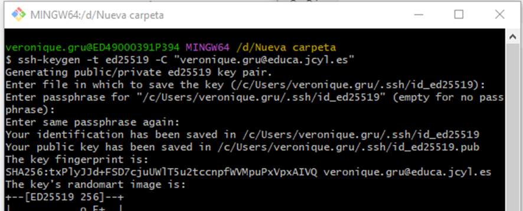  
Se aigna una contraseña para más seguridad, que hay que recordar porque sino no se podrá utilizar la clave.

* Se crean los archivos, la clave privada y la clave publica que habrá que guradar para poder utilizarlas.
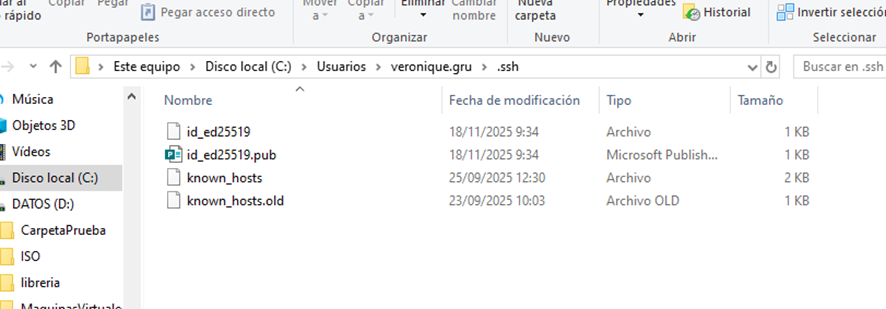  

* Se entra en los Settings de GitHub.  
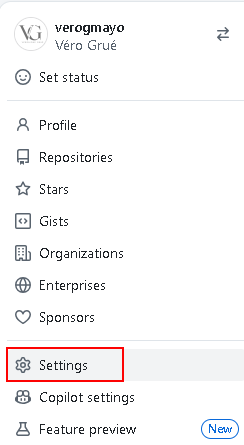  

* Y se entra en SSH and GPG keys en en menu de la izquierda  
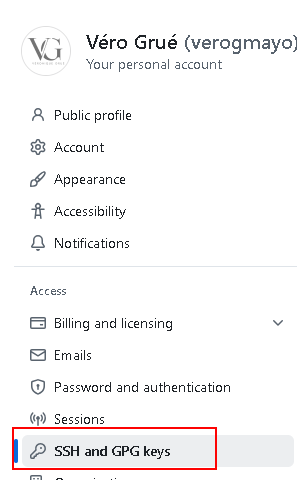  

* Se crea una nueva ssh key haciendo clic en new ssh Key  
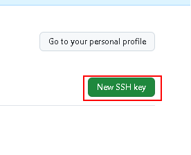  

* Se  le da un nombre se elige el tipo de key y se copia la clave publica en el recuadro 
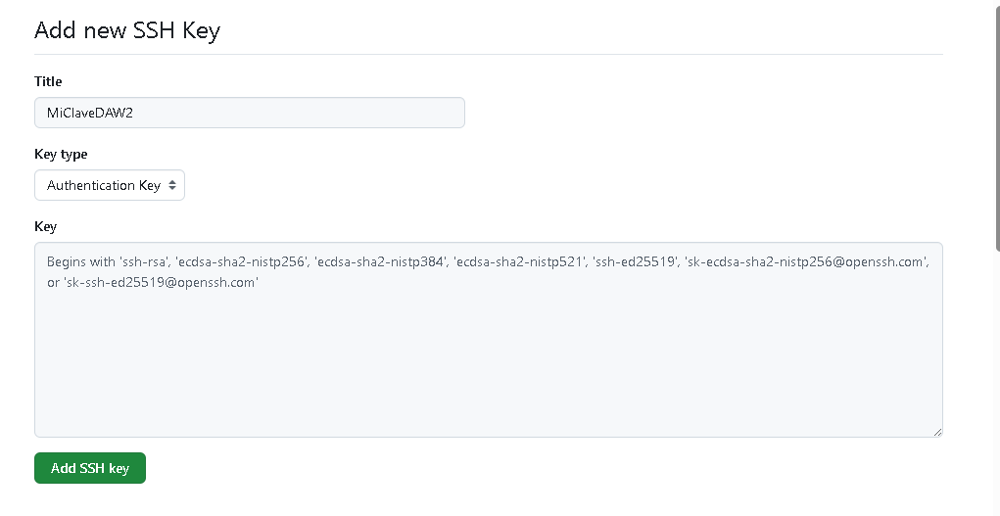  

* Y se ve la clave publica agregada. 
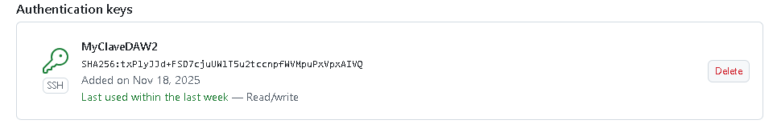  

