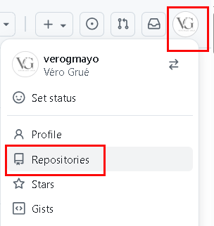
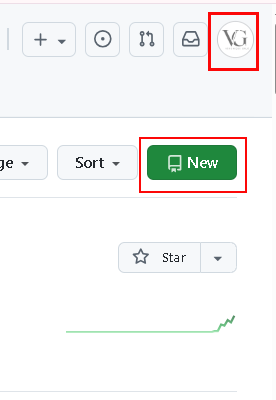
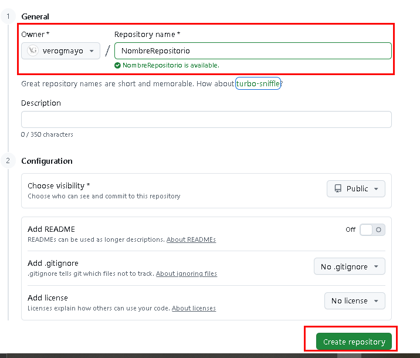

# CFGS Desarrollo de Aplicaciones Web

- [CFGS Desarrollo de Aplicaciones Web](#cfgs-desarrollo-de-aplicaciones-web)
  - [3-Git-y-GitHub](#3-git-y-github)
    - [3.1 **Git**](#31-git)
      - [**Descarga e Instalación**](#descarga-e-instalación)
        - [1. Descargar Git](#1-descargar-git)
        - [2. Instalar Git](#2-instalar-git)
        - [3. Verificar la instalación](#3-verificar-la-instalación)
      - [**Inicialización y Configuración**](#inicialización-y-configuración)
        - [1. Inicialización](#1-inicialización)
        - [2. Nombre y email](#2-nombre-y-email)
        - [3. Configurar el editor de texto (opcional)](#3-configurar-el-editor-de-texto-opcional)
        - [4. Verificar la configuración](#4-verificar-la-configuración)
        - [5. Merge con "ola"](#5-merge-con-ola)
  - [3.2  **GitHub**](#32--github)
    - [Crear un repositorio](#crear-un-repositorio)

## 3-Git-y-GitHub

### 3.1 **Git**
    Git es un sistema de control de versiones distribuido gratuito y de código abierto que se utiliza para rastrear los cambios en el código fuente durante el desarrollo de las aplicaciones.
#### **Descarga e Instalación**
 
##### 1. Descargar Git

1. Se accede al sitio oficial de Git:
    [https://git-scm.com/downloads](https://git-scm.com/downloads)
2. Se hace clic en **Windows**.
   Se descarga la versión acorde con su equipo. Existe una versión de escritorio y una portable.
    Al pinchar en el enlace de la versión, que se quiera, la descarga comenzará automaticamente.

---

##### 2. Instalar Git

1. Se ejecuta el instalador descargado.
2. Se acepta los términos de licencia y se siguen los pasos recomendados:
    * **Se elije la carpeta de instalación :** se puede dejar la que viene por defecto.
    * **Select Components:** se puede dejar las opciones por defecto.
    * **Start Menu Folder:** se puede dejar lo que viene por defecto.
    * **Editor por defecto:** se selecciona el editor de texto que se prefiera.
    * **Name of the initial branch:** se puede dejar la que viene por defecto o poner el nombre que se quiera.Es la rama que se creara por defecto al iniciar una repositorio nuevo.
    * **PATH environment:** se recomienda seleccionar :
     `Git from the command line and also from 3rd-party software`.
    * **SSH executable:** se puede dejar la que viene por defecto(bundle ssh) para poder utilizar openSSH. .
    * **HTTPS transport backend:** se puede dejar la que viene por defecto para poder utilizar la libreria de windows .
    * El resto de opciones puedes dejarlas por defecto.
3. Se empieza con la instalación haciendo clic en **Instalar**.
4. Finaliza la instalación haciendo clic en **Finish**.

---

##### 3. Verificar la instalación

 Se abre **Símbolo del sistema (CMD)**, **PowerShell**, **GitBash** o la **terminal de VS Code** y se ejecuta:

```bash
git --version
```

Deberías ver algo como:
```
git version 2.47.1.windows.1
```

---
#### **Inicialización y Configuración**

##### 1. Inicialización 
Se abre el editor de texto dentro de la carpeta del proyecto y se inicializa git.
```bash
git init
```

Tambien se puede clonar de un repositorio de github
  ```bash
  git clone <URL>
  ```
##### 2. Nombre y email 
Se debe de configurar git con un nombre y un correo
Estos datos se asocian a los *commits*:

```bash
git config --global user.name "Nombre"
git config --global user.email "email@ejemplo.com"
```


---

##### 3. Configurar el editor de texto (opcional) 


```bash
git config --global core.editor "editorDeTexto"
```

---
##### 4. Verificar la configuración 

```bash
git config --list
```
---


##### 5. Merge con "ola"

* Primero se hace el merge de developerVG a master --no--ff
 ```bash
# Estar en master
git checkout master

# Traer los cambios remotos
git pull origin master

# Merge NO fast-forward
git merge developerVG --no-ff -m "Merge branch 'developerVG' into master"

# Subir a GitHub
git push origin master
```

* Segundo se hace el merge de master a devloperVG --ff

 ```bash
# Estar en developerVG
git checkout developerVG

# Traer cambios de master
git pull origin master

# Merge fast-forward
git merge master --ff

# Subir a GitHub
git push origin developerVG
```

## 3.2  **GitHub**

### Crear un repositorio
* Para crear un repositorio en gitHub se hace clic en el icono que está arriba a la derecha y se elije Repositories.



* Se hace clic en new, arriba a  la derecha



* Se indica un nombre para el repositorio y si no se necesita nada mas, se puede hacer clic en Creat Repository

