# CFGS Desarrollo de Aplicaciones Web


- [CFGS Desarrollo de Aplicaciones Web](#cfgs-desarrollo-de-aplicaciones-web)
  - [1. Entorno de Desarrollo](#1-entorno-de-desarrollo)
    - [1.1 Ubuntu Server 24.04.3 LTS](#11-ubuntu-server-24043-lts)
      - [1.1.1 **Configuración inicial**](#111-configuración-inicial)
        - [Nombre y configuraicón de red](#nombre-y-configuraicón-de-red)
        - [**Actualizar el sistema**](#actualizar-el-sistema)
        - [**Configuración fecha y hora**](#configuración-fecha-y-hora)
        - [**Cuentas administradoras**](#cuentas-administradoras)
        - [**Habilitar cortafuegos**](#habilitar-cortafuegos)
        - [**Comprobar conexión**](#comprobar-conexión)
      - [1.1.2 Instalación del servidor web](#112-instalación-del-servidor-web)
        - [Instalación](#instalación)
        - [Verficación del servicio](#verficación-del-servicio)
        - [Virtual Hosts](#virtual-hosts)
        - [Permisos y usuarios](#permisos-y-usuarios)
        - [HTTPS](#HTTPS)
      - [1.1.3 Ejecución PHP con PHP-FPM](#113-ejecución-php-con-php-fpm)
        - [**Instalación**](#instalación-1)
        - [Ficheros de configuración de PHP para php-fpm:](#ficheros-de-configuración-de-php-para-php-fpm)
        - [**Configuración de Apache2 con PHP-FPM**](#configuración-de-apache2-con-php-fpm)
        - [**Comprobación de funcionamiento PHP-FPM**](#comprobación-de-funcionamiento-php-fpm)
      - [1.1.4 MariaDB](#114-mariadb)
      - [1.1.5 XDebug](#115-xdebug)
      - [1.1.6 DNS](#116-dns)
      - [1.1.7 SFTP](#117-sftp)
      - [1.1.8 Apache Tomcat](#118-apache-tomcat)
      - [1.1.9 LDAP](#119-ldap)
    - [1.2 Windows 11](#12-windows-11)
      - [1.2.1 **Configuración inicial**](#121-configuración-inicial)
        - [**Nombre y configuración de red**](#nombre-y-configuración-de-red)
        - [**Cuentas administradoras**](#cuentas-administradoras-1)
      - [1.2.2 **Navegadores**](#122-navegadores)
      - [1.2.3 **MobaXterm**](#123-mobaxterm)
      - [1.2.4 **Netbeans**](#124-netbeans)
      - [1.2.5 **Visual Studio Code**](#125-visual-studio-code)
  - [2. GitHub](#2-github)
  - [3.Entorno de Explotación](#3entorno-de-explotación)

|  DAW/DWES Tema2 |
|:-----------:|
||
| INSTALACIÓN, CONFIGURACIÓN Y DOCUMENTACIÓN DE ENTORNO DE DESARROLLO Y DEL ENTORNO DE EXPLOTACIÓN |

## 1. Entorno de Desarrollo

### 1.1 Ubuntu Server 24.04.3 LTS

Este documento es una guía detallada del proceso de instalación y configuración de un servidor de aplicaciones en Ubuntu Server utilizando Apache, con soporte PHP y MySQL

#### 1.1.1 **Configuración inicial**

##### Nombre y configuraicón de red
Descargar la iso de Ubuntu Server en la página (Server install image) : https://releases.ubuntu.com/noble/

> **Nombre de la máquina**: daw-used\
> **Memoria RAM**: 2G\
> **Particiones**: 150G(/) y resto (/var)\
> **Configuración de red interface**: xxxx \
> **Dirección IP** :xx.xx.xx.xx/22\
> **GW**: xx.xx.xx.xx/22\
> **DNS**: xx.xx.xx.xx

Para saber que sistema operativo se tiene.
```bash
uname -a
```

* Para cambiar el nombre de la maquina si fuera necesario. 
  Primero se mira el nombre actual.
```bash
sudo hostnamectl
```
 Se cambia
 ```bash
sudo hostnamectl set-hostname nombreMaquina
```
Despues hay que cambiarlo en /etc/hosts
```bash
sudo nano /etc/hosts
```
Para que cambie, en el prompt, hay que cerrar sessión.
```bash
exit
```

* Para ver Interfaces de red y sus direcciones IP:
```bash
ip a
```
* Para ver la tabla de enrutamiento.
```bash
ip r
```

* Para comprobar las particiones: 
  vista jerárquica (disco → particiones → puntos de montaje)
```bash
lsblk
```
o 
```bash
df -h
```
o una vista completa del sistema de archivos + permisos.
```bash
lsblk -fm
```
o mostrar todos los dispositivos, incluso los vacíos o no usados
```bash
lsblk -a
```
o mostrar solo los nombres, sin formato visual
```bash
lsblk -fn
```
o listar particiones con detalles del disco físico
```bash
fdisk -l
```


Editar el fichero de configuración del interface de red  **/etc/netplan**,
* Para configurar la red de interface:
  Se hace una copia de seguridad del archivo de configuración que se encuentra en /etc/netplan. 
```bash
sudo cp 50-cloud-init.yaml 50-cloud-init.yaml.backup
```
* Para cambiar el nombre del archivo
```bash
sudo mv 50-cloud-init.yaml enp0s3.yaml
```

```bash

# This is the network config written by 'subiquity'
network:
  ethernets:
    enp0s3:
      addresses:
       - 10.199.10.49/22
      nameservers:
         addresses:
         - 10.151.123.21
         - 10.151.126.21
      routes:
          - to: default
             via: 10.199.8.1
         search: [educa.jcyl.es]
  version: 2
````
* Para aplicar la configuración
```bash
sudo netplan apply
```

##### **Actualizar el sistema**

```bash
sudo apt update
sudo apt upgrade
```

##### **Configuración fecha y hora**

[Establecer fecha, hora y zona horaria](https://somebooks.es/establecer-la-fecha-hora-y-zona-horaria-en-la-terminal-de-ubuntu-20-04-lts/ "Cambiar fecha y hora")
* para ver la hora del servidor
```bash
date
```

* Si hubiera que cambiar la hora del servidor, se haría así
```bash
timedatectl set-timezone Europe/Madrid
```
##### **Cuentas administradoras**

> - [X] root(inicio)
> - [X] miadmin/paso
> - [X] miadmin2/paso

* Creación del usuario miadmin2 perteneciente al grupo sudo
```bash
sudo useradd miadmin2
sudo usermod -aG sudo miadmin2
```
* Pra crear un usuario que pertenezca a varios grupos
```bash
sudo useradd -m -G sudo,adm,cdrom,dip,plugdev,lxd -s/bin/bash nombreUsuario
```
* Para ver en que grupo está miadmin2
```bash
cat /etc/group | grep miadmin
```
* Para quitar o poner permisos
```bash
cat /etc/passwd | grep miadmin
```
* Para saber la carpeta shell de un usuario, por ejemplo miadmin.
```bash
cat /etc/passwd | grep miadmin
```
* Para crear una usuario con una shell concreta
```bash
sudo usermod -s /bin/bash miadmin
```
##### **Habilitar cortafuegos**

como activar cortafuegos
```bash
sudo ufw enable
```

* Para desactivar el cortafuego
```bash
sudo ufw disable
```

* Para activar el puerto 22
```bash
sudo ufw allow 22
```
* Para borrar puertos 
  primero hay que saber cual es el numero de proceso de puerto
```bash
sudo ufw status numbered
```
  y borrar el puerto
```bash
sudo ufw delete numdeproceso
```
* Para ver el status de cortafuergos
```bash
sudo ufw status
```

##### **Comprobar conexión**
* Se hace ping del anfitrion al servidor. En el cmd del anfitrion.
```bash
ping [IP servidor]
```

* Para conectarse al servidor desde el anfitrion
```bash
ssh usuario@ipServidor
```

* Para apagar el servidor desde el anfitrion una vez dentro.(0 es el tiempo de espera para apagar)
```bash
sudo shutdown -t 0
```
#### 1.1.2 Instalación del servidor web

##### Instalación
* Actualizar
```bash
sudo apt update
```
* Instalar las versiones más recientes de los programas.
```bash
sudo apt upgrade -y
```
* Instalar Apache2
```bash
sudo apt install apache2 -y
```

* Verificar el estado del servicio
```bash
sudo systemctl status apache2
```
* Se abre el puerto 80
```bash
sudo ufw allow 80
```
* Se borra el puerto 80 v6
```bash
sudo ufw status numbered
```
```bash
sudo ufw delete numeroproceso
```

* Se crea un directorio de errores. Y hay que indicarlo en el 000-default
ErrorLog /var/www/html/error/error.log

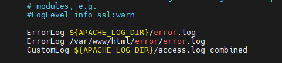

* Modificar apache2.conf para .htaccess
```bash
sudo nano /etc/apache2/apache2.conf
```
Buscar la sección 
<Directory /var/www/>
    Options Indexes FollowSymLinks
    AllowOverride None
    Require all granted
</Directory>

Y cambiar a 
<Directory /var/www/>
    Options Indexes FollowSymLinks
    AllowOverride All
    Require all granted
</Directory>

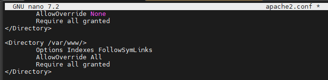

* Crear el archivo .htaccess
```bash
sudo touch /var/www/html/.htaccess

```
* Hacer restart de apache
```bash
sudo systemctl restart apache2
```

##### Verficación del servicio
* Comprobar si se puede ver el index de Apache2
```bash
sudo nano /var/www/html/index.html
```
En el navegador se puede con la URL:http//IPServidor/index.html

##### Virtual Hosts
##### Permisos y usuarios


* Creación del usuario operador web.
    -M → No crear el directorio home (el home será /var/www/html, pero no lo crea).

-d /var/www/html → Establece /var/www/html como directorio home del usuario.

-N → No crea un grupo con el mismo nombre que el usuario.

-g www-data → Asigna el grupo primario www-data.

-s /bin/bash → Asigna la shell Bash.
```bash
sudo useradd -M -d /var/www/html -N -g www-data -s /bin/bash operadorweb
```
Información de los usuarios
```bash
id operadorweb
```
o
```bash
cat /etc/passwd | grep operador
```

Para cambiar de contraseña
```bash
sudo passwd operadorweb
```

Para cambiar el grupo del propietario (www-data (para web))
```bash
sudo chown -R operadorweb:www-data /var/www/html
```
Para borrar un usuario de un grupo
```bash
sudo gpasswd -d nombreusuario nombregrupo
```
Para cambiar permisos
```bash
sudo chmod -R 775 /var/www/html
```
* Para borrar un usuario
```bash
sudo deluser nombreusuario
```

##### HTTPS
Creación de los certificados SSL en apache.

Se actualiza el servidor
```bash
sudo apt update
```
```bash
sudo apt upgrade
```
Habilitar el modulo ssl por si no estuviera habilitado
```bash
sudo a2enmod ssl
```
Se crea el certificado SSL(Se pueden cambiar el nombre de los ficheros)
```bash
sudo openssl req -x509 -nodes -days 365 -newkey rsa:2048 -keyout /etc/ssl/private/apache-vg-used.key -out /etc/ssl/certs/vg-used.crt
```

Hay que rellenar la infomracion solicitada

```bash
Country Name (2 letter code) [AU]:ES
State or Province Name (full name) [Some-State]:ZAMORA
Locality Name (eg, city) []:BENAVENTE
Organization Name (eg, company) [Internet Widgits Pty Ltd]:IES LOS SAUCES
Organizational Unit Name (eg, section) []:INFORMATICA
Common Name (e.g. server FQDN or YOUR name) []:vg-used
Email Address []:veronique.gru@educa.jcyl.es
```

Se reinicia apache2
```bash
sudo systemctl restart apache2 
```

Se entra en la carpeta /etc/apache2/sites-available/
```bash
cd /etc/apache2/sites-available/
ls
```
Se hace una copia del archivo default-ssl.conf
```bash
sudo cp default-ssl.conf vg-used.conf
ls
```
Se entra en vg-used.conf
```bash
sudo nano vg-used.conf
```
Se modifican los nombres de los archivos, en el archivo vg-used.conf, del certificado ssl(se indican los que se pusieron al crear el certificado ).
```bash
 #   SSLCertificateFile directive is needed.
        SSLCertificateFile      /etc/ssl/certs/vg-used.crt
        SSLCertificateKeyFile   /etc/ssl/private/apache-vg-used.key
 #   Server Certificate Chain:
ls
```

```bash
sudo a2ensite vg-used.conf
```
 Se reinicia el servicio apache
```bash
sudo systemctl restart apache2
```
 Se habilita el puerto 443
 ```bash
sudo ufw allow 443
ls
```

Se borra el puerto 443 v6
```bash
sudo ufw status numbered
```
```bash
sudo ufw delete numeroproceso
```

#### 1.1.3 Ejecución PHP con PHP-FPM

FPM (FastCGI Process Manager) es un servidor de aplicaciones PHP que se encarga de interpretar código PHP.

**Instalación**
----

```bash
sudo apt install php8.3-fpm php8.3
```

Ficheros de configuración de PHP para php-fpm:
---


* **/etc/php/8.3/fpm/conf.d**: Módulos instalados en esta configuración de php (enlaces simbólicos a /etc/php/8.3/mods-available)
*  **/etc/php/8.3/fpm/php-fpm.conf** : Configuración general de php-fpm
*  **/etc/php/8.3/fpm/php.ini** : Configuraicón de php para este escenario
*  **/etc/php/8.3/fpm/pool.d** : Directorio con distintos pool de configuración. Cada aplicación puede tener una configuración distinta (procesos distintos) de php-fpm.
  
Por defecto tenemos un pool cuya configuración la encontramos en **/etc/php/8.3/fpm/pool.d/ www.conf**, en este fichero podemos configurar parámetros, los más importantes son:

* **[www]**: -es el nombre del pool, si tenemos varios, cada uno tiene que tener un nombre.
* ** user y group** : Usuario y grupo con el que va a ejecutar los procesos
* **listen**: Se indica el socket unix o el socket TCP donde se van a escuchar los procesos:
  * Por defecto, escucha por un socket unix: listen=/run/php/php8.3-fpm.sock
  * Si queremos que escuche por TCO; listen=127.0.0.1:9000
* Directivas de procesamiento, gestión de procesos:
  * **pm**: Por defecto es igual a dynamic (el número de procesos se crean y se destruyen de forma dinámica). Otros valores: static o ondemand.
  * Otras directivas: **pm.max_children** (número máxio de procesos hijo que pueden ser creados al mismo tiempo para manejar solicitudes), **pm.start_servers** (cuantos procesos PHP-FPM se lanzararón al inicio de forma automática),**pm.min_spare_servers**( número mínimo de procesos del servidor inactivos para manejar nuevas solicitudes),...
  * **pm.status_path=/status**: No es necesario, vamos a activar la URL de status para comprobar el estado del proceso.

Reiniciar el servicio:
```bash
sudo systemctl restart php8.3-fpm
```

**Configuración de Apache2 con PHP-FPM**
---

Apache2 va a funcionar como proxy inverso(reverse proxy) para las peticiones de los recursos php. cuando solicitamos un fichero php, apache2 le pasará la petición a php-fpm para que interprete el php y luego devuelva la respuesta al servidor web.

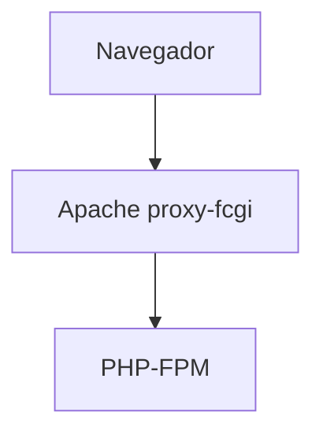

```bash
sudo a2enmod proxy_fcgi setenvif
```

**Activarlo para cada virtualhost**

Un **socket** es un "canal de comunicación* entre dos procesos, en nuestro caso es entre el programa Apache con PHP-FPM.

Se pueden usar dos tipos de SOCKET:

* Si php-fpm está escuchando en un SOCKET TCP

Usa una dirección IP y un puerto para comunicarse, por lo tanto usa el protocolo TCP/IP (comunicación en red) y puede conectarse desde otra máquina si el puerto está abierto.
  
```bash
  ProxyPassMatch ^/(.*\.php)$ fcgi://127.0.0.1:9000/var/www/html/$1
```

- La directiva `ProxyPassMatch`Indica a Apache que use un sistema proxy con una expresión regular para indicar qué peticiones redirigir.

- `^/(.*\.php)` Es la expresión regular que cpatura cualquier URL que termina en .php y el contenido del parentesis se guarda en $1. Por ejemplo: /index.php, /blog/post.php,etc
-  `fcgi://127.0.0.1:9000/var/www/html/$1` define el destino FastCGI donde enviará las peticiones:
   -  fcgi:// usa el protocolo FastCGI
   -  127.0.0.1:9000 dirección y puerto donde PHP-FPM está escuchando
   -  /var/www/html/$1 ruta real del archivo PHP en el servidor (Apache sustituye $1 por el nombre del archivo)

* Si php-fpm está escuchando en un  SOCKET UNIX (local)
  
Existe un **archivo especial** en `/run/php/php8.3-fpm.sock`que actua como punto de comunicación dentro de la propia máquina en sistemas UNIX/Linux y no usa puertos ni direcciones IP.
 
 Se pone esta expresion en el archivo /etc/apache2/sites-available/000-default.conf
```bash
  ProxyPassMatch ^/(.*\.php)$ unix:/run/php/php8.3-fpm.sock|fcgi://127.0.0.1/var/www/html
```
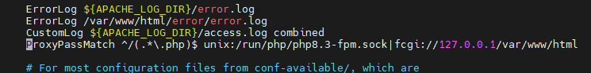

Otra forma de hacerlo:

* Si php-fpm está escuchando en un socket TCP
  La directiva `SetHandler` indica qué manejador debe usarse para procesar las solicitudes de ciertos archivos.
  En este caso los archivos PHP, los envía al proxy FastCGI
  
```bash
<FilesMatch "\.php$">
  	SetHandler "proxy:fcgi://127.0.0.1:9000"
  </FilesMatch>
```

* Si php-fpm está escuchado en un socket UNIX

```bash
  <FilesMatch "\.php$">
 	  SetHandler "proxy:unix:/run/php/php8.2-fpm.sock|fcgi://127.0.0.1/"
  </FilesMatch>
```

**Activarlo para todos los virtualhost**
El fichero de configuraicón `php8.3-fpm`en el directorio `/etc/apache2/conf-available`, por defecto funciona cuando php-fpm está escuchando en un socket UNIX:

```bash
<FilesMatch ".+\.ph(?:ar|p|tml)$">
    SetHandler "proxy:unix:/run/php/php8.3-fpm.sock|fcgi://localhost"
</FilesMatch>
```

`<FilesMatch ".+\.ph(?:ar|p|tml)$"> ` Aplica esta configuración solo a archivos cuyo nombre coincida con esa expresión regular:

.+\.phar

.+\.php

.+\.phtml

Es decir: a cualquier archivo PHP o variantes (.phar, .php, .phtml).

`SetHandler "proxy:unix:/run/php/php8.3-fpm.sock|fcgi://localhost"`

Esta es la línea clave.

* `SetHandler`  define cómo Apache debe procesar esos archivos.

* `proxy` usa el módulo de Apache llamado mod_proxy.

* `unix:/run/php/php8.3-fpm.sock ` indica que la comunicación con PHP-FPM será a través de un socket UNIX local (no TCP).

* `|fcgi://localhost ` especifica el protocolo FastCGI, y que el destino lógico (nombre del backend) es “localhost”.
  
Por último activamos (o comprobar que esta activado):

```bash
sudo a2enconf php8.3-fpm
```

**Comprobación de funcionamiento PHP-FPM**
---

PHP-FPM puede escuchar por socket UNIX o TCP/IP (host:puerto). Revisar cada "pool" en Ubuntu en `/etc/php/8.3/fpm/pool.d/www.conf`

```bash
grep '^listen' /etc/php/8.3/fpm/pool.d/*.conf
```

Dos posibles resultados:

```bash
listen = /run/php/php8.3-fpm.sock

```

Esta escuchando en socket UNIX

```bash
listen = 127.0.0.1:9000
```

Está escuchando por TCP/IP en la dirección local

#### 1.1.4 MariaDB


# MariaDB

MariaDB es un sistema de gestión de bases de datos relacional (RDBMS), muy similar a MySQL, permitiendo almacenar, organizar y acceder a información mediante el lenguaje **SQL (Structured Query Language)**.  
Es una alternativa moderna y abierta a MySQL, muy usada en servidores web, aplicaciones empresariales y sistemas en la nube.


##### Instalación de MariaDB

En consola escribe los siguientes comandos:

```bash
sudo apt update
sudo apt install mariadb-server -y
````


##### Configurar Acceso Remoto en el fichero de configuración MariaDB(donde está definido el puerto: port=3306)

Esto permitirá conectarse a la base de datos MariaDB desde otros equipos.
Edita el fichero de configuración:

```bash
sudo nano /etc/mysql/mariadb.conf.d/50-server.cnf
```

Se localiza la línea:

```bash
bind-address = 127.0.0.1
```

Y y se cambia por:

```bash
bind-address = 0.0.0.0
```

Esto permite que MariaDB acepte conexiones desde cualquier IP.

Reinicia el servidor MariaDB:

```bash
sudo systemctl restart mariadb
```


##### Comandos útiles del servicio

| Acción                         | Comando                          | Descripción                                                  |
| ------------------------------ | -------------------------------- | ------------------------------------------------------------ |
| Iniciar el servicio            | `sudo systemctl start mariadb`   | Inicia el servidor MariaDB.                                  |
| Detener el servicio            | `sudo systemctl stop mariadb`    | Detiene el servidor MariaDB.                                 |
| Reiniciar el servicio          | `sudo systemctl restart mariadb` | Reinicia el servidor.                                        |
| Ver estado del servicio        | `sudo systemctl status mariadb`  | Muestra si el servidor está activo o inactivo.               |
| Habilitar inicio automático    | `sudo systemctl enable mariadb`  | Configura el servicio para iniciarse al arrancar el sistema. |
| Deshabilitar inicio automático | `sudo systemctl disable mariadb` | Evita que el servicio se inicie automáticamente.             |
| Ver versión instalada          | `mariadb --version`              | Muestra la versión actual de MariaDB instalada.              |


##### Comprobación del puerto usado por el servidor

MariaDB usa el puerto **tcp/3306** por defecto.
Si el puerto no está abierto, se abre :

 * Se abre el puerto 3306
```bash
sudo ufw allow 3306
```
* Se borra el puerto 3306 v6
```bash
sudo ufw status numbered
```
```bash
sudo ufw delete numeroproceso
```

###### Usando comandos del sistema

```bash
sudo ss -punta | grep mariadb
```

Ejemplo de salida:

```
tcp   LISTEN 0      80           0.0.0.0:3306       0.0.0.0:*     users:(("mariadbd",pid=874,fd=24))

```

Otros comando util: Listar los procesos en ejecución relacionados con MariaDB.

```bash
sudo ps -aux | grep mariadb
```
Ejemplo de salida:

```
mysql        874  0.0  5.2 1351180 105300 ?      Ssl  10:16   0:01 /usr/sbin/mariadbd
miadmin     5257  0.0  0.1   9728  2304 pts/0    S+   10:40   0:00 grep --color=auto mariadb

```

###### Ver con consola de MariaDB

Se entra al cliente:

```bash
sudo mariadb
```

Luego se ejecuta:

```sql
SHOW VARIABLES LIKE 'port';
```

Resultado esperado:

| Variable_name | Value |
| ------------- | ----- |
| port          | 3306  |


##### Creación de un usuario administrador con contraseña

En sistemas Ubuntu con MariaDB 10.3, el usuario **root** se autentica mediante el complemento **unix_socket** por defecto, en lugar de una contraseña.
Esto ofrece mayor seguridad, pero puede complicar el acceso desde programas externos (p. ej., phpMyAdmin).

> **No se recomienda modificar la cuenta root.**
> En su lugar, crea una cuenta administrativa independiente para autenticación con contraseña.

Se abre el cliente de MariaDB:

```bash
sudo mariadb
```

Luego se crea un nuevo usuario con privilegios de root:

```sql
CREATE USER 'adminsql'@'%' IDENTIFIED BY 'paso';
GRANT ALL ON *.* TO 'adminsql'@'%' WITH GRANT OPTION;
```

O también se puede usar:

```sql
GRANT ALL ON *.* TO 'adminsql'@'%' IDENTIFIED BY 'paso' WITH GRANT OPTION;
```

 Se puede listar todos los usuarios y sus hosts:

```sql
SELECT User, Host FROM mysql.user;
```

Conectarse de forma remota con el nuevo usuario: (fuera del cliente MariaDB)

```bash
mariadb -u adminsql -p -h your_server_ip
```

---

##### Asegurar el servidor MariaDB

Se ejecuta el script de seguridad:

```bash
sudo mysql_secure_installation
```

Este asistente te permitirá:

* Configurar una contraseña fuerte para root.
* Eliminar usuarios anónimos.
* Deshabilitar el inicio de sesión remoto del root.
* Eliminar bases de datos de prueba.
* Recargar las tablas de privilegios.

###### Pasos del asistente

1. Pulsa **Enter** si no hay contraseña de root definida.
2. Define una **contraseña segura** para el usuario root.
3. Elimina el usuario anónimo (**Sí**).
4. Desactiva el acceso remoto del usuario root (**Sí**).
5. Elimina la base de datos de prueba (**Sí**).
6. Recarga los privilegios (**Sí**).

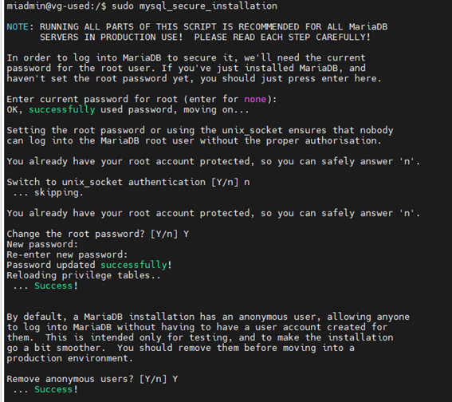


#### 1.6 Módulos PHP

##### a) `php8.3-mysql`

El módulo **php8.3-mysql** es la extensión que permite a PHP conectarse y comunicarse con servidores de bases de datos **MySQL** o **MariaDB**.  
Sin este módulo, PHP no puede ejecutar consultas SQL, ni leer ni escribir datos en su base de datos.

###### Instalación del módulo y reinicio del servicio PHP-FPM

```bash
sudo apt install php8.3-mysql
sudo systemctl restart php8.3-fpm
````

###### Comparativa de módulos

| Módulo          | Propósito                                                        | Estado actual          |
| --------------- | ---------------------------------------------------------------- | ---------------------- |
| `php-mysql`     | Módulo antiguo (mezclaba `mysql` y `mysqli`)                     | ❌ Obsoleto desde PHP 7 |
| `php-mysqli`    | Extensión mejorada orientada a MySQL/MariaDB                     | ✅ Activa y recomendada |
| `php-pdo-mysql` | Permite conexión vía PDO (interfaz orientada a objetos y segura) | ✅ Activa y recomendada |

###### Mostrar qué extensiones están instaladas

```bash
sudo php -m | grep mysql
```


##### b) `php8.3-intl`

La extensión **php8.3-intl** (Internationalization) está basada en la biblioteca **ICU (International Components for Unicode)**.
Permite que PHP muestre información adaptada a la región e idioma sin configuraciones manuales.

######Instalación

```bash
sudo apt install php8.3-intl
```

###### Funciones principales

| Funcionalidad                           | Descripción                                                              | Ejemplo                                                |
| --------------------------------------- | ------------------------------------------------------------------------ | ------------------------------------------------------ |
| **Formateo de fechas y horas**          | Muestra las fechas según idioma o país                                   | `27 de octubre de 2025 (es)` / `October 27, 2025 (en)` |
| **Formateo de números**                 | Usa separadores decimales y de miles según la región                     | `1.220,66 (es_ES)` / `1,220.66 (en_US)`                |
| **Monedas**                             | Formatea precios automáticamente según el país                           | `€ 1.200,50` / `$ 1,200.50`                            |
| **Traducción y comparación de cadenas** | Ordena y compara texto con reglas locales                                | Útil para ordenar palabras con acentos                 |
| **Normalización Unicode**               | Asegura que caracteres acentuados o especiales se comparen correctamente | Útil para búsquedas y validaciones                     |


#####  `XDebug`

**Xdebug** es una extensión de PHP diseñada para ayudar en la **depuración (debugging)** y el **análisis de rendimiento (profiling)** del código PHP.
Permite ver qué hace el programa internamente mientras se ejecuta, paso a paso, y medir su rendimiento.

###### Funciones principales

* 🐞 Depurador paso a paso (*step debugging*)

  * Permite pausar la ejecución del script en cualquier punto (*breakpoint*).
  * Permite inspeccionar variables, pilas de llamadas (*call stack*) y expresiones.
  * Se puede usar junto a IDEs como **VSCode**, **NetBeans**, **PhpStorm**, etc.
  * Comunicación mediante el protocolo **DBGp** (puerto 9003).

---

###### Verificar si está instalado

```bash
sudo php -v | grep xdebug
```

Si no aparece, se instala:

```bash
sudo apt install php8.3-xdebug
```

---

###### Configuración del módulo Xdebug

Se edita el archivo de configuración:

```bash
sudo nano /etc/php/8.3/fpm/conf.d/20-xdebug.ini
```

Agrega las siguientes líneas:

```ini
xdebug.mode=develop,debug
xdebug.start_with_request=yes
xdebug.client_host=127.0.0.1
xdebug.client_port=9003
xdebug.log=/tmp/xdebug.log
xdebug.log_level=7
xdebug.idekey="netbeans-xdebug"
xdebug.discover_client_host=1
```

SE guardan los cambios y se reinicia el servicio:

```bash
sudo systemctl restart apache2
# o si usas php-fpm
sudo systemctl restart php8.3-fpm
```

---

###### Permisos para los logs

```bash
sudo touch /tmp/xdebug.log
sudo chmod 666 /tmp/xdebug.log
sudo chown root:root /tmp/xdebug.log
```


#### 1.1.5 XDebug

##### Instalación y configuración

##### Verifica si Xdebug está instalado

```bash
sudo php -v | grep xdebug
```

##### Si no aparece, instalálo:
```bash
sudo apt install php8.3-xdebug
```

Luego se edita el fichero de configuración:

```bash
sudo nano /etc/php/8.3/fpm/conf.d/20-xdebug.ini
```

Y añade

```bash
xdebug.mode=develop,debug
xdebug.start_with_request=yes
xdebug.client_host=127.0.0.1
xdebug.client_port=9003
xdebug.log=/tmp/xdebug.log
xdebug.log_level=7
xdebug.idekey="netbeans-xdebug"
xdebug.discover_client_host=1
```

Guarda y reinicia el servidor

```bash
sudo systemctl restart apache2
# o si usas php-fpm
sudo systemctl restart php8.3-fpm
```

#### 1.1.6 DNS
#### 1.1.7 SFTP
#### 1.1.8 Apache Tomcat
#### 1.1.9 LDAP

### 1.2 Windows 11
#### 1.2.1 **Configuración inicial**
##### **Nombre y configuración de red**
##### **Cuentas administradoras**
#### 1.2.2 **Navegadores**
#### 1.2.3 **MobaXterm**
Descargar MobaXterm en este enlace : https://mobaxterm.mobatek.net/download.html
Para crear una sesión ssh, hacer clic en el botón de session arriba a la izquierda. 

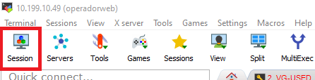

Cuando aparezca la ventana, hacer clic en SSH

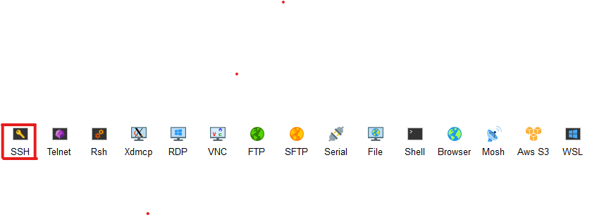

Se rellena. El host, es la IP del servidor y se puede indicar el usuario si se quiere, y se le da a OK
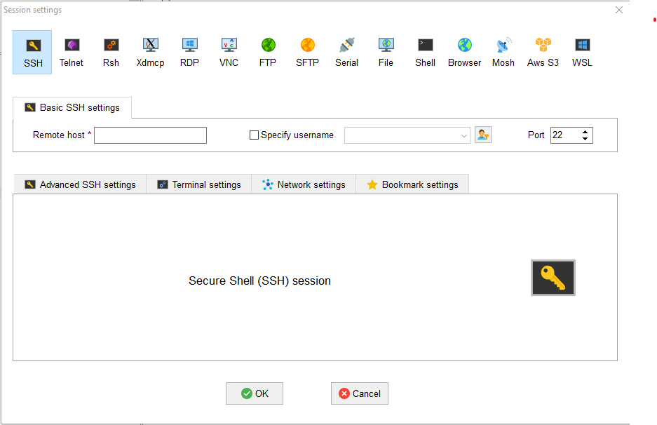

Se hace clic en la conexión, que se encuentra  en la parte izquierda.S

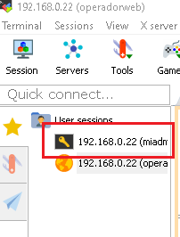

Aparece la terminal con el usuario, si se ha indicado en la creación, sino habrá que indicar el usuario y la contraseña.
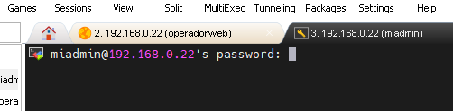

#### 1.2.4 **Netbeans**
* Crear un proyecto PHP en Netbeans
Se hace clic en File -> New Project o se hace clic en el pestaña del cuadrado naranja con un más

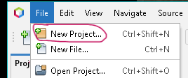


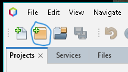

En el primer paso de la creación de proyecto, se selecciona PHP en Categories, y PHP Aplicación from Remote Server y se hace clic en Next

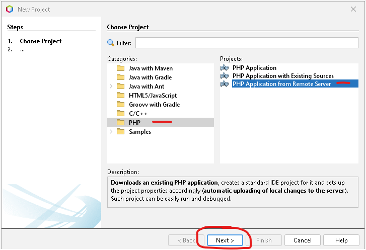

En el paso 2 se indica el nombre del proyecto, y la ubicación en local
y se hace clic en Next
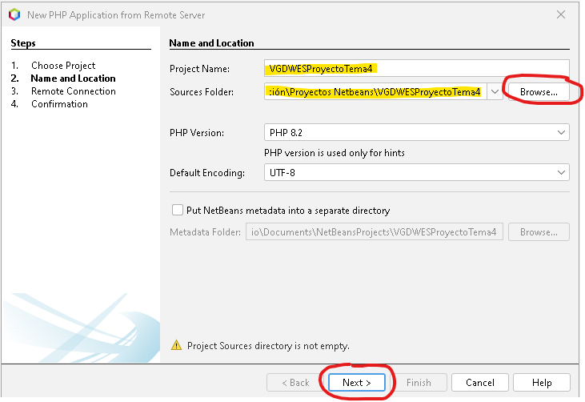

En el paso 3 se indica la IP del servidor...
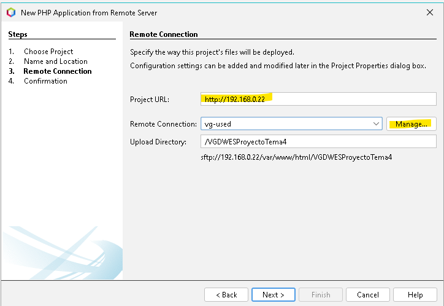

 y se hace clic en Manage...
 para configurar la conexion al servidor remoto, donde se indicará el nombre del servidor, la IP , el puerto, el nombre del usuario con permisos para actuar en las carpetas del proyecto, la contraseña....
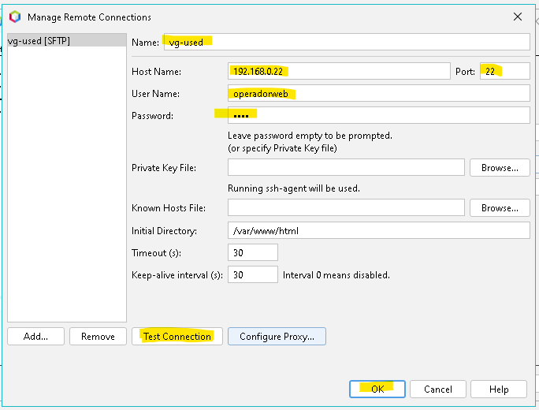

 se hace un test de conexión y saldrá un mensaje de confirmación
 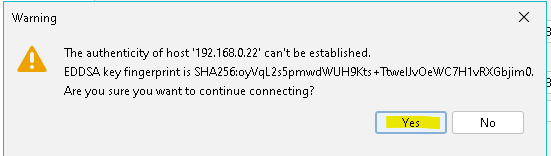
   hacer clic en Yes,  si el test es ok, hacer clic en OK...(el servidor remoto tiene que estar encendido sino no hace la conexion)
  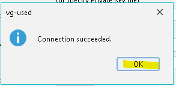
   se cierra la ventana de conexion se indica la ubicación de la carpeta del proyecto en el servidor y se hace clic en Next en la ventana del paso 3.
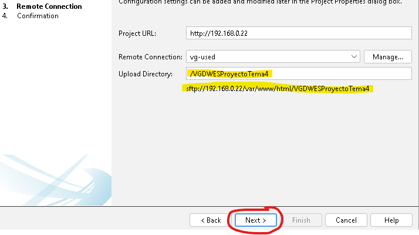

Sale de nuevo el mensaje de Confirmación de conexión y se hace clic en Yes.


Se checkea que la carpeta del proyecto tenga todos los elementos necesarios y se hace clic en finish.
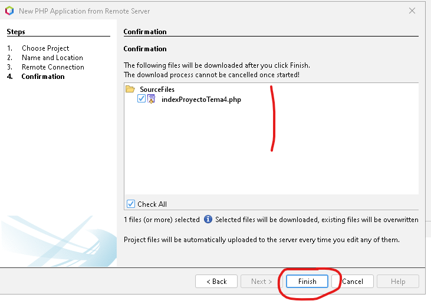

Sale de nuevo el mensaje de Confirmación de conexión y se hace clic en Yes.


El proyecto aparecerá en la parte izquierda del IDE.
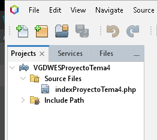


#### 1.2.5 **Visual Studio Code**


## 2. GitHub
## 3.Entorno de Explotación

---

> Véronique Grué  
> Curso: 2025/2026  
> 2º Curso CFGS Desarrollo de Aplicaciones Web  
> Despliegue de aplicaciones web


