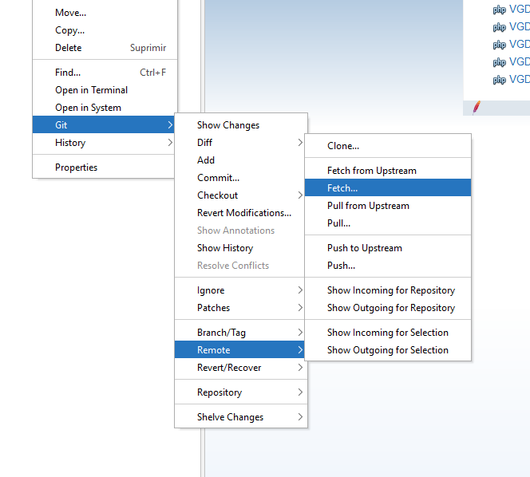
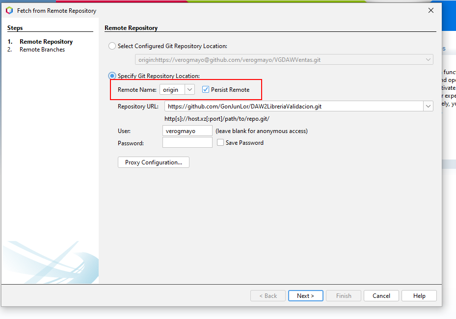
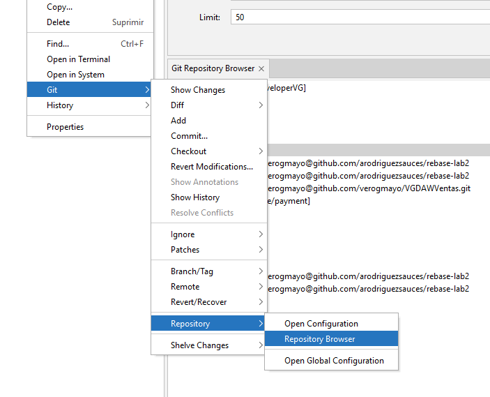
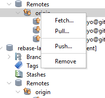

##Trabajar con varios repositorios en un proyecto
Si se quiere trabajar con una rama que no sea del repositoprio se hace una fetch y se añade una rama temporal.
Coger la librería de un proyecto para ponerlo en otro

