# INSTALACIÓN DE APACHE TOMCAT
## Situación Inicial
Sistema Operativo: Windows 11
✔
Servidor Web: Servidor Tomcat
✔
Configuración de Red:
✔
Dirección IPv4:
✔
Nombre del servidor:
✔
Software: Navegador: Mozilla Firefox, Chrome, etc.

## INSTALACIÓN DE JAVA STANDARD EDITION DEVELOPMENT KIT (JDK)
1.
Iniciar sesión en Windows
2.
Descargar Java SE Development Kit en https://adoptium.net/es/
3.
Elige la versión 64 bits de instalación, y descargue el fichero
4.
Instalación la versión JDK descargada.
5.
Comprobar la versión con el comando java -version y javac -version
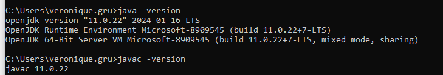
La variable path, contiene el directorio bin de JDK instalado
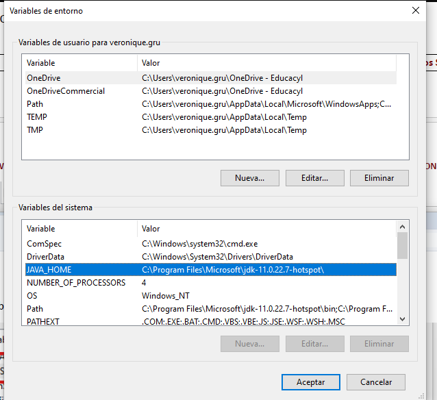

## INSTALACIÓN DE TOMCAT¿QUÉ VERSIÓN DE JAVA NECESITAS?
1)
Descarga de https://tomcat.apache.org/
Apache Tomcat 10.1.x
Úsalo si tienes:
•
Java 11 o superior (ideal: Java 17 o 21)
Es la versión estable y recomendada hoy Soporte a largo plazo Ideal para proyectos nuevos y aprendizaje

javax.* era el paquete original de JavaEE, mantenido por Oracle y usado durante muchos años en: Servlets, JSP, JPA Y JSF. Hasta Java EE 8 -> javax.* jakarta:* es en nuevo nombre que Java EE paso a la Eclipse Foundation, Oracle cedió JavaEE, pero no el nombre javax. A partir de Jakarta EE 9 se renombraron todos los paquetes. Desde Jakarta EE9 -> jakarta.* Tomcat 9 -> Javax Tomcat 10+ > Jakarta
Mirar la version de java hay que tener
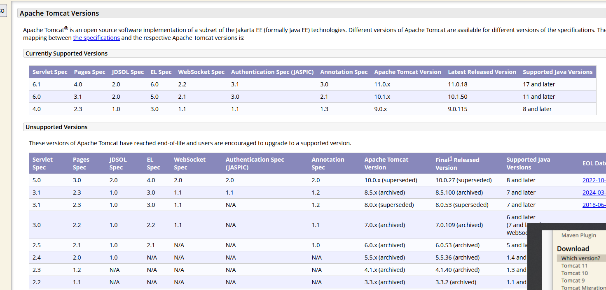
Vamos a instalar la version 11

Descargar el Core con extensión zip
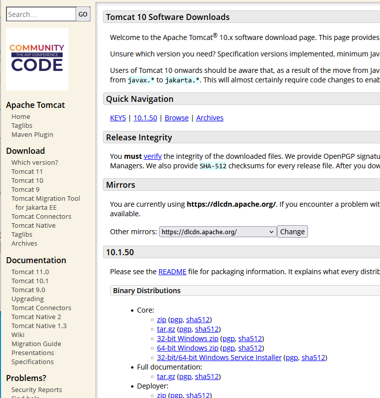
64bits
3)
En el disco de datos, en una carpeta llamada software descomprimirla
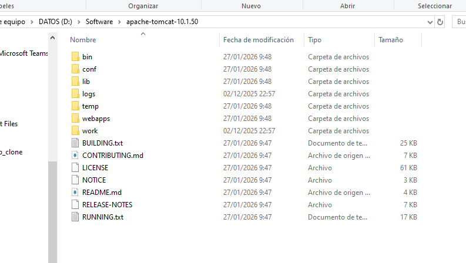
4)
A continuación, ir a Apache Netbeans y añadir el Servidor Tomcat. En el menú Tools→ Server. En “Servers” hacemos clic en el botón derecho “Add Server Instance”

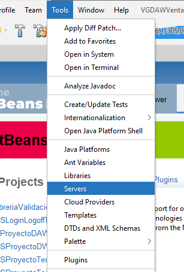
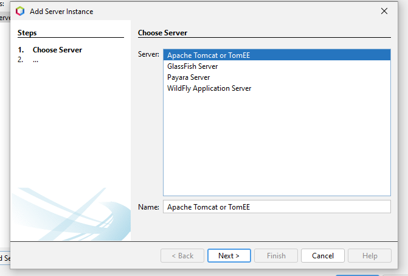
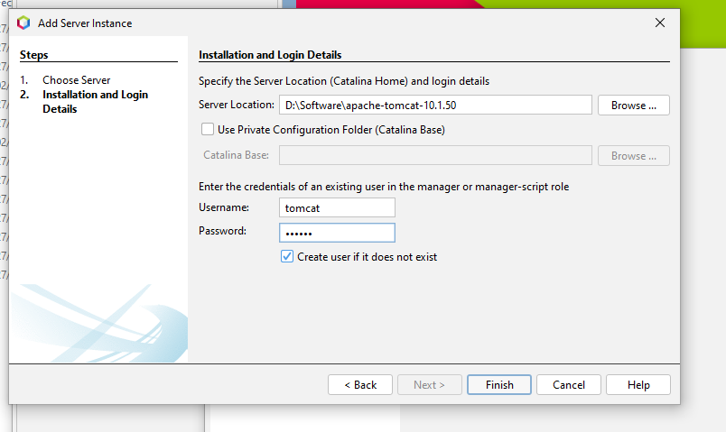

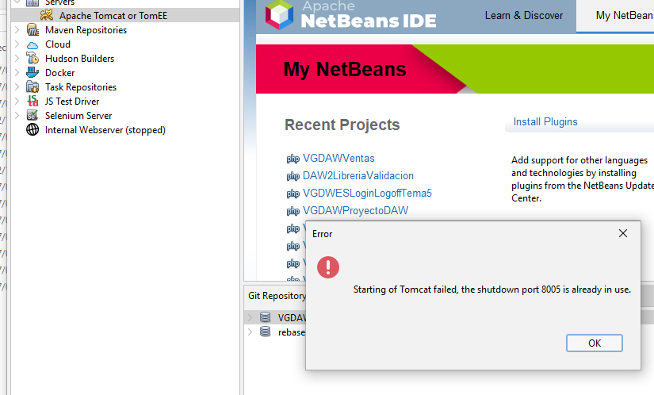
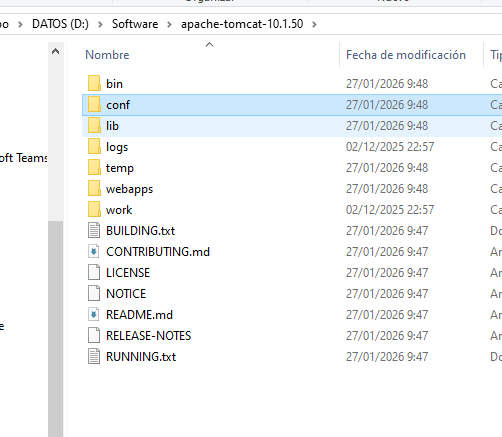
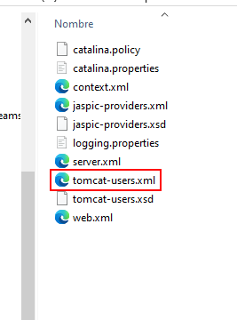
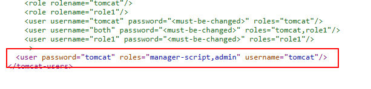
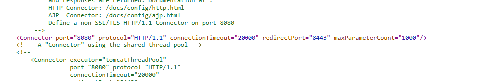

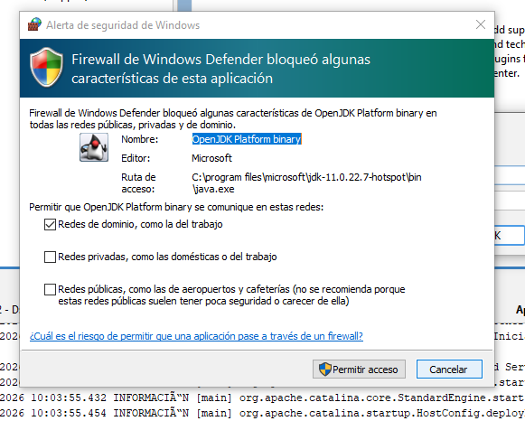
se cancela
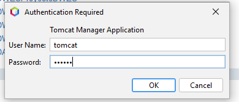
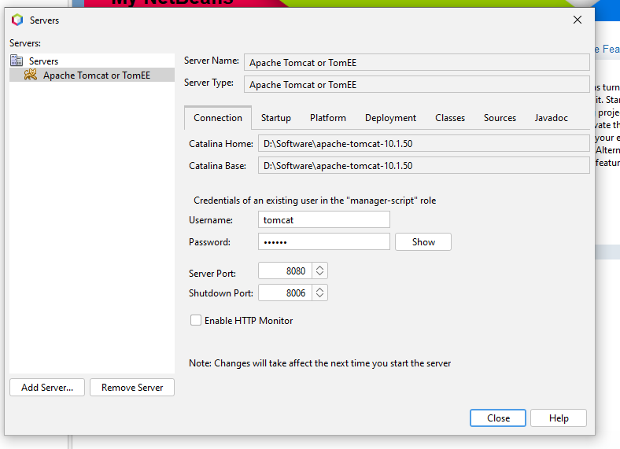
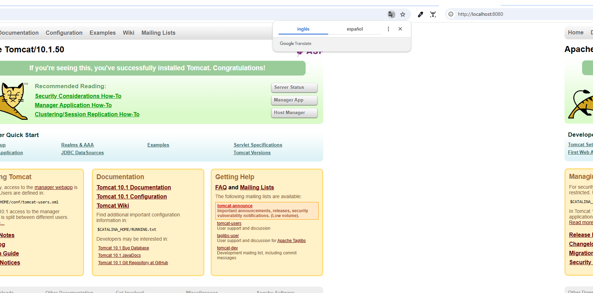

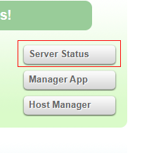

Rol para administrar las aplicaciones
´´´txt
<role rolename="manager-gui"/>
<user username="tomcat" password="s3cret" roles="manager-gui"/>
´´´
Entrar en adm de rol

Archivos de Java vs php MVC
jpa
