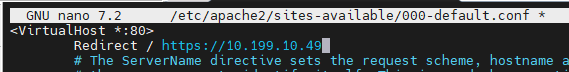
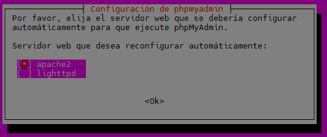
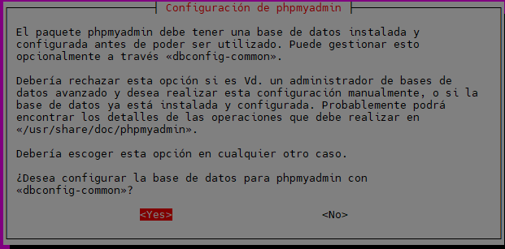
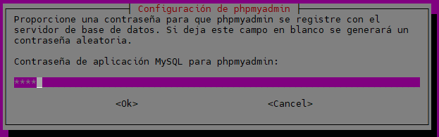
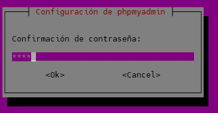
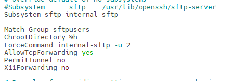

# SERVIDOR DE DESARROLLO
|  |
|:-----------:|
||
| INSTALACIÓN, CONFIGURACIÓN Y DOCUMENTACIÓN DEL SERVIDOR DE DESARROLLO |


- [SERVIDOR DE DESARROLLO](#servidor-de-desarrollo)
  - [1.1 Ubuntu Server 24.04.3 LTS](#11-ubuntu-server-24043-lts)
    - [**Configuración inicial**](#configuración-inicial)
    - [**Nombre y configuraicón de red**](#nombre-y-configuraicón-de-red)
    - [**Actualizar el sistema**](#actualizar-el-sistema)
    - [**Configuración fecha y hora**](#configuración-fecha-y-hora)
    - [**Cuentas administradoras**](#cuentas-administradoras)
    - [**Habilitar cortafuegos**](#habilitar-cortafuegos)
    - [**Instalar Antivirus**](#instalar-antivirus)
    - [**Comprobar conexión**](#comprobar-conexión)
  - [1.2 Apache2](#12-apache2)
    - [Instalación](#instalación)
    - [Verficación del servicio](#verficación-del-servicio)
    - [Virtual Hosts](#virtual-hosts)
    - [Permisos y usuarios](#permisos-y-usuarios)
    - [HTTPS](#https)
    - [HTTP A HTTPS](#http-a-https)
  - [1.3 Ejecución PHP con PHP-FPM](#13-ejecución-php-con-php-fpm)
    - [**Instalación**](#instalación-1)
    - [**Configuración de Apache2 con PHP-FPM**](#configuración-de-apache2-con-php-fpm)
    - [**Activarlo para cada virtualhost**](#activarlo-para-cada-virtualhost)
    - [**Comprobación de funcionamiento PHP-FPM**](#comprobación-de-funcionamiento-php-fpm)
  - [1.4 MariaDB](#14-mariadb)
    - [Instalación y Configuración de MariaDB](#instalación-y-configuración-de-mariadb)
    - [Consola de MariaDB](#consola-de-mariadb)
    - [Creación de un usuario administrador](#creación-de-un-usuario-administrador)
  - [1.5 PHPMyadmin](#15-phpmyadmin)
  - [1.6 Módulos PHP](#16-módulos-php)
    - [a) `php8.3-mysql`](#a-php83-mysql)
      - [Instalación del módulo y reinicio del servicio PHP-FPM](#instalación-del-módulo-y-reinicio-del-servicio-php-fpm)
          - [Mostrar qué extensiones están instaladas](#mostrar-qué-extensiones-están-instaladas)
    - [b) `php8.3-intl`](#b-php83-intl)
      - [Instalación](#instalación-2)
      - [Funciones principales](#funciones-principales)
  - [1.5 XDebug](#15-xdebug)
  - [1.6 DNS](#16-dns)
  - [1.7 SFTP](#17-sftp)
  - [1.8 LDAP](#18-ldap)


## 1.1 Ubuntu Server 24.04.3 LTS

Este documento es una guía detallada del proceso de instalación y configuración de un servidor de aplicaciones en Ubuntu Server utilizando Apache, con soporte PHP y MySQL

### **Configuración inicial**

### **Nombre y configuraicón de red**
Descargar la iso de Ubuntu Server en la página (Server install image) : https://releases.ubuntu.com/noble/

> **Nombre de la máquina**: daw-used\
> **Memoria RAM**: 2G\
> **Particiones**: 150G(/) y resto (/var)\
> **Configuración de red interface**: xxxx \
> **Dirección IP** :xx.xx.xx.xx/22\
> **GW**: xx.xx.xx.xx/22\
> **DNS**: xx.xx.xx.xx

Para saber que sistema operativo se tiene.
```bash
uname -a
```

Para saber la versión,
```bash
lsb_release -a
```

* Para cambiar el nombre de la maquina si fuera necesario. 
  Primero se mira el nombre actual.
```bash
sudo hostnamectl
```
 Se cambia
 ```bash
sudo hostnamectl set-hostname nombreMaquina
```
Despues hay que cambiarlo en /etc/hosts
```bash
sudo nano /etc/hosts
```
Para que cambie, en el prompt, hay que cerrar sessión.
```bash
exit
```

* Para ver Interfaces de red y sus direcciones IP:
```bash
ip a
```
* Para ver la tabla de enrutamiento.
```bash
ip r
```
* Para saber el DNS del servidor.
```bash
resolvectl status
```

* Para comprobar las particiones: 
  vista jerárquica (disco → particiones → puntos de montaje)
```bash
lsblk
```
o 
```bash
df -h
```
o una vista completa del sistema de archivos + permisos.
```bash
lsblk -fm
```
o mostrar todos los dispositivos, incluso los vacíos o no usados
```bash
lsblk -a
```
o mostrar solo los nombres, sin formato visual
```bash
lsblk -fn
```
o listar particiones con detalles del disco físico
```bash
fdisk -l
```


Editar el fichero de configuración del interface de red  **/etc/netplan**,
* Para configurar la red de interface:
  Se hace una copia de seguridad del archivo de configuración que se encuentra en /etc/netplan. 
```bash
cd /etc/netplan
sudo cp 50-cloud-init.yaml 50-cloud-init.yaml.backup
```
* Para cambiar el nombre del archivo
```bash
sudo mv 50-cloud-init.yaml enp0s3.yaml
```

* Y se edita el fichero /etc/netplan


```bash
# This is the network config written by 'subiquity'
network:
  ethernets:
    enp0s3:
      addresses:
       - 10.199.10.49/22
      nameservers:
         addresses:
         - 10.151.123.21
         - 10.151.126.21
      routes:
          - to: default
             via: 10.199.8.1
         search: [educa.jcyl.es]
  version: 2
````

* Para aplicar la configuración
```bash
sudo netplan apply
```

### **Actualizar el sistema**

```bash
sudo apt update
sudo apt upgrade
```

### **Configuración fecha y hora**

[Establecer fecha, hora y zona horaria](https://somebooks.es/establecer-la-fecha-hora-y-zona-horaria-en-la-terminal-de-ubuntu-20-04-lts/ "Cambiar fecha y hora")
* para ver la hora del servidor
```bash
date
```

* Si hubiera que cambiar la hora del servidor, se haría así
```bash
timedatectl set-timezone Europe/Madrid
```
### **Cuentas administradoras**

> - [X] root(inicio)
> - [X] miadmin/paso
> - [X] miadmin2/paso

* Creación del usuario miadmin2 perteneciente al grupo sudo
```bash
sudo useradd miadmin2
sudo usermod -aG sudo miadmin2
```
* Pra crear un usuario que pertenezca a varios grupos
```bash
sudo useradd -m -G sudo,adm,cdrom,dip,plugdev,lxd -s/bin/bash nombreUsuario
```
* Para ver en que grupo está miadmin2
```bash
cat /etc/group | grep miadmin
```
* Para ver los usuarios, y saber su carpeta shell (grep es para filtrar)
```bash
cat /etc/passwd | grep nombreUsuario
```

* Para crear un usuario con una shell concreta
```bash
sudo usermod -s /bin/bash miadmin
```

### **Habilitar cortafuegos**

como activar cortafuegos
```bash
sudo ufw enable
```

* Para desactivar el cortafuego
```bash
sudo ufw disable
```

* Para ver los puertos y su estado
```bash
sudo ufw status
```

* Para activar el puerto 22
```bash
sudo ufw allow 22
```

* Para borrar puertos 
  primero hay que saber cual es el numero de proceso de puerto
```bash
sudo ufw status numbered
```
  y borrar el puerto
```bash
sudo ufw delete numdeproceso
```

### **Instalar Antivirus**

Se actualiza el servidor
```bash
sudo apt update
sudo apt upgrade -y
```

Se intala el antivirus clamav

```bash
sudo apt install clamav clamav-daemon -y
```

Se actualiza la base de datos del virus:
Pimero se detiene el servicio
```bash
sudo systemctl stop clamav-freshclam
```

y se actualiza la base de datos manualmente
```bash
sudo freshclam
```

Se inicia y habilita para el arranque automatico
```bash
sudo systemctl start clamav-freshclam
sudo systemctl enable clamav-freshclam
```

Se verifica el servicio de actualización de definiciones de virus esté activo:
```bash
systemctl status clamav-freshclam
```

Para escanear un archivo o directorio
Escanea un directorio
```bash
sudo clamscan -i /home/
```
Escanea un archivo
```bash
sudo clamscan /home/file.sh
```

Para saber la version del antivirus
```bash
clamscan --version
```

### **Comprobar conexión**
* Se hace ping del anfitrion al servidor. En el cmd del anfitrion.
```bash
ping [IP servidor]
```

* Para conectarse al servidor desde el anfitrion
```bash
ssh usuario@ipServidor
```

* Para apagar el servidor desde el anfitrion una vez dentro.(0 es el tiempo de espera para apagar)
```bash
sudo shutdown -t 0
```

## 1.2 Apache2

### Instalación
* Actualizar
```bash
sudo apt update
```
* Instalar las versiones más recientes de los programas.
```bash
sudo apt upgrade -y
```
* Instalar Apache2
```bash
sudo apt install apache2 -y
```

* Verificar el estado del servicio
```bash
sudo systemctl status apache2
```
* Se abre el puerto 80
```bash
sudo ufw allow 80
```
* Se borra el puerto 80 v6
```bash
sudo ufw status numbered
```
```bash
sudo ufw delete numeroproceso
```

* Se crea un directorio de errores. 

```bash
sudo mkdir /var/www/html/error
sudo touch /var/www/html/error/error.log
```
* Y hay que indicarlo en el /etc/apache2/sites-available/000-default, ya antes haremos una copia por si surje algún imprevisto. 
```bash
sudo cp 000-default.conf 000-default.conf.backup
```

```bash
sudo nano /etc/apache2/sites-available/000-default.conf
```


ErrorLog /var/www/html/error/error.log


* Modificar apache2.conf para .htaccess
```bash
sudo nano /etc/apache2/apache2.conf
```
Buscar la sección 
<Directory /var/www/>
    Options Indexes FollowSymLinks
    AllowOverride None
    Require all granted
</Directory>

Y cambiar a 
<Directory /var/www/>
    Options Indexes FollowSymLinks
    AllowOverride All
    Require all granted
</Directory>


* Crear el archivo .htaccess
```bash
sudo touch /var/www/html/.htaccess

```
* Hacer restart de apache
```bash
sudo systemctl restart apache2
```

### Verficación del servicio
* Comprobar si se puede ver el index de Apache2
```bash
sudo nano /var/www/html/index.html
```
En el navegador se puede con la URL:http//IPServidor/index.html

### Virtual Hosts
### Permisos y usuarios

* Creación del usuario operador web.
    -M → No crear el directorio home (el home será /var/www/html, pero no lo crea).

-d /var/www/html → Establece /var/www/html como directorio home del usuario.
-N → No crea un grupo con el mismo nombre que el usuario.
-g www-data → Asigna el grupo primario www-data.
-s /bin/bash → Asigna la shell Bash.

```bash
sudo useradd -M -d /var/www/html -N -g www-data -s /bin/bash operadorweb
```
* Información de los usuarios
```bash
id operadorweb
```
o
```bash
cat /etc/passwd | grep operador
```

Para cambiar de contraseña
```bash
sudo passwd operadorweb
```

Para cambiar el grupo del propietario (www-data (para web))
```bash
sudo chown -R operadorweb:www-data /var/www/html
```
Para borrar un usuario de un grupo
```bash
sudo gpasswd -d nombreusuario nombregrupo
```
Para cambiar permisos
```bash
sudo chmod -R 775 /var/www/html
```
* Para borrar un usuario
```bash
sudo deluser nombreusuario
```

### HTTPS
Creación de los certificados SSL en apache.

Se actualiza el servidor
```bash
sudo apt update
```
```bash
sudo apt upgrade
```
Habilitar el modulo ssl por si no estuviera habilitado
```bash
sudo a2enmod ssl
```
Se crea el certificado SSL(Se pueden cambiar el nombre de los ficheros)
```bash
sudo openssl req -x509 -nodes -days 365 -newkey rsa:2048 -keyout /etc/ssl/private/apache-vg-used.key -out /etc/ssl/certs/vg-used.crt
```

Hay que rellenar la información solicitada

```bash
Country Name (2 letter code) [AU]:ES
State or Province Name (full name) [Some-State]:ZAMORA
Locality Name (eg, city) []:BENAVENTE
Organization Name (eg, company) [Internet Widgits Pty Ltd]:IES LOS SAUCES
Organizational Unit Name (eg, section) []:INFORMATICA
Common Name (e.g. server FQDN or YOUR name) []:vg-used
Email Address []:veronique.gru@educa.jcyl.es
```

Se reinicia apache2
```bash
sudo systemctl restart apache2 
```

Se entra en la carpeta /etc/apache2/sites-available/
```bash
cd /etc/apache2/sites-available/
```
Se hace una copia del archivo default-ssl.conf
```bash
sudo cp default-ssl.conf vg-used-ssl.conf
```
Se entra en vg-used-ssl.conf
```bash
sudo nano vg-used.conf
```
Se modifican los nombres de los archivos, en el archivo vg-used.conf, del certificado ssl(se indican los que se pusieron al crear el certificado ).
```bash
 #   SSLCertificateFile directive is needed.
        SSLCertificateFile      /etc/ssl/certs/vg-used.crt
        SSLCertificateKeyFile   /etc/ssl/private/apache-vg-used.key
 #   Server Certificate Chain:
ls
```

```bash
sudo a2ensite vg-used.conf
```
 Se reinicia el servicio apache
```bash
sudo systemctl restart apache2
```
 Se habilita el puerto 443
 ```bash
sudo ufw allow 443
```

Se borra el puerto 443 v6
```bash
sudo ufw status numbered
```
```bash
sudo ufw delete numeroproceso
```

### HTTP A HTTPS
Para redireccionar apache HTTP a HTTPS hay que 
* Activar el modulo alias
```bash
sudo a2enmod alias
```
* Recargar Apache
```bash
sudo systemctl reload apache2
```
* Editar el fichero /etc/apache2/sites-available/000-default.conf
Se añade la linea : Redirect y la url a la que se quiere redireccionar.
```bash
sudo nano /etc/apache2/sites-available/000-default.conf
```


* Recargar Apache
```bash
sudo systemctl reload apache2
```
* Se verifica el estado
```bash
sudo apache2ctl configtest
```
Debe mostrar : Syntax OK


## 1.3 Ejecución PHP con PHP-FPM

FPM (FastCGI Process Manager) es un servidor de aplicaciones PHP que se encarga de interpretar código PHP.

### **Instalación**
----

```bash
sudo apt install php8.3-fpm php8.3
```

Reiniciar el servicio:
```bash
sudo systemctl restart php8.3-fpm
```

### **Configuración de Apache2 con PHP-FPM**
---

Para habilitar los modulos Proxy_FCGI y SetEnvif
```bash
sudo a2enmod proxy_fcgi setenvif
```

### **Activarlo para cada virtualhost**

Para que se comunique entre php y el apache
 
 Se pone esta expresion en el archivo /etc/apache2/sites-available/000-default.conf
```bash
  ProxyPassMatch ^/(.*\.php)$ unix:/run/php/php8.3-fpm.sock|fcgi://127.0.0.1/var/www/html
```


  
Por último activamos (o comprobamos que esta activado):

```bash
sudo a2enconf php8.3-fpm
```

### **Comprobación de funcionamiento PHP-FPM**
---

PHP-FPM puede escuchar por socket UNIX o TCP/IP (host:puerto). Revisar cada "pool" en Ubuntu en `/etc/php/8.3/fpm/pool.d/www.conf`

```bash
grep '^listen' /etc/php/8.3/fpm/pool.d/*.conf
```

Dos posibles resultados:

```bash
listen = /run/php/php8.3-fpm.sock

```

Esta escuchando en socket UNIX

```bash
listen = 127.0.0.1:9000
```

Está escuchando por TCP/IP en la dirección local

 

## 1.4 MariaDB

MariaDB es un sistema de gestión de bases de datos relacional (RDBMS), muy similar a MySQL, permitiendo almacenar, organizar y acceder a información mediante el lenguaje **SQL (Structured Query Language)**.  
Es una alternativa moderna y abierta a MySQL, muy usada en servidores web, aplicaciones empresariales y sistemas en la nube.


### Instalación y Configuración de MariaDB

En consola escribe los siguientes comandos:

```bash
sudo apt update
sudo apt install mariadb-server -y
```


* Configuración Acceso Remoto en el fichero de configuración MariaDB(donde está definido el puerto: port=3306)

Esto permitirá conectarse a la base de datos MariaDB desde otros equipos. Edita el fichero de configuración:

```bash
sudo nano /etc/mysql/mariadb.conf.d/50-server.cnf
```

Se localiza la línea:

```bash
bind-address = 127.0.0.1
```

Y y se cambia por:

```bash
bind-address = 0.0.0.0
```

Esto permite que MariaDB acepte conexiones desde cualquier IP.

Reinicia el servidor MariaDB:

```bash
sudo systemctl restart mariadb
```


* Comandos útiles del servicio

| Acción                         | Comando                          | Descripción                                                  |
| ------------------------------ | -------------------------------- | ------------------------------------------------------------ |
| Iniciar el servicio            | `sudo systemctl start mariadb`   | Inicia el servidor MariaDB.                                  |
| Detener el servicio            | `sudo systemctl stop mariadb`    | Detiene el servidor MariaDB.                                 |
| Reiniciar el servicio          | `sudo systemctl restart mariadb` | Reinicia el servidor.                                        |
| Ver estado del servicio        | `sudo systemctl status mariadb`  | Muestra si el servidor está activo o inactivo.               |
| Habilitar inicio automático    | `sudo systemctl enable mariadb`  | Configura el servicio para iniciarse al arrancar el sistema. |
| Deshabilitar inicio automático | `sudo systemctl disable mariadb` | Evita que el servicio se inicie automáticamente.             |
| Ver versión instalada          | `mariadb --version`              | Muestra la versión actual de MariaDB instalada.              |


* Comprobación del puerto usado por el servidor

MariaDB usa el puerto **tcp/3306** por defecto.
Si el puerto no está abierto, se abre :

 * Se abre el puerto 3306
```bash
sudo ufw allow 3306
```
* Se borra el puerto 3306 v6
```bash
sudo ufw status numbered
```
```bash
sudo ufw delete numeroproceso
```

* Usando comandos del sistema

```bash
sudo ss -punta | grep mariadb
```

Ejemplo de salida:

```
tcp   LISTEN 0      80           0.0.0.0:3306       0.0.0.0:*     users:(("mariadbd",pid=874,fd=24))

```

Otros comando util: Listar los procesos en ejecución relacionados con MariaDB.

```bash
sudo ps -aux | grep mariadb
```
Ejemplo de salida:

```
mysql        874  0.0  5.2 1351180 105300 ?      Ssl  10:16   0:01 /usr/sbin/mariadbd
miadmin     5257  0.0  0.1   9728  2304 pts/0    S+   10:40   0:00 grep --color=auto mariadb

```

### Consola de MariaDB

Se entra al cliente:

```bash
sudo mariadb
```

Luego se ejecuta:

```sql
SHOW VARIABLES LIKE 'port';
```

Resultado esperado:

| Variable_name | Value |
| ------------- | ----- |
| port          | 3306  |


### Creación de un usuario administrador 

En sistemas Ubuntu con MariaDB 10.3, el usuario **root** se autentica mediante el complemento **unix_socket** por defecto, en lugar de una contraseña.
Esto ofrece mayor seguridad, pero puede complicar el acceso desde programas externos (p. ej., phpMyAdmin).

> **No se recomienda modificar la cuenta root.**
> En su lugar, crea una cuenta administrativa independiente para autenticación con contraseña.

Se abre el cliente de MariaDB:

```bash
sudo mariadb
```

Luego se crea un nuevo usuario con privilegios de root:

```sql
CREATE USER 'adminsql'@'%' IDENTIFIED BY 'paso';
GRANT ALL PRIVILEGES ON *.* TO 'adminsql'@'%' WITH GRANT OPTION;
```

O también se puede usar:

```sql
GRANT ALL ON *.* TO 'adminsql'@'%' IDENTIFIED BY 'paso' WITH GRANT OPTION;
```

 Se puede listar todos los usuarios y sus hosts:

```sql
SELECT User, Host FROM mysql.user;
```

Conectarse de forma remota con el nuevo usuario: (fuera del cliente MariaDB)

```bash
mariadb -u adminsql -p -h your_server_ip
```

---

* Asegurar el servidor MariaDB

Se ejecuta el script de seguridad:

```bash
sudo mysql_secure_installation
```

Este asistente te permitirá:

* Configurar una contraseña fuerte para root.
* Eliminar usuarios anónimos.
* Deshabilitar el inicio de sesión remoto del root.
* Eliminar bases de datos de prueba.
* Recargar las tablas de privilegios.

* Pasos del asistente

1. Pulsa **Enter** si no hay contraseña de root definida.
2. Define una **contraseña segura** para el usuario root.
3. Elimina el usuario anónimo (**Sí**).
4. Desactiva el acceso remoto del usuario root (**Sí**).
5. Elimina la base de datos de prueba (**Sí**).
6. Recarga los privilegios (**Sí**).


## 1.5 PHPMyadmin
* Se actualiza el servidor
```bash
sudo apt update
sudo apt upgrade
````
* Se instala phpMyadmin
```bash
sudo apt install phpmyadmin
````
* Se abre la consola de instalación
Se selcciona apache como servidor web, con la barra espaciadora y se mueve el cursor con las flechas y con tab hacia el Ok.


Se confirma la base de datos selecionando YES


Se indica la contraseña


Se confirma la contraseña


* Se crea un enlace simbolico de phpMyadmin a Apache
```bash
sudo ln -sf /etc/phpmyadmin/apache.conf /etc/apache2/conf-available/phpmyadmin.conf
````
* Se habilita la configuración de phpmyadmin
```bash
sudo a2enconf phpmyadmin
````
* Se hace el restar a Apache
```bash
sudo systemctl restart apache2
````

## 1.6 Módulos PHP

### a) `php8.3-mysql`

El módulo **php8.3-mysql** es la extensión que permite a PHP conectarse y comunicarse con servidores de bases de datos **MySQL** o **MariaDB**.  
Sin este módulo, PHP no puede ejecutar consultas SQL, ni leer ni escribir datos en su base de datos.

#### Instalación del módulo y reinicio del servicio PHP-FPM

```bash
sudo apt install php8.3-mysql
sudo systemctl restart php8.3-fpm
````

###### Mostrar qué extensiones están instaladas

```bash
sudo php -m | grep mysql
```

### b) `php8.3-intl`

La extensión **php8.3-intl** (Internationalization) está basada en la biblioteca **ICU (International Components for Unicode)**.
Permite que PHP muestre información adaptada a la región e idioma sin configuraciones manuales.

#### Instalación

```bash
sudo apt install php8.3-intl
```

#### Funciones principales

| Funcionalidad                           | Descripción                                                              | Ejemplo                                                |
| --------------------------------------- | ------------------------------------------------------------------------ | ------------------------------------------------------ |
| **Formateo de fechas y horas**          | Muestra las fechas según idioma o país                                   | `27 de octubre de 2025 (es)` / `October 27, 2025 (en)` |
| **Formateo de números**                 | Usa separadores decimales y de miles según la región                     | `1.220,66 (es_ES)` / `1,220.66 (en_US)`                |
| **Monedas**                             | Formatea precios automáticamente según el país                           | `€ 1.200,50` / `$ 1,200.50`                            |
| **Traducción y comparación de cadenas** | Ordena y compara texto con reglas locales                                | Útil para ordenar palabras con acentos                 |
| **Normalización Unicode**               | Asegura que caracteres acentuados o especiales se comparen correctamente | Útil para búsquedas y validaciones                     |


## 1.5 XDebug

**Xdebug** es una extensión de PHP diseñada para ayudar en la **depuración (debugging)** y el **análisis de rendimiento (profiling)** del código PHP.
Permite ver qué hace el programa internamente mientras se ejecuta, paso a paso, y medir su rendimiento.

* Funciones principales

* 🐞 Depurador paso a paso (*step debugging*)

  * Permite pausar la ejecución del script en cualquier punto (*breakpoint*).
  * Permite inspeccionar variables, pilas de llamadas (*call stack*) y expresiones.
  * Se puede usar junto a IDEs como **VSCode**, **NetBeans**, **PhpStorm**, etc.
  * Comunicación mediante el protocolo **DBGp** (puerto 9003).

---

* Verificar si está instalado

```bash
sudo php -v | grep xdebug
```

Si no aparece, se instala:

```bash
sudo apt install php8.3-xdebug
```

---

* Configuración del módulo Xdebug

Se edita el archivo de configuración:

```bash
sudo nano /etc/php/8.3/fpm/conf.d/20-xdebug.ini
```

Agrega las siguientes líneas:

```ini
xdebug.mode=develop,debug
xdebug.start_with_request=yes
xdebug.client_host=127.0.0.1
xdebug.client_port=9003
xdebug.log=/tmp/xdebug.log
xdebug.log_level=7
xdebug.idekey="netbeans-xdebug"
xdebug.discover_client_host=1
```

Se guardan los cambios y se reinicia el servicio:

```bash
sudo systemctl restart apache2
# o si usas php-fpm
sudo systemctl restart php8.3-fpm
```

---

* Permisos para los logs

```bash
sudo touch /tmp/xdebug.log
sudo chmod 666 /tmp/xdebug.log
sudo chown root:root /tmp/xdebug.log
```

## 1.6 DNS

## 1.7 SFTP
* Usuarios Enjaulados
  Se crean usuarios enjaulados para que tengas acceso unicamente a la carpeta en la que tiene que trabajar y no pueda acceder al árbol de directorios de nuestro servidor, es decir, solo puede entrar, modificar, leer y borrar en cualquier fichero o directorio dentro del directorio al que tiene acceso.

  Para ellos se crea primero una grupo, en este caso "sftpusers", al que pertenecerán los usuarios enjaulados.

```bash
sudo groupadd sftpusers
```

Se crea el usuario con acceso a /var/www/enjaulado1 y pertececiente al grupo sftpusers
```bash
sudo useradd -g www-data -G sftpusers -m -d /var/www/enjaulado1 enjaulado1
```
Se Cambia la contraseña del usuario 
```bash
sudo passwd enjaulado1
```

Ahora se cambian los permisos del directorio jaula y de los directorio padre. 
Para ello se da permiso a root.
Cambiando el dueño del directorio.
```bash
sudo chown root:root /var/www/enjaulado1
```
Quitando el permiso de escritura del directorio 
```bash
sudo chmod 555 /var/www/enjaulado1
```

Ahora hay que crear la carpeta donde vamos a subir los proyectos y aplicaciones.
Se crea la carpeta httpdocs
```bash
sudo mkdir /var/www/enjaulado1/httpdocs
```

Le damos permisos de lectura y escritura a todos y de ejecución a root
```bash
sudo chmod 2775 -R /var/www/enjaulado1/httpdocs
```
Se cambia el propietario del directorio
```bash
sudo chown enjaulado1:www-data -R /var/www/enjaulado1/httpdocs
```

Ahora se edita el archivo de configuración /etc/ssh/sshd_config
```bash
cd /etc/ssh/
#Se hace una copia de seguridad del archivo 
sudo cp sshd_config sshd_config.backup
#Se abre el archivo
sudo nano sshd_config
# Se busca esta linea y la comentamos 
Subsystem sftp /usr/lib/openssh/sftp-server
# y copiamos a continuación estas lineas 
Subsystem sftp internal-sftp

Match Group sftpusers
ChrootDirectory %h
ForceCommand internal-sftp -u 2
AllowTcpForwarding yes
PermitTunnel no
X11Forwarding no
```


```Bash
#Se guarda el archivo y se reinicia el sercivio ssh
sudo systemctl restart ssh
```
## 1.8 LDAP 
Protocolo Ligero de Acceso a Directorios (Lightweight Directory Access Protocol)


