[Volver al menu principal](README.md)

# SERVIDOR DE DESARROLLO
|  |
|:-----------:|
||
| INSTALACIÓN, CONFIGURACIÓN Y DOCUMENTACIÓN DEL SERVIDOR DE DESARROLLO |


- [SERVIDOR DE DESARROLLO](#servidor-de-desarrollo)
  - [1.1 Ubuntu Server 24.04.3 LTS](#11-ubuntu-server-24043-lts)
    - [**Configuración inicial**](#configuración-inicial)
    - [**Nombre y configuraicón de red**](#nombre-y-configuraicón-de-red)
    - [**Actualizar el sistema**](#actualizar-el-sistema)
    - [**Configuración fecha y hora**](#configuración-fecha-y-hora)
    - [**Cuentas administradoras**](#cuentas-administradoras)
    - [**Habilitar cortafuegos**](#habilitar-cortafuegos)
    - [**Instalar Antivirus**](#instalar-antivirus)
    - [**Comprobar conexión**](#comprobar-conexión)
  - [**1.2 Apache2**](#12-apache2)
    - [Instalación](#instalación)
    - [**Comprobar su estado del servicio**](#comprobar-su-estado-del-servicio)
    - [**Permisos y usuarios**](#permisos-y-usuarios)
    - [**HTTPS**](#https)
    - [**HTTP A HTTPS**](#http-a-https)
    - [Módulos de Apache Instalados](#módulos-de-apache-instalados)
  - [1.3 Ejecución PHP con PHP-FPM](#13-ejecución-php-con-php-fpm)
    - [**Instalación**](#instalación-1)
    - [**Configuración de Apache2 con PHP-FPM**](#configuración-de-apache2-con-php-fpm)
    - [**Activarlo para todos los virtualhost**](#activarlo-para-todos-los-virtualhost)
    - [**Configuración del php.ini para un entorno de desarrollo.**](#configuración-del-phpini-para-un-entorno-de-desarrollo)
    - [**Comprobación de funcionamiento PHP-FPM**](#comprobación-de-funcionamiento-php-fpm)
  - [1.4 MariaDB](#14-mariadb)
    - [**Instalación y Configuración de MariaDB**](#instalación-y-configuración-de-mariadb)
    - [**Consola de MariaDB**](#consola-de-mariadb)
    - [**Creación de un usuario administrador**](#creación-de-un-usuario-administrador)
  - [1.5 PHPMyadmin](#15-phpmyadmin)
    - [Instalación](#instalación-2)
    - [Configuración](#configuración)
  - [1.6 Módulos PHP](#16-módulos-php)
    - [a) `php8.3-mysql`](#a-php83-mysql)
      - [Instalación del módulo y reinicio del servicio PHP-FPM](#instalación-del-módulo-y-reinicio-del-servicio-php-fpm)
          - [Mostrar qué extensiones están instaladas](#mostrar-qué-extensiones-están-instaladas)
    - [b) `php8.3-intl`](#b-php83-intl)
      - [Instalación](#instalación-3)
      - [Funciones principales](#funciones-principales)
    - [Módulos y Extensiones Comunes de PHP](#módulos-y-extensiones-comunes-de-php)
  - [1.7 XDebug](#17-xdebug)
  - [1.8 SITIOS VIRTUALES](#18-sitios-virtuales)
    - [Se configura sitio1 en el servidor](#se-configura-sitio1-en-el-servidor)
  - [1.9 Redirección DirectoryIndex](#19-redirección-directoryindex)
  - [1.10 SFTP](#110-sftp)
  - [1.11 LDAP](#111-ldap)
  - [1.12 Herramientas de Desarrollo](#112-herramientas-de-desarrollo)
    - [1.2.1 PHPDocumentor](#121-phpdocumentor)
    - [Requisitos Mínimos](#requisitos-mínimos)
    - [Verificación de Requisitos Previos](#verificación-de-requisitos-previos)
    - [Instalación](#instalación-4)


## 1.1 Ubuntu Server 24.04.3 LTS

Este documento es una guía detallada del proceso de instalación y configuración de un servidor de aplicaciones en Ubuntu Server utilizando Apache, con soporte PHP y MySQL

### **Configuración inicial**

### **Nombre y configuraicón de red**
Descargar la iso de Ubuntu Server en la página (Server install image) : https://releases.ubuntu.com/noble/

> **Nombre de la máquina**: daw-used\
> **Memoria RAM**: 2G\
> **Particiones**: 150G(/) y resto (/var)\
> **Configuración de red interface**: xxxx \
> **Dirección IP** :10.199.10.49/22\
> **GW**: xx.xx.xx.xx/22\
> **DNS**: xx.xx.xx.xx

Para saber que sistema operativo se tiene.
```bash
uname -a
```

Para saber la versión,
```bash
lsb_release -a
```

* Para cambiar el nombre de la maquina si fuera necesario. 
  Primero se mira el nombre actual.
```bash
sudo hostnamectl
```
 Se cambia
 ```bash
sudo hostnamectl set-hostname nombreMaquina
```
Despues hay que cambiarlo en /etc/hosts
```bash
sudo nano /etc/hosts
```
Para que cambie, en el prompt, hay que cerrar sessión.
```bash
exit
```

* Para ver Interfaces de red y sus direcciones IP:
```bash
ip a
```
* Para ver la tabla de enrutamiento.
```bash
ip r
```
* Para saber el DNS del servidor.
```bash
resolvectl status
```

* Para comprobar las particiones: 
  vista jerárquica (disco → particiones → puntos de montaje)
```bash
lsblk
```
o 
```bash
df -h
```
o una vista completa del sistema de archivos + permisos.
```bash
lsblk -fm
```
o mostrar todos los dispositivos, incluso los vacíos o no usados
```bash
lsblk -a
```
o mostrar solo los nombres, sin formato visual
```bash
lsblk -fn
```
o listar particiones con detalles del disco físico
```bash
fdisk -l
```


Editar el fichero de configuración del interface de red  **/etc/netplan**,
* Para configurar la red de interface:
  Se hace una copia de seguridad del archivo de configuración que se encuentra en /etc/netplan. 
```bash
cd /etc/netplan
sudo cp 50-cloud-init.yaml 50-cloud-init.yaml.backup
```
* Para cambiar el nombre del archivo
```bash
sudo mv 50-cloud-init.yaml enp0s3.yaml
```

* Y se edita el fichero /etc/netplan


```bash
# This is the network config written by 'subiquity'
network:
  ethernets:
    enp0s3:
      addresses:
       - 10.199.10.49/22
      nameservers:
         addresses:
         - 10.151.123.21
         - 10.151.126.21
         search: [educa.jcyl.es]
      routes:
          - to: default
            via: 10.199.8.1
  version: 2
```

* Para aplicar la configuración
```bash
sudo netplan apply
```

### **Actualizar el sistema**

```bash
sudo apt update
sudo apt upgrade
```

### **Configuración fecha y hora**

[Establecer fecha, hora y zona horaria](https://somebooks.es/establecer-la-fecha-hora-y-zona-horaria-en-la-terminal-de-ubuntu-20-04-lts/ "Cambiar fecha y hora")
* para ver la hora del servidor
```bash
date
```

* Si hubiera que cambiar la hora del servidor, se haría así
```bash
timedatectl set-timezone Europe/Madrid
```
### **Cuentas administradoras**

> - [X] root(inicio)
> - [X] miadmin/paso
> - [X] miadmin2/paso

* Creación del usuario miadmin2 perteneciente al grupo sudo
```bash
sudo useradd miadmin2
sudo usermod -aG sudo miadmin2
```
* Para crear un usuario que pertenezca a varios grupos
```bash
sudo useradd -m -G sudo,adm,cdrom,dip,plugdev,lxd -s/bin/bash nombreUsuario
```
* Para ver en que grupo está miadmin2
```bash
cat /etc/group | grep miadmin
```
* Para ver los usuarios, y saber su carpeta shell (grep es para filtrar)
```bash
cat /etc/passwd | grep nombreUsuario
```

* Para crear un usuario con una shell concreta
```bash
sudo usermod -s /bin/bash miadmin
```

### **Habilitar cortafuegos**

como activar cortafuegos
```bash
sudo ufw enable
```

* Para desactivar el cortafuego
```bash
sudo ufw disable
```

* Para ver los puertos y su estado
```bash
sudo ufw status
```

* Para activar el puerto 22
```bash
sudo ufw allow 22
```

* Para borrar puertos 
  primero hay que saber cual es el numero de proceso de puerto
```bash
sudo ufw status numbered
```
  y borrar el puerto
```bash
sudo ufw delete numdeproceso
```

### **Instalar Antivirus**

Se actualiza el servidor
```bash
sudo apt update
sudo apt upgrade -y
```

Se intala el antivirus clamav

```bash
sudo apt install clamav clamav-daemon -y
```

Se actualiza la base de datos del virus:
Pimero se detiene el servicio
```bash
sudo systemctl stop clamav-freshclam
```

y se actualiza la base de datos manualmente
```bash
sudo freshclam
```

Se inicia y habilita para el arranque automatico
```bash
sudo systemctl start clamav-freshclam
sudo systemctl enable clamav-freshclam
```

Se verifica el servicio de actualización de definiciones de virus esté activo:
```bash
systemctl status clamav-freshclam
```

Para escanear un archivo o directorio
Escanea un directorio
```bash
sudo clamscan -i /home/
```
Escanea un archivo
```bash
sudo clamscan /home/file.sh
```

Para saber la version del antivirus
```bash
clamscan --version
```

### **Comprobar conexión**
* Se hace ping del anfitrion al servidor. En el cmd del anfitrion.
```bash
ping [IP servidor]
```

* Para conectarse al servidor desde el anfitrion
```bash
ssh usuario@ipServidor
```

* Para apagar el servidor desde el anfitrion una vez dentro.(0 es el tiempo de espera para apagar)
```bash
sudo shutdown -t 0
```

## **1.2 Apache2**

### Instalación
* Actualizar
```bash
sudo apt update
```
* Instalar las versiones más recientes de los programas.
```bash
sudo apt upgrade -y
```
* Instalar Apache2
```bash
sudo apt install apache2 -y
```

* Verificar el estado del servicio
```bash
sudo systemctl status apache2
```
* Se abre el puerto 80
```bash
sudo ufw allow 80
```
* Se borra el puerto 80 v6
```bash
sudo ufw status numbered
```
```bash
sudo ufw delete numeroproceso
```

* Se crea un directorio de errores. 

```bash
sudo mkdir /var/www/html/error
sudo touch /var/www/html/error/error.log
```
* Y hay que indicarlo en el /etc/apache2/sites-available/000-default, ya antes haremos una copia por si surje algún imprevisto. 
```bash
sudo cp 000-default.conf 000-default.conf.backup
```

```bash
sudo nano /etc/apache2/sites-available/000-default.conf
```


ErrorLog /var/www/html/error/error.log


* Modificar apache2.conf para .htaccess
```bash
sudo nano /etc/apache2/apache2.conf
```
Buscar la sección 
<Directory /var/www/>
    Options Indexes FollowSymLinks
    AllowOverride None
    Require all granted
</Directory>

Y cambiar a 
<Directory /var/www/>
    Options Indexes FollowSymLinks
    AllowOverride All
    Require all granted
</Directory>


* Crear el archivo .htaccess
```bash
sudo touch /var/www/html/.htaccess

```
* Hacer restart de apache
```bash
sudo systemctl restart apache2
```

### **Comprobar su estado del servicio**
* Comprobar si se puede ver el index de Apache2
```bash
sudo nano /var/www/html/index.html
```
En el navegador se puede con la URL:http//IPServidor/index.html


### **Permisos y usuarios**

* Creación del usuario operador web.
    -M → No crear el directorio home (el home será /var/www/html, pero no lo crea).

-d /var/www/html → Establece /var/www/html como directorio home del usuario.
-N → No crea un grupo con el mismo nombre que el usuario.
-g www-data → Asigna el grupo primario www-data.
-s /bin/bash → Asigna la shell Bash.

```bash
sudo useradd -M -d /var/www/html -N -g www-data -s /bin/bash operadorweb
```
* Información de los usuarios
```bash
id operadorweb
```
o
```bash
cat /etc/passwd | grep operador
```

Para cambiar de contraseña
```bash
sudo passwd operadorweb
```

Para cambiar el grupo del propietario (www-data (para web))
```bash
sudo chown -R operadorweb:www-data /var/www/html
```
Para borrar un usuario de un grupo
```bash
sudo gpasswd -d nombreusuario nombregrupo
```
Para cambiar permisos
```bash
sudo chmod -R 775 /var/www/html
```
* Para borrar un usuario
```bash
sudo deluser nombreusuario
```

### **HTTPS**
Creación de los certificados SSL en apache.

Se actualiza el servidor
```bash
sudo apt update
```
```bash
sudo apt upgrade
```
Habilitar el modulo ssl por si no estuviera habilitado
```bash
sudo a2enmod ssl
```
Se crea el certificado SSL(Se pueden cambiar el nombre de los ficheros)
```bash
sudo openssl req -x509 -nodes -days 365 -newkey rsa:2048 -keyout /etc/ssl/private/apache-vg-used.key -out /etc/ssl/certs/vg-used.crt
```

Hay que rellenar la información solicitada

```bash
Country Name (2 letter code) [AU]:ES
State or Province Name (full name) [Some-State]:ZAMORA
Locality Name (eg, city) []:BENAVENTE
Organization Name (eg, company) [Internet Widgits Pty Ltd]:IES LOS SAUCES
Organizational Unit Name (eg, section) []:INFORMATICA
Common Name (e.g. server FQDN or YOUR name) []:vg-used
Email Address []:veronique.gru@educa.jcyl.es
```

Se reinicia apache2
```bash
sudo systemctl restart apache2 
```

Se entra en la carpeta /etc/apache2/sites-available/
```bash
cd /etc/apache2/sites-available/
```
Se hace una copia del archivo default-ssl.conf
```bash
sudo cp default-ssl.conf vg-used-ssl.conf
```
Se entra en vg-used-ssl.conf
```bash
sudo nano vg-used.conf
```
Se modifican los nombres de los archivos, en el archivo vg-used.conf, del certificado ssl(se indican los que se pusieron al crear el certificado ).
```bash
 #   SSLCertificateFile directive is needed.
        SSLCertificateFile      /etc/ssl/certs/vg-used.crt
        SSLCertificateKeyFile   /etc/ssl/private/apache-vg-used.key
 #   Server Certificate Chain:
ls
```

```bash
sudo a2ensite vg-used.conf
```
```bash
#para desactivar el sitio si lo necesitamos
sudo a2dissite vg-used.conf
```
 Se reinicia el servicio apache
```bash
sudo systemctl restart apache2
```
 Se habilita el puerto 443
 ```bash
sudo ufw allow 443
```

Se borra el puerto 443 v6
```bash
sudo ufw status numbered
```
```bash
sudo ufw delete numeroproceso
```

### **HTTP A HTTPS**
Para redireccionar apache HTTP a HTTPS hay que 
* Activar el modulo alias 
```bash
sudo a2enmod alias
```

* Recargar Apache
```bash
sudo systemctl reload apache2
```
* Editar el fichero /etc/apache2/sites-available/000-default.conf
Se añade la linea : Redirect y la url a la que se quiere redireccionar.
```bash
sudo nano /etc/apache2/sites-available/000-default.conf
```


* Recargar Apache
```bash
sudo systemctl reload apache2
```
* Se verifica el estado
```bash
sudo apache2ctl configtest
```
Debe mostrar : Syntax OK


También se puede hacer de esta forma.
activando el modulo rewrite
```bash
sudo a2enmod rewrite
```
y escribiendo esto en el .haccess
```bash
RewriteEngine On
RewriteCond %{SERVER_PORT} 80
RewriteRule ^(.*)$ https://10.199.10.49/$1 [R,L]
```

### Módulos de Apache Instalados


| Módulo | Tipo | Descripción | Uso Principal |
| :--- | :--- | :--- | :--- |
| **core\_module** | Static | Funcionalidad **fundamental** del servidor. | No puede ser desactivado, maneja las directivas básicas como `AllowOverride`. |
| **so\_module** | Static | Habilita la carga de otros módulos **compartidos** (*Shared Objects*). | Permite usar la directiva `LoadModule`. Es vital para el funcionamiento modular. |
| **watchdog\_module** | Static | Herramienta interna para monitorear y gestionar procesos. | Mantenimiento de la estabilidad y procesos internos. |
| **http\_module** | Static | Implementa el protocolo HTTP. | Maneja la comunicación y las peticiones web. |
| **log\_config\_module** | Static | Configuración de los archivos de registro (logs). | Define los formatos de los logs (`CustomLog`, `ErrorLog`). |
| **logio\_module** | Static | Registro de la entrada/salida de la red (bytes transferidos). | Añade información de I/O a los logs. |
| **version\_module** | Static | Permite definir configuraciones basadas en la versión de Apache. | Útil para compatibilidad en entornos heterogéneos. |
| **unixd\_module** | Static | Funcionalidad específica para sistemas Unix (gestión de ID de usuario y grupo). | Define el usuario y grupo bajo el que se ejecuta Apache (`User`, `Group`). |
| **access\_compat\_module** | Shared | Proporciona compatibilidad con directivas de control de acceso antiguas. | Permite usar directivas obsoletas como `Order`, `Deny`, `Allow`. |
| **alias\_module** | Shared | Mapea URLs a directorios fuera de la raíz del documento. | Define rutas virtuales (`Alias`, `ScriptAlias`). |
| **auth\_basic\_module** | Shared | Implementa la **autenticación básica** HTTP simple. | Pide nombre de usuario y contraseña para acceder a recursos. |
| **authn\_core\_module** | Shared | Base para todos los módulos de autenticación (el motor central). | Requerido por cualquier módulo que maneje credenciales. |
| **authn\_file\_module** | Shared | Autenticación basada en archivos de texto (`.htpasswd`). | Verifica credenciales contra un archivo local. |
| **authz\_core\_module** | Shared | Base para todos los módulos de autorización (el motor central). | Define quién tiene permitido acceder a los recursos (`Require`). |
| **authz\_host\_module** | Shared | Autorización basada en el **nombre de host o dirección IP** del cliente. | Restringe el acceso por IP o dominio. |
| **authz\_user\_module** | Shared | Autorización basada en el **usuario autenticado**. | Restringe el acceso a usuarios específicos. |
| **autoindex\_module** | Shared | Genera automáticamente un **listado de archivos** si no hay `DirectoryIndex`. | Muestra el contenido de un directorio si no hay `index.html`. |
| **deflate\_module** | Shared | **Compresión de contenido** antes de enviarlo al cliente. | Reduce el tamaño de los datos (HTML, CSS, JS) para una carga más rápida. |
| **dir\_module** | Shared | Maneja la configuración de **`DirectoryIndex`**. | Define el archivo predeterminado a cargar (como `index.php`). |
| **env\_module** | Shared | Manipulación de **variables de entorno**. | Permite pasar variables de entorno a los scripts (ej: a PHP). |
| **filter\_module** | Shared | Permite el procesamiento de contenido a través de filtros. | Es la base para aplicar otros módulos (como `deflate`) al contenido. |
| **mime\_module** | Shared | Determina el **tipo MIME** (contenido) de los archivos. | Envía la cabecera `Content-Type` correcta (ej: `text/html`, `image/jpeg`). |
| **mpm\_event\_module** | Shared | **Módulo Multipróceso (MPM)**. Maneja el modelo de concurrencia y procesos. | Modelo eficiente para manejar muchas peticiones simultáneas, común en sistemas modernos. |
| **negotiation\_module** | Shared | Negociación de contenido (elegir el mejor idioma, codificación, etc.). | Sirve el archivo `.en.html` si el navegador pide inglés. |
| **proxy\_module** | Shared | Permite que Apache actúe como un servidor **proxy**. | Reenvía peticiones a otros servidores o aplicaciones. |
| **proxy\_fcgi\_module** | Shared | Conector de proxy para **FastCGI**. | **Crucial para PHP**: Permite que Apache pase peticiones a un proceso PHP-FPM dedicado. |
| **reqtimeout\_module** | Shared | Establece límites de tiempo para recibir el encabezado y el cuerpo de una solicitud. | Protege contra ataques lentos (Slowloris). |
| **setenvif\_module** | Shared | Establece variables de entorno basándose en encabezados HTTP. | Útil para personalizar el comportamiento del servidor según el cliente. |
| **socache\_shmcb\_module** | Shared | Soporte para caché de objetos en memoria compartida. | Usado a menudo por el módulo `ssl_module` para almacenamiento en caché de sesiones TLS. |
| **ssl\_module** | Shared | Implementa el cifrado **SSL/TLS (HTTPS)**. | Permite manejar certificados y comunicación segura. |
| **status\_module** | Shared | Proporciona una página con el **estado y rendimiento** del servidor. | Permite monitorear el uso de procesos y la carga de Apache. |

---


## 1.3 Ejecución PHP con PHP-FPM

FPM (FastCGI Process Manager) es un servidor de aplicaciones PHP que se encarga de interpretar código PHP.

### **Instalación**
----

```bash
sudo apt install php8.3-fpm php8.3
```

Reiniciar el servicio:
```bash
sudo systemctl restart php8.3-fpm
```

### **Configuración de Apache2 con PHP-FPM**
---

Para habilitar los modulos Proxy_FCGI y SetEnvif
```bash
sudo a2enmod proxy_fcgi setenvif
```

### **Activarlo para todos los virtualhost**

El fichero de configuración php8.3-fpm en el directorio /etc/apache2/conf-available, por defecto funciona cuando php-fpm está escuchando en un socket UNIX
Se configura de la siguiente forma:

Se abre el fichero /etc/apache2/conf-available/php8.3-fpm.conf

```bash
sudo nano /etc/apache2/conf-available/php8.3-fpm.conf
``` 
Y se copia esto o se comprueba si ya está:
```bash
 <FilesMatch ".+\.ph(?:ar|p|tml)$">
    SetHandler "proxy:unix:/run/php/php8.3-fpm.sock|fcgi://localhost"
</FilesMatch>
```  

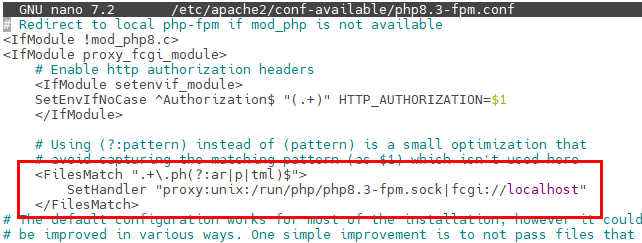  

  
Por último activamos (o comprobamos que esta activado) y se recarga apache2:

```bash
sudo a2enconf php8.3-fpm
systemctl reload apache2
```
```bash
#si se quisiera desactivar el fichero de configuración
sudo a2disconf php8.3-fpm
```

### **Configuración del php.ini para un entorno de desarrollo.**

Primero se hace una copia del archivo.  
```bash
cd /etc/php/8.3/fpm/
sudo cp php.ini php.ini.bk2025
sudo nano php.ini
```

* Configuración PHP por Entorno

Esta tabla compara las configuraciones de PHP para los entornos de **Desarrollo** y **Producción** en las secciones **General** y **Errores**.

| Directiva | DESARROLLO | PRODUCCIÓN |
| :--- | :--- | :--- |
| **GENERAL** | | |
| `file-uploads` | `On` | `On` |
| `allow-url_fopen` | `On` | `Off` |
| `memory_limit` | `256M` | `256M` |
| `upload_max_filesize` | `100M` | `100M` |
| `max_execution_time` | `360` | `360` |
| `date.timezone` | `Europe/Madrid` | `Europe/Madrid` |
| **ERRORES** | | |
| `display_errors` | `On` | `Off` |
| `error_reporting` | `E_ALL` | `E_ALL & ~E_NOTICE` |
| `display_startup_errors` | `On` | `Off` |
| `log_errors` | `On` | `On` |
| `error_log` | `/var/log/php_errors.log` | - |

---

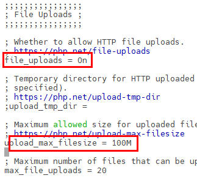   
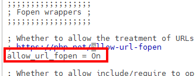
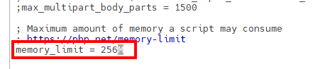
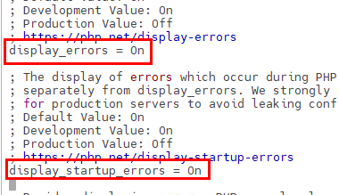 
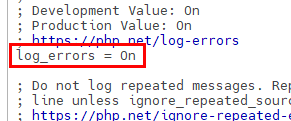  
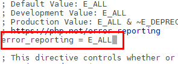  

* Se reinicia el servicio php y se comprueba que está corriendo.

```bash
sudo systemctl restart php8.3-fpm.service
sudo systemctl status php8.3-fpm.service
```
Se puede comprobar que los datos se han cambiado en el php.info().

* Para ver los módulos activos de php:
```bash
apache2ctl -M
```
### **Comprobación de funcionamiento PHP-FPM**
---

PHP-FPM puede escuchar por socket UNIX o TCP/IP (host:puerto). Revisar cada "pool" en Ubuntu en `/etc/php/8.3/fpm/pool.d/www.conf`

```bash
grep '^listen' /etc/php/8.3/fpm/pool.d/*.conf
```

Dos posibles resultados:

```bash
listen = /run/php/php8.3-fpm.sock

```

Esta escuchando en socket UNIX

```bash
listen = 127.0.0.1:9000
```

Está escuchando por TCP/IP en la dirección local


## 1.4 MariaDB

MariaDB es un sistema de gestión de bases de datos relacional (RDBMS), muy similar a MySQL, permitiendo almacenar, organizar y acceder a información mediante el lenguaje **SQL (Structured Query Language)**.  
Es una alternativa moderna y abierta a MySQL, muy usada en servidores web, aplicaciones empresariales y sistemas en la nube.


### **Instalación y Configuración de MariaDB**

En consola escribe los siguientes comandos:

```bash
sudo apt update
sudo apt install mariadb-server -y
```


* Configuración Acceso Remoto en el fichero de configuración MariaDB(donde está definido el puerto: port=3306)

Esto permitirá conectarse a la base de datos MariaDB desde otros equipos. Edita el fichero de configuración:

```bash
sudo nano /etc/mysql/mariadb.conf.d/50-server.cnf
```

Se localiza la línea:

```bash
bind-address = 127.0.0.1
```

Y y se cambia por:

```bash
bind-address = 0.0.0.0
```

Esto permite que MariaDB acepte conexiones desde cualquier IP.

Reinicia el servidor MariaDB:

```bash
sudo systemctl restart mariadb
```


* Comandos útiles del servicio

| Acción                         | Comando                          | Descripción                                                  |
| ------------------------------ | -------------------------------- | ------------------------------------------------------------ |
| Iniciar el servicio            | `sudo systemctl start mariadb`   | Inicia el servidor MariaDB.                                  |
| Detener el servicio            | `sudo systemctl stop mariadb`    | Detiene el servidor MariaDB.                                 |
| Reiniciar el servicio          | `sudo systemctl restart mariadb` | Reinicia el servidor.                                        |
| Ver estado del servicio        | `sudo systemctl status mariadb`  | Muestra si el servidor está activo o inactivo.               |
| Habilitar inicio automático    | `sudo systemctl enable mariadb`  | Configura el servicio para iniciarse al arrancar el sistema. |
| Deshabilitar inicio automático | `sudo systemctl disable mariadb` | Evita que el servicio se inicie automáticamente.             |
| Ver versión instalada          | `mariadb --version`              | Muestra la versión actual de MariaDB instalada.              |


* Comprobación del puerto usado por el servidor

MariaDB usa el puerto **tcp/3306** por defecto.
Si el puerto no está abierto, se abre :

 * Se abre el puerto 3306
```bash
sudo ufw allow 3306
```
* Se borra el puerto 3306 v6
```bash
sudo ufw status numbered
```
```bash
sudo ufw delete numeroproceso
```

* Usando comandos del sistema

```bash
sudo ss -punta | grep mariadb
```

Ejemplo de salida:

```
tcp   LISTEN 0      80           0.0.0.0:3306       0.0.0.0:*     users:(("mariadbd",pid=874,fd=24))

```

Otros comando util: Listar los procesos en ejecución relacionados con MariaDB.

```bash
sudo ps -aux | grep mariadb
```
Ejemplo de salida:

```
mysql        874  0.0  5.2 1351180 105300 ?      Ssl  10:16   0:01 /usr/sbin/mariadbd
miadmin     5257  0.0  0.1   9728  2304 pts/0    S+   10:40   0:00 grep --color=auto mariadb

```

### **Consola de MariaDB**

Se entra al cliente:

```bash
sudo mariadb
```

Luego se ejecuta:

```sql
SHOW VARIABLES LIKE 'port';
```

Resultado esperado:

| Variable_name | Value |
| ------------- | ----- |
| port          | 3306  |


### **Creación de un usuario administrador**

En sistemas Ubuntu con MariaDB 10.3, el usuario **root** se autentica mediante el complemento **unix_socket** por defecto, en lugar de una contraseña.
Esto ofrece mayor seguridad, pero puede complicar el acceso desde programas externos (p. ej., phpMyAdmin).

> **No se recomienda modificar la cuenta root.**
> En su lugar, crea una cuenta administrativa independiente para autenticación con contraseña.

Se abre el cliente de MariaDB:

```bash
sudo mariadb
```

Luego se crea un nuevo usuario con privilegios de root:

```sql
CREATE USER 'adminsql'@'%' IDENTIFIED BY 'paso';
GRANT ALL PRIVILEGES ON *.* TO 'adminsql'@'%' WITH GRANT OPTION;
```

O también se puede usar:

```sql
GRANT ALL ON *.* TO 'adminsql'@'%' IDENTIFIED BY 'paso' WITH GRANT OPTION;
```

 Se puede listar todos los usuarios y sus hosts:

```sql
SELECT User, Host FROM mysql.user;
```

Conectarse de forma remota con el nuevo usuario: (fuera del cliente MariaDB)

```bash
mariadb -u adminsql -p -h your_server_ip
```

---

* Asegurar el servidor MariaDB

Se ejecuta el script de seguridad:

```bash
sudo mysql_secure_installation
```

Este asistente te permitirá:

* Configurar una contraseña fuerte para root.
* Eliminar usuarios anónimos.
* Deshabilitar el inicio de sesión remoto del root.
* Eliminar bases de datos de prueba.
* Recargar las tablas de privilegios.

* Pasos del asistente

1. Pulsa **Enter** si no hay contraseña de root definida.
2. Define una **contraseña segura** para el usuario root.
3. Elimina el usuario anónimo (**Sí**).
4. Desactiva el acceso remoto del usuario root (**Sí**).
5. Elimina la base de datos de prueba (**Sí**).
6. Recarga los privilegios (**Sí**).


## 1.5 PHPMyadmin
### Instalación
* Enlace tutorial :https://www.devtutorial.io/how-to-install-phpmyadmin-with-apache-on-ubuntu-24-04-p3467.html

Antes de instalar se miran los modulos instalados.
```bash
php -m > /home/miadmin/listadomodulos.txt
```
Despues de instalar:
```bash
php -m > /home/miadmin/listadomodulos2.txt
```
Y comparamos los dos ficheros. En /home/miadmin, se buscan las diferencias entre los archivos.
```bash
diff listadomodulos.txt listadomodulos2.txt
```

* Se actualiza el servidor
```bash
sudo apt update
sudo apt upgrade
```
* Se instala phpMyadmin
```bash
sudo apt install phpmyadmin
```
* Se abre la consola de instalación
Se selcciona apache como servidor web, con la barra espaciadora y se mueve el cursor con las flechas y con tab hacia el Ok.


Se confirma la base de datos selecionando YES


Se indica la contraseña


Se confirma la contraseña


### Configuración

* Se crea un enlace simbolico de phpMyadmin a Apache
```bash
sudo ln -sf /etc/phpmyadmin/apache.conf /etc/apache2/conf-available/phpmyadmin.conf
```
* Se habilita la configuración de phpmyadmin
```bash
sudo a2enconf phpmyadmin
```
* Se hace el restar a Apache
```bash
sudo systemctl restart apache2
```
* Se prueba en el navegador si funciona.  
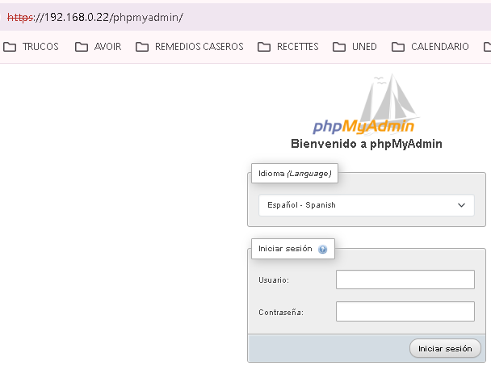  

* Se ponen las credenciales del usuario de la base de datos. En este caso adminsql, y se accede a la base de datos.  
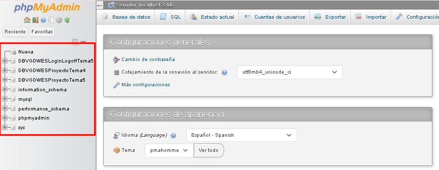  
Se puede ver el la parte izquierda las bases de datos creadas.  


## 1.6 Módulos PHP

### a) `php8.3-mysql`

El módulo **php8.3-mysql** es la extensión que permite a PHP conectarse y comunicarse con servidores de bases de datos **MySQL** o **MariaDB**.  
Sin este módulo, PHP no puede ejecutar consultas SQL, ni leer ni escribir datos en su base de datos.

#### Instalación del módulo y reinicio del servicio PHP-FPM

```bash
sudo apt install php8.3-mysql
sudo systemctl restart php8.3-fpm
```

###### Mostrar qué extensiones están instaladas

```bash
sudo php -m | grep mysql
```

### b) `php8.3-intl`

La extensión **php8.3-intl** (Internationalization) está basada en la biblioteca **ICU (International Components for Unicode)**.
Permite que PHP muestre información adaptada a la región e idioma sin configuraciones manuales.

#### Instalación

```bash
sudo apt install php8.3-intl
```

#### Funciones principales

| Funcionalidad                           | Descripción                                                              | Ejemplo                                                |
| --------------------------------------- | ------------------------------------------------------------------------ | ------------------------------------------------------ |
| **Formateo de fechas y horas**          | Muestra las fechas según idioma o país                                   | `27 de octubre de 2025 (es)` / `October 27, 2025 (en)` |
| **Formateo de números**                 | Usa separadores decimales y de miles según la región                     | `1.220,66 (es_ES)` / `1,220.66 (en_US)`                |
| **Monedas**                             | Formatea precios automáticamente según el país                           | `€ 1.200,50` / `$ 1,200.50`                            |
| **Traducción y comparación de cadenas** | Ordena y compara texto con reglas locales                                | Útil para ordenar palabras con acentos                 |
| **Normalización Unicode**               | Asegura que caracteres acentuados o especiales se comparen correctamente | Útil para búsquedas y validaciones                     |


### Módulos y Extensiones Comunes de PHP

| Módulo | Descripción | Uso Principal |
| :--- | :--- | :--- |
| **bz2** | Soporte para el algoritmo de compresión **Bzip2**. | Leer y escribir archivos comprimidos `.bz2`. |
| **calendar** | Funciones para convertir entre diferentes sistemas de calendario. | Conversión entre calendarios (Juliano, Gregoriano, Hebreo, etc.). |
| **Core** | El corazón de PHP. Contiene todas las funcionalidades básicas del lenguaje. | Funciones y constantes fundamentales (siempre habilitado). |
| **ctype** | Funciones para verificar el tipo de caracteres. | Comprobación de si un carácter es alfanumérico, dígito, etc. |
| **curl** | Soporte para la librería **cURL**. | Realizar peticiones HTTP, FTP y otras transferencias de red. |
| **date** | Manejo de fechas y horas, incluyendo la clase `DateTime`. | Formateo, manipulación y cálculo de fechas y zonas horarias. |
| **dom** | Manipulación del **DOM (Document Object Model)**. | Analizar y manipular documentos HTML y XML como objetos. |
| **exif** | Extracción de información de metadatos (EXIF) de archivos de imágenes. | Leer la información de la cámara (fecha, modelo, exposición) de fotos. |
| **FFI** | **Foreign Function Interface**. Permite llamar a funciones de bibliotecas compartidas de C nativas. | Interoperabilidad con código C sin necesidad de extensiones. |
| **fileinfo** | Detección del **tipo de contenido** (MIME) de un archivo. | Determinar de forma segura si un archivo es una imagen, PDF, etc. |
| **filter** | Herramientas para **validar y sanear** entradas de datos. | Limpiar entradas de usuario (formularios, URLs) para evitar inyecciones. |
| **ftp** | Funciones del **Protocolo de Transferencia de Archivos (FTP)**. | Conexión, subida y descarga de archivos a través de FTP. |
| **gd** | Soporte para la librería **GD Graphics Library**. | Creación, manipulación y generación de imágenes (miniaturas, CAPTCHAs). |
| **gettext** | Soporte para internacionalización (i18n) usando la librería GNU **gettext**. | Localización de cadenas de texto de la aplicación. |
| **hash** | Funciones de *hashing* criptográfico. | Generación de *hashes* seguros (SHA-256, MD5, etc.). |
| **iconv** | Conversión de codificación de caracteres. | Convertir cadenas entre diferentes codificaciones (ej: UTF-8 a ISO-8859-1). |
| **intl** | Extensión de **Internacionalización** basada en la librería ICU. | Soporte avanzado para formatos de moneda, fechas, ordenación de texto (collator). |
| **json** | Codificación y decodificación de datos en formato **JSON**. | Intercambio de datos con APIs web (REST, etc.). |
| **libxml** | Soporte para la librería **libxml**. Requerido por otras extensiones XML y DOM. | Funciones básicas para trabajar con XML. |
| **mbstring** | **Multibyte String**. Funciones para manipular cadenas de caracteres multibyte. | Trabajar correctamente con codificaciones como UTF-8 (necesario para la mayoría de los idiomas). |
| **mcrypt** | (Obsoleto en PHP 7.2+) Interfaz para la librería de **cifrado Mcrypt**. | Tareas de cifrado y descifrado. |
| **mysqli** | Interfaz mejorada para la base de datos **MySQL**. | Conexión y manipulación de bases de datos MySQL. |
| **mysqlnd** | **MySQL Native Driver**. Sustituto de bajo nivel para `libmysql`. | Proporciona un controlador más rápido para las extensiones `mysqli` y `PDO_MySQL`. |
| **openssl** | Funciones de criptografía basadas en la librería **OpenSSL**. | Implementación de SSL/TLS, *hashing*, certificados y cifrado seguro. |
| **pcntl** | **Process Control**. Funciones para la gestión de procesos en sistemas POSIX. | Crear *forks* y gestionar procesos hijo (común en scripts de *daemon*). |
| **pcre** | **Perl Compatible Regular Expressions**. | Motor de expresiones regulares (como `preg_match`). |
| **PDO** | **PHP Data Objects**. Interfaz de abstracción de bases de datos. | Proporciona una interfaz común para interactuar con diferentes bases de datos (MySQL, PostgreSQL, etc.). |
| **pdo_mysql** | Controlador específico de MySQL para la extensión **PDO**. | Permite que PDO se conecte a MySQL. |
| **Phar** | Archivos de PHP (*PHP Archive*). | Empaquetar aplicaciones PHP completas en un solo archivo ejecutable. |
| **posix** | Funciones del sistema operativo compatibles con **POSIX**. | Interacción con el sistema operativo (IDs de usuario, procesos, señales). |
| **random** | Generación de números y bytes **criptográficamente seguros** al azar. | Seguridad y generación de tokens únicos. |
| **readline** | Interfaz para la librería **Readline** de GNU. | Permite leer líneas desde la entrada estándar con capacidades de edición (en el CLI). |
| **Reflection** | Proporciona información sobre la estructura de clases, métodos, etc., en tiempo de ejecución. | Análisis e inspección de código (usado por frameworks y ORMs). |
| **session** | Soporte para la gestión de sesiones de usuario. | Almacenamiento de datos de usuario entre diferentes peticiones HTTP. |
| **shmop** | **Shared Memory Operations**. Funciones para memoria compartida en sistemas Unix. | Comunicación entre procesos a través de memoria. |
| **SimpleXML** | Una forma sencilla y orientada a objetos de trabajar con documentos XML. | Lectura fácil y rápida de datos en archivos XML. |
| **sockets** | Interfaz de bajo nivel para la comunicación de red. | Crear servidores o clientes de *sockets* personalizados (TCP/UDP). |
| **sodium** | Librería de criptografía moderna (NaCL/libsodium). | Operaciones criptográficas de alto rendimiento y fácil uso. |
| **SPL** | **Standard PHP Library**. Colección de interfaces y clases de utilidad. | Iteradores, estructuras de datos y gestión de excepciones (siempre habilitado). |
| **standard** | Contiene funciones de uso general no asignadas a otras extensiones. | Funciones básicas de I/O, cadenas, *arrays*, etc. (siempre habilitado). |
| **sysvmsg** | Funciones para colas de mensajes del sistema V. | Comunicación entre procesos. |
| **sysvsem** | Funciones para semáforos del sistema V. | Control de concurrencia entre procesos. |
| **sysvshm** | Funciones para memoria compartida del sistema V. | Comunicación entre procesos. |
| **tokenizer** | Divide el código PHP en sus *tokens* componentes. | Análisis estático de código (usado por herramientas de calidad de código). |
| **xdebug** | Herramienta de **depuración** y perfilado. | Depuración paso a paso, análisis de cobertura y optimización de código. |
| **xml** | Analizador sintáctico (parser) XML basado en **SAX**. | Procesamiento de XML basado en eventos. |
| **xmlreader** | Analizador sintáctico XML basado en *streams* (Pull parser). | Lectura eficiente de grandes documentos XML. |
| **xmlwriter** | API para escribir documentos XML de forma incremental. | Creación rápida de archivos XML. |
| **xsl** | Soporte para **XSLT (eXtensible Stylesheet Language Transformations)**. | Transformación de documentos XML a otros formatos (HTML, texto, etc.). |
| **Zend OPcache** | Módulo de **caché de código de operación**. | Acelera la ejecución de PHP almacenando código precompilado en memoria. |
| **zip** | Soporte para archivos **Zip**. | Lectura, escritura y manipulación de archivos `.zip`. |
| **zlib** | Soporte para la compresión **Zlib/Gzip**. | Compresión y descompresión de datos (comúnmente usado en la compresión de salida HTTP). |

Comandos para activar y desactivar módulos.
```bash
#activar el módulo
sudo a2enmod nombreModulo
```
```bash
#desactivar el módulo
sudo a2dismod nombreModulo
```


## 1.7 XDebug

**Xdebug** es una extensión de PHP diseñada para ayudar en la **depuración (debugging)** y el **análisis de rendimiento (profiling)** del código PHP.
Permite ver qué hace el programa internamente mientras se ejecuta, paso a paso, y medir su rendimiento.

* Funciones principales

*  Depurador paso a paso (*step debugging*)

  * Permite pausar la ejecución del script en cualquier punto (*breakpoint*).
  * Permite inspeccionar variables, pilas de llamadas (*call stack*) y expresiones.
  * Se puede usar junto a IDEs como **VSCode**, **NetBeans**, **PhpStorm**, etc.
  * Comunicación mediante el protocolo **DBGp** (puerto 9003).

---

* Verificar si está instalado

```bash
sudo php -v | grep xdebug
```

Si no aparece, se instala:

```bash
sudo apt install php8.3-xdebug
```

---

* Configuración del módulo Xdebug

Se edita el archivo de configuración:

```bash
sudo nano /etc/php/8.3/fpm/conf.d/20-xdebug.ini
```

Agrega las siguientes líneas:

```ini
xdebug.mode=develop,debug
xdebug.start_with_request=yes
xdebug.client_host=127.0.0.1
xdebug.client_port=9003
xdebug.log=/tmp/xdebug.log
xdebug.log_level=7
xdebug.idekey="netbeans-xdebug"
xdebug.discover_client_host=1
```

Se guardan los cambios y se reinicia el servicio:

```bash
sudo systemctl restart apache2
# o si usas php-fpm
sudo systemctl restart php8.3-fpm
```

---

* Permisos para los logs

```bash
sudo touch /tmp/xdebug.log
sudo chmod 666 /tmp/xdebug.log
sudo chown root:root /tmp/xdebug.log
```
* Se puede ver que está habilitado en el phpinfo  
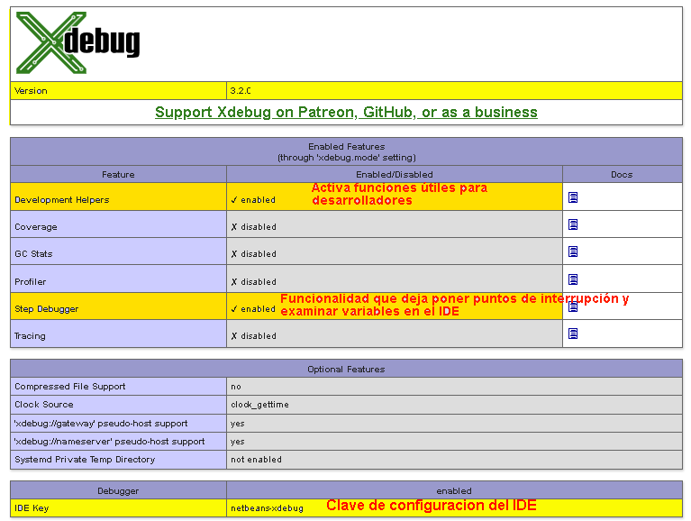  

## 1.8 SITIOS VIRTUALES
###Se crea el DNS sitio1 en Plesk
* Se va a Sitios web y dominios y en la parte central vamos a la pestaña y hacemos clic en hosting y DNS
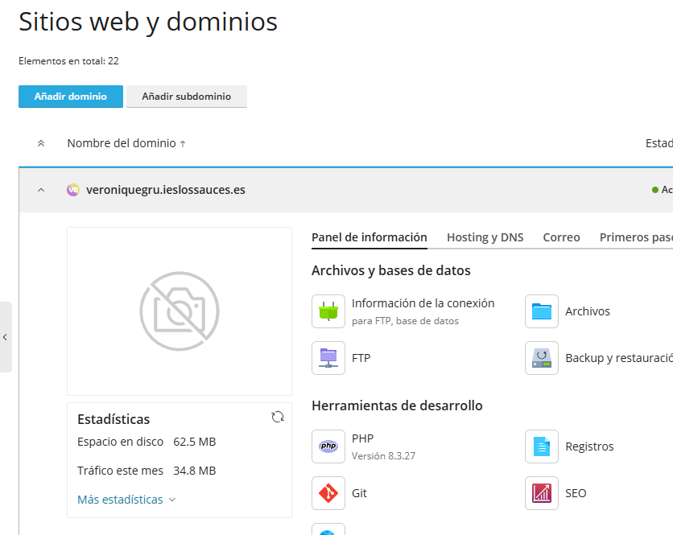

* Se hace clic en DNS
 
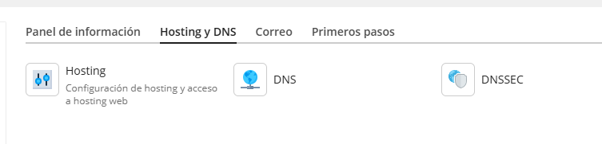

* en Añadir registro

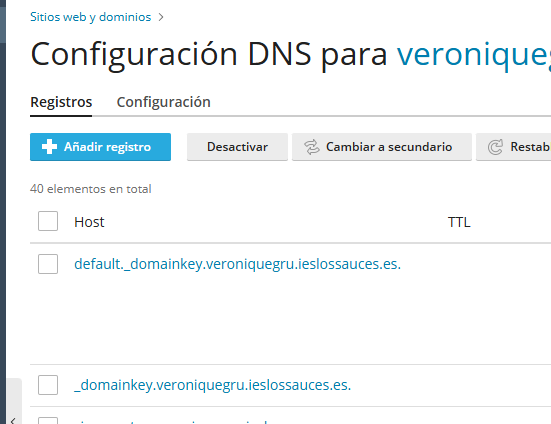

* y se rellena el formulario
  
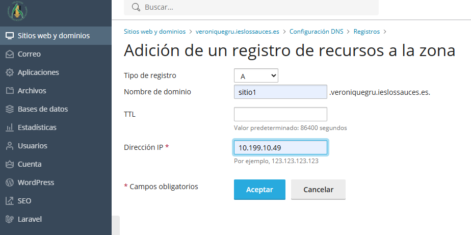

### Se configura sitio1 en el servidor
* Se crea la carpeta error si no está creada.
```bash
sudo mkdir /var/www/enjaulado1/error
sudo chmod 2775 -R /var/www/enjaulado1/error
sudo chown enjaulado1:www-data -R /var/www/enjaulado1/error
```
(con el 2 se asegura de que todos los archivos o subdirectorios creados dentro de ese directorio hereden el grupo propietario de ese directorio, en lugar del grupo primario del usuario que los creó.)  

* Se hace una copia del ficheros /etc/apache2/sites-available/000-default.conf 
Se entre en la carpeta /etc/apache2/sites-available y se hace la copia del fichero
```bash
sudo sudo cp /etc/apache2/sites-available/000-default.conf /etc/apache2/sites-available/sitio1-veroniquegru-ieslossauces-es.conf

```
* Se modifica el archivo
```bash
sudo nano /etc/apache2/sites-available/sitio1-veroniquegru-ieslossauces-es.conf
```
```bash
  ServerName sitio1.veroniquegru.ieslossauces.es
  ServerAdmin webmaster@localhost
  DocumentRoot /var/www/enjaulado1

  ErrorLog ${APACHE_LOG_DIR}/error-sitio1.log
  ErrorLog /var/www/enjaulado1/error/error.log
  CustomLog ${APACHE_LOG_DIR}/access-sitio1.log combined
  ProxyPassMatch ^/(.*\.php)$ unix:/run/php/php8.3-fpm.sock|fcgi://127.0.0.1/var/www/enjaulado1/httpdocs
```
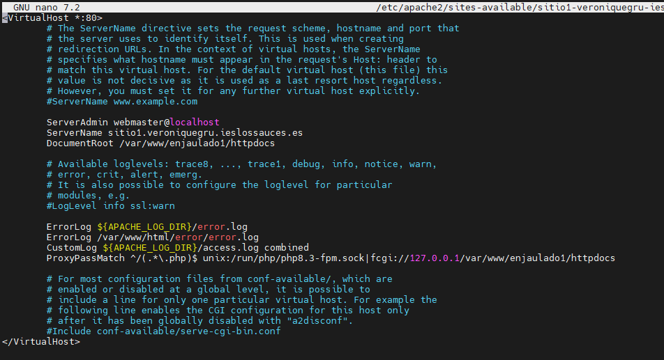

* Se habilita el sitio
```bash
sudo a2ensite sitio1-veroniquegru-ieslossauces-es.conf
```
* Se verifica que la configuración de apache no tenga errores
```bash
sudo apache2ctl configtest
```
* Y se recarga el Apache
```bash
sudo systemctl reload apache2
```

* Para saber los sitios que están habilitados
```bash
sudo apache2ctl -S
```
* Resolución de nombre


## 1.9 Redirección DirectoryIndex
El DirectoryIndex define la página de inicio por defecto de cada directorio, resolviendo la petición de una carpeta a un archivo específico sin que el usuario tenga que escribirlo. Está manejado por el modulo : mod_dir.
Se puede buscar el archivo con 
```bash
ls /etc/apache2/mods-enabled | grep dir
```  
Para saber como está definido se abre el fichero dir.conf
```bash
sudo /etc/apache2/mods-enabled/dir.conf 
```  
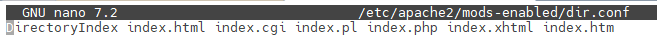  
Los archivos están por orden de prioridad.

El servidor lee primero el fichero dir.conf y luego lee el .htaccess de los proyectos, que sobreescribe esta lista. Si el index principal del proyecto no es ninguno de los de dir.conf, busca en .htaccess. 
Ejemplo de redirección en .htaccess   
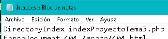  


## 1.10 SFTP
* Si no está instalado lo instalamos.
Actualizamos
```bash
sudo apt update
```
Instalamos el openssh
```bash
sudo apt install openssh-server -y 
```
Y lo iniciamos
```bash
sudo systemctl restart ssh
```

Otros comandos para el ssh:
```bash
sudo systemctl start ssh      # Iniciar el servicio
sudo systemctl stop ssh       # Detener el servicio
```

* Usuarios Enjaulados
  Se crean usuarios enjaulados para que tengas acceso unicamente a la carpeta en la que tiene que trabajar y no pueda acceder al árbol de directorios de nuestro servidor, es decir, solo puede entrar, modificar, leer y borrar en cualquier fichero o directorio dentro del directorio al que tiene acceso.

  Para ellos se crea primero una grupo, en este caso "sftpusers", al que pertenecerán los usuarios enjaulados.

```bash
sudo groupadd sftpusers
```

Se crea el usuario con acceso a /var/www/enjaulado1 y pertececiente al grupo sftpusers
```bash
sudo useradd -g www-data -G sftpusers -m -d /var/www/enjaulado1 enjaulado1
```
Se Cambia la contraseña del usuario 
```bash
sudo passwd enjaulado1
```

Ahora se cambian los permisos del directorio jaula y de los directorio padre. 
Para ello se da permiso a root.
Cambiando el dueño del directorio.
```bash
sudo chown root:root /var/www/enjaulado1
```
Quitando el permiso de escritura del directorio 
```bash
sudo chmod 555 /var/www/enjaulado1
```

Ahora hay que crear la carpeta donde vamos a subir los proyectos y aplicaciones.
Se crea la carpeta httpdocs
```bash
sudo mkdir /var/www/enjaulado1/httpdocs
```

Le damos permisos de lectura y escritura a todos y de ejecución a root
```bash
sudo chmod 2775 -R /var/www/enjaulado1/httpdocs
```
Se cambia el propietario del directorio
```bash
sudo chown enjaulado1:www-data -R /var/www/enjaulado1/httpdocs
```

Ahora se edita el archivo de configuración /etc/ssh/sshd_config
```bash
cd /etc/ssh/
#Se hace una copia de seguridad del archivo 
sudo cp sshd_config sshd_config.backup
#Se abre el archivo
sudo nano sshd_config
# Se busca esta linea y la comentamos 
Subsystem sftp /usr/lib/openssh/sftp-server
# y copiamos a continuación estas lineas 
Subsystem sftp internal-sftp

Match Group sftpusers
ChrootDirectory %h
ForceCommand internal-sftp -u 2
AllowTcpForwarding yes
PermitTunnel no
X11Forwarding no
```


```Bash
#Se guarda el archivo y se reinicia el sercivio ssh
sudo systemctl restart ssh
```
## 1.11 LDAP 
Protocolo Ligero de Acceso a Directorios (Lightweight Directory Access Protocol)

## 1.12 Herramientas de Desarrollo
### 1.2.1 PHPDocumentor
### Requisitos Mínimos

- **Sistema Operativo**: Ubuntu/Debian (o distribuciones basadas en APT)
- **PHP**: Versión 8.1 o superior (en este manual se usa PHP 8.3)
- **Extensiones PHP requeridas**:
  - php-xml (DOM, XMLWriter, SimpleXML)
  - php-mbstring
- **Herramientas del sistema**: wget, sudo
- **Espacio en disco**: Al menos 50 MB para phpDocumentor y las dependencias

---

### Verificación de Requisitos Previos

Antes de comenzar la instalación, se verifica que se tiene los componentes necesarios:

* **Comprobar la versión de PHP instalada:**
```bash
php -v
```

* **Verificar si las extensiones PHP ya están instaladas:**
```bash
php -m | grep -E "xml|mbstring"
```
Si aparecen `xml` y `mbstring` en la salida, las extensiones ya están instaladas y se puede omitir su instalación.


---

### Instalación

* Se actualiza el servidor
```bash
sudo apt update
sudo apt upgrade
```
Si no están instaladas se instalan las extensiones de PHP que se necesita para procesar archivos y plantillas XML/HTML.

* Instalar la extensión XML: Necesaria para leer la configuración y plantillas de phpDocumentor.  
```bash
sudo apt install php8.3-xml
```

* Instalar la extensión MBString: Necesaria para el manejo correcto de
cadenas de múltiples bytes (caracteres especiales, acentos).
```bash
sudo apt install php8.3-mbstring
```

* Reiniciar el servicio de PHP: Para que las extensiones recién instaladas se
carguen.
```bash
sudo service php8.3-fpm restart # Si usas PHP-FPM
```
o
```bash
sudo service apache2 restart # Si usas Apache
```

* Descarga e Instalación de phpDocumentor (Método PHAR)
  Descargar el archivo PHAR: Utiliza wget para descargar el ejecutable a tu
servidor  
```bash
wget https://phpdoc.org/phpDocumentor.phar
```

* Se pasa el archivo al servidor y se le otorgan los permisos de ejecución
(yo lo he copiado en la carpeta de DWES)
```bash
sudo chmod +x phpDocumentor.phar
```

* Se mueve a una ubicación global /usr/local/bin y se renombra a phpdoc para poder ejecutarlo desde cualquier directorio
```bash
sudo mv phpDocumentor.phar /usr/local/bin/phpdoc
```

* Se ejecuta phpdoc
```bash
phpdoc
```

* Se entra en la carpeta del código fuente:
```bash
cd /var/www/html/VGDWESProyectoTema3/codigoPHP
```

Para que no haya problema para que se cree la carpeta docs en la carpeta codigoPHP, hay que dar permisos.
```bash
sudo chmod -R 775 /var/www/html/VGDWESProyectoTema3
```

* Se ejecuta el phpDocumentor
```bash
phpdoc --directory . --target docs
```
--directory .: Busca archivos PHP en el directorio actual.
--target docs: Genera el HTML de salida en la carpeta docs.

El proceso finaliza creando la carpeta docs con el archivo index.html, que
contiene la documentación.


