[Volver al menu principal](README.md)

# OTRO SERVIDOR DE DESARROLLO - APACHE TOMCAT
Apache Tomcat es un servidor de aplicaciones Java de código abierto que implementa las especificaciones Java Servlet, JavaServer Pages (JSP) y WebSocket. Esta guía proporciona instrucciones detalladas para instalar y configurar Tomcat en tres entornos diferentes:
•	Servidor Ubuntu Linux
•	Windows con NetBeans IDE
•	Windows con Visual Studio Code

- [OTRO SERVIDOR DE DESARROLLO - APACHE TOMCAT](#otro-servidor-de-desarrollo---apache-tomcat)
  - [¿Qué es Apache Tomcat?](#qué-es-apache-tomcat)
  - [1. Instalación en Ubuntu Server](#1-instalación-en-ubuntu-server)
    - [1.1 Prerrequisitos](#11-prerrequisitos)
    - [1.2 Actualizar el Sistema](#12-actualizar-el-sistema)
    - [1.3 Instalar Java JDK](#13-instalar-java-jdk)
    - [1.4 Descargar Apache Tomcat](#14-descargar-apache-tomcat)
    - [1.5 Crear Usuario para Tomcat](#15-crear-usuario-para-tomcat)
    - [1.6 Configurar Permisos](#16-configurar-permisos)
    - [1.7 Crear Servicio Systemd](#17-crear-servicio-systemd)
    - [1.8 Iniciar y Habilitar el Servicio](#18-iniciar-y-habilitar-el-servicio)
    - [1.9 Configurar Firewall](#19-configurar-firewall)
    - [1.10 Configurar Usuarios del Manager](#110-configurar-usuarios-del-manager)
    - [1.11 Permitir Acceso Remoto al Manager](#111-permitir-acceso-remoto-al-manager)
    - [1.12 Verificación](#112-verificación)
  - [](#)
  - [2. Instalación en Windows para NetBeans](#2-instalación-en-windows-para-netbeans)
    - [2.1 Prerrequisitos](#21-prerrequisitos)
    - [2.2 Instalar Java JDK](#22-instalar-java-jdk)
    - [2.3 Descargar Apache Tomcat](#23-descargar-apache-tomcat)
    - [2.4 Agregar Tomcat a NetBeans](#24-agregar-tomcat-a-netbeans)
    - [2.5 Configurar Usuarios de Administración](#25-configurar-usuarios-de-administración)
    - [2.6 Iniciar Tomcat desde NetBeans](#26-iniciar-tomcat-desde-netbeans)
    - [2.7 Crear un Proyecto Web](#27-crear-un-proyecto-web)
    - [2.8 Ejecutar la Aplicación](#28-ejecutar-la-aplicación)
  - [3. Instalación en Windows para Visual Studio Code](#3-instalación-en-windows-para-visual-studio-code)
    - [3.1 Prerrequisitos](#31-prerrequisitos)
    - [3.2 Instalar Extensiones Necesarias](#32-instalar-extensiones-necesarias)
    - [3.3 Descargar e Instalar Tomcat](#33-descargar-e-instalar-tomcat)
    - [3.4 Agregar Tomcat a VS Code](#34-agregar-tomcat-a-vs-code)
      - [Opción A: Usando la extensión Tomcat for Java](#opción-a-usando-la-extensión-tomcat-for-java)
      - [Opción B: Usando Community Server Connectors](#opción-b-usando-community-server-connectors)
    - [3.5 Crear Proyecto Web con Maven](#35-crear-proyecto-web-con-maven)
    - [3.6 Configurar pom.xml](#36-configurar-pomxml)
    - [3.7 Se crea un Servlet](#37-se-crea-un-servlet)
    - [3.7 Compilar el Proyecto](#37-compilar-el-proyecto)
    - [3.8 Generar el WAR](#38-generar-el-war)
    - [3.9 Desplegar en Tomcat](#39-desplegar-en-tomcat)
  - [4. Solución de Problemas Comunes](#4-solución-de-problemas-comunes)
    - [4.1 Puerto 8080 ya en uso](#41-puerto-8080-ya-en-uso)
    - [4.2 Error JAVA\_HOME no configurado](#42-error-java_home-no-configurado)
    - [4.3 Tomcat no inicia en Ubuntu](#43-tomcat-no-inicia-en-ubuntu)


## ¿Qué es Apache Tomcat?
Apache Tomcat es un contenedor de servlets y servidor web de código abierto, desarrollado por Apache Software, diseñado para ejecutar aplicaciones Web Java (servlets y JavaServer Pages – JSP). Actúa como el motor que procesa contenido dinámico, funcionando en cualquier sistema operativo con Máquinas Virtual Java.


## 1. Instalación en Ubuntu Server

### 1.1 Prerrequisitos

- Ubuntu 20.04 o superior
- Acceso root o privilegios sudo
- Conexión a Internet

### 1.2 Actualizar el Sistema

Primero, se actualiza los paquetes del sistema:

```bash
sudo apt update && sudo apt upgrade -y
```

### 1.3 Instalar Java JDK

Tomcat requiere Java para funcionar. Si no está instalado hay que instalar OpenJDK 11 o superior, paquete del Kit de desarrollo de Java, es un paquete por defecto default-jdk: este paquete instala la máquina virtual de Java (JVM) y todos los componentes necesarios para compilar y ejecutar aplicaciones Java. Es más completo y adecuado si estás desarrollando aplicaciones Java y necesitas el compilador (“javac”) y otras herramientas de desarrollo.

```bash
sudo apt install default-jdk -y
```

Se verifica la instalación:

```bash
java -version
```  
  
Se puede comprobar en que directorio instalo JVM, usando el comando:

```bash
sudo update-java-alternatives -l
```  
  

Se edita el fichero /etc/enviroment y establece las variables JAVA_HOME, que debe apuntar al directorio donde está instalado JDK, y la variable JRE_HOME, que apuntará al directorio donde está instalado la máquina virtual Java.
Valor Actual   
  
```bash
PATH="/usr/local/sbin:/usr/local/bin:/usr/sbin:/usr/bin:/sbin:/bin:/usr/games:/usr/local/games:/snap/bin"
```
Hay que camibarlo por este PATH
```bash
PATH="/usr/local/sbin:/usr/local/bin:/usr/sbin:/usr/bin:/sbin:/bin:/usr/games:/usr/local/games:/snap/bin"
JAVA_HOME="/usr/lib/jvm/java-1.21.0-openjdk-amd64"
```  
    

Se hace rebootse comprueba el contenido de la variale $JAVA_HOME  
  


### 1.4 Descargar Apache Tomcat  

Hay 2 opciones para descargar Apache Tomcat.
- Opción 1 : Se instala el servidor Tomcat desde los repositorios oficiales de Ubuntu: 
Se va a instalar usando los paquetes precompilados de Ubuntu (.deb). En este caso se va a instalar la versión 10 ya que la 9 ya no está en ubuntu 24.04, lo han sustituido por la 10 que utiliza JakartaEE (jakarta.*)
```bash
sudo apt-get install tomcat10
```
Se verifica el status
```bash
systemctl status tomcat10
```  
    

Se comprueba desde el cliente que tenemos acceso a Tomcat escribiendo la ip del servidor y :8080  

http://192.168.0.22:8080/  
  
  

Para completar la instalación se recomienda instalar estos paquetes:
La Documentación:
```bash
sudo apt install tomcat10-docs
```  
  
Los ejemplos:
```bash
sudo apt install tomcat10-examples  
```   
  
La Adminsitración
```bash
sudo apt install tomcat10-admin
```  
El acceso a documentación y a los ejemplos es mediante el link de la página de inicio de http://IP:8080, pero para el acceso a la administración hay que registrar un usuario con el role de manager-gui , manager-gui y admin-script, admin-gui.  
  
En el archivo  /etc/tomcat10/tomcat-users.xml  

```bash
sudo nano /etc/tomcat10/tomcat-users.xml
```  
Se puede registrar un usuario tomcat y se añade permisos a tomcat
```bash
 <role rolename="manager-gui"/>
  <user username="tomcat" password="paso" roles="manager-gui,admin-gui"/>

```
y se hace restart del servicio tomcat
```bash
sudo service tomcat10 restart
```  
  
y se puede entrar en el manager webapp y en host-manager webapp desde http://IP:8080  
     
  
    
    


- Directorios de Tomcat
Directorios de Tomcat
En la instalación los paquetes precompilados de Ubuntu (.deb) (la que hemos realizado) Tomcat se ha instalado usando las siguientes ubicaciones.

Ubicación de binarios:
```bash
cd /usr/share/tomcat10/bin
```  
  

Esto  mostrará los archivos ejecutables de Tomcat, como “startup.sh”, “shutdown.sh” y otros scripts en el directorio bin.

- Directorio de configuración
```bash
cd /etc/tomcat10
```  
  
Aquí se encontrarás archivos de configuración, como “server.xml”, “web.xml”, entre otros.  

- Directorio de despliegue de aplicaciones
Las aplicaciones web desplegadas en Tomcat se encuentran en el directorio “webapps”
```bash
cd /var/lib/tomcat10/webapps
```  
  

- Directorio de datos (logs, temp, work)
Los archivos de registro (logs), archivos temporales y el directorio de trabajo se encuentra en el directorio

```bash
cd /var/lib/tomcat10
```  
    

- El servicio de Apache TomCat puede ser iniciado o detenido usando los scripts que viene incluidos dentro del paquete, para iniciar el servicio de nuestro Apache TomCat ingresaremos el comando:
```bash
sudo /usr/share/tomcat10/bin/startup.sh
```  
  

- Vamos a verificar que el servicio está corriendo de manera correcta y a través del puerto 8080, para ello ejecutaremos el siguiente comando:
```bash
ss -punta |grep 8080
```  
  


- Opción 2:

Se descarga la última versión de Tomcat (versión 10.1 en este ejemplo):

```bash
cd /tmp
wget https://archive.apache.org/dist/tomcat/tomcat-10/v10.1.34/bin/apache-tomcat-10.1.34.tar.gz
```  
  
Se extrae el archivo y se mueve a /opt/tomcat:
Si no existe la carpeta se crea.
```bash
sudo mkdir -p /opt/tomcat
```

```bash
sudo tar xzvf apache-tomcat-10.1.34.tar.gz -C /opt/tomcat --strip-components=1
```
Se comprueba que se ha descomprimido    
   


### 1.5 Crear Usuario para Tomcat

Por seguridad,se crea un usuario específico para ejecutar Tomcat(si no se ha creado antes):

```bash
sudo useradd -m -U -d /opt/tomcat -s /bin/false tomcat
```
### 1.6 Configurar Permisos

Se asigna los permisos correctos:

```bash
sudo chown -R tomcat:tomcat /opt/tomcat/
sudo chmod -R u+x /opt/tomcat/bin
```

### 1.7 Crear Servicio Systemd

Se crea un archivo de servicio para gestionar Tomcat:

```bash
sudo nano /etc/systemd/system/tomcat.service
```

Se agrega el siguiente contenido:

```ini
[Unit] 
Description=Apache Tomcat Web Application Container After=network.target 

[Service] 
Type=forking 
Environment="JAVA_HOME=/usr/lib/jvm/java-1.21.0-openjdk-amd64" 
Environment="CATALINA_PID=/opt/tomcat/temp/tomcat.pid" Environment="CATALINA_HOME=/opt/tomcat" Environment="CATALINA_BASE=/opt/tomcat" Environment="CATALINA_OPTS=-Xms512M -Xmx1024M -server -XX:+UseParallelGC" Environment="JAVA_OPTS=-Djava.awt.headless=true -Djava.security.egd=file:/dev/urandom" ExecStart=/opt/tomcat/bin/startup.sh ExecStop=/opt/tomcat/bin/shutdown.sh User=tomcat Group=tomcat UMask=0007 RestartSec=10 Restart=always

[Install] 
WantedBy=multi-user.target
```  
    

### 1.8 Iniciar y Habilitar el Servicio

```bash
sudo systemctl daemon-reload
sudo systemctl start tomcat
sudo systemctl enable tomcat
sudo systemctl status tomcat
```

### 1.9 Configurar Firewall

Si se usa UFW, hay que abrir el puerto 8080:

```bash
sudo ufw allow 8080/tcp
```

### 1.10 Configurar Usuarios del Manager

Se edita el archivo de usuarios para acceder al administrador web si no está hecho:

```bash
sudo nano /opt/tomcat/conf/tomcat-users.xml
```

Antes de la etiqueta de cierre `</tomcat-users>`, se agrega:

```xml
<role rolename="manager-gui"/>
<role rolename="admin-gui"/>
<user username="admin" password="TuPasswordSeguro" roles="manager-gui,admin-gui"/>
```

### 1.11 Permitir Acceso Remoto al Manager

Para acceder al Manager desde cualquier IP, se edita:

```bash
sudo nano /opt/tomcat/webapps/manager/META-INF/context.xml
```

Se comenta o se elimina la línea del Valve:

```xml
<!-- <Valve className="org.apache.catalina.valves.RemoteAddrValve"
         allow="127\.\d+\.\d+\.\d+|::1|0:0:0:0:0:0:0:1" /> -->
```  
  
Se reinicia Tomcat:

```bash
sudo systemctl restart tomcat
```

### 1.12 Verificación

Se accede a Tomcat desde su navegador en: `http://tu-servidor:8080`   
    
---  

## 2. Instalación en Windows para NetBeans

### 2.1 Prerrequisitos

- Windows 10 o superior
- JDK 11 o superior instalado
- NetBeans IDE (se recomienda Apache NetBeans 17 o superior)

### 2.2 Instalar Java JDK 

1. Se descarga el JDK desde https://www.oracle.com/java/technologies/downloads/ o https://adoptium.net/
2. Se ejecuta el instalador y se sigue el asistente
3. Se anota la ruta de instalación (ejemplo: `C:\Program Files\Java\jdk-17`)
4. Se configura la variable de entorno `JAVA_HOME` apuntando a esta ruta
   Para ello se va a "editar las variables de Entorno"  
     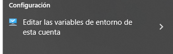  
  Se configura la variable apuntando a la ruta donde se encuentra el jdk  
  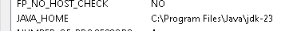    
  

### 2.3 Descargar Apache Tomcat

1. Ir a  https://tomcat.apache.org/   
   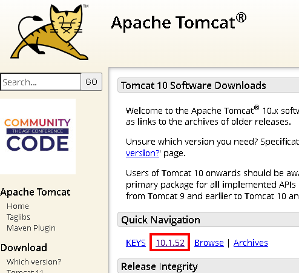  
2. Se descarga la versión Core: Windows zip (64-bit)  
   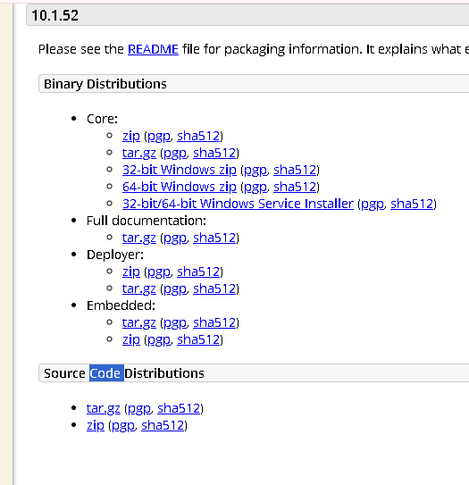  
3. Se extrae el archivo ZIP en una ubicación permanente (ejemplo: `C:\apache-tomcat-10.1.18`)  
   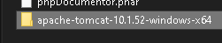   
4. Es mejor evitar rutas con espacios o caracteres especiales  


### 2.4 Agregar Tomcat a NetBeans

1. Abrir NetBeans
2. Ir a **Tools > Servers** (Herramientas > Servidores)  
   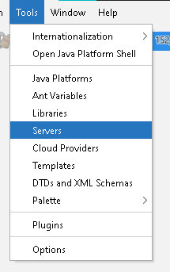   
3. Se hace clic en **Add Server** (Agregar servidor)  
   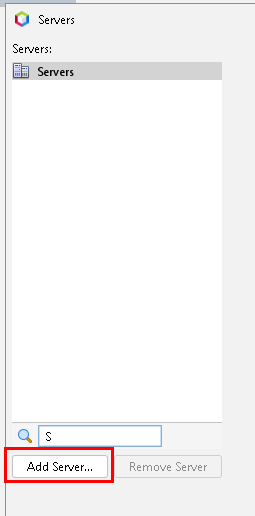  
4. Seleccionar **Apache Tomcat** o **TomEE** y next  
   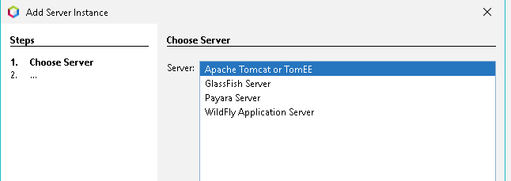  
5. Asignar un nombre e indicar un usuario y una contraseña. El usuario que viene por defecto es tomcat con contraseña tomacat.  
   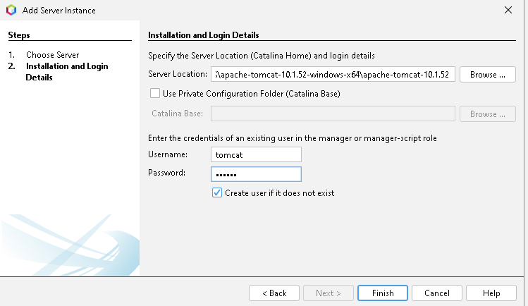    
6. Se hace clic en **Finish** y **close**
    

### 2.5 Configurar Usuarios de Administración

Se edita el archivo `tomcat-users.xml` ubicado en la carpeta conf de Tomcat:  
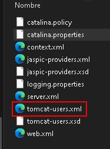  

Si no está se agrega antes de `</tomcat-users>`:  
Se puede poner el nombre de usuario y la contraseña que se quiera.
Este suele ser el que viene por defecto.

```xml
<role rolename="manager-script"/>
<role rolename="manager-gui"/>
<user username="tomcat" password="tomcat" roles="manager-script,manager-gui"/>
```   
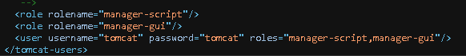  


### 2.6 Iniciar Tomcat desde NetBeans

1. En la pestaña **Services** (Servicios), y **Servers** se ve el servidor tomcat  
   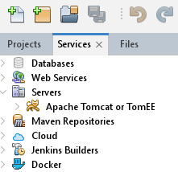   
2. Hacer clic derecho en el servidor Tomcat
3. Seleccione **Start**  
   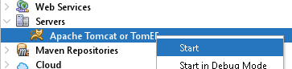  
4. Se inicia el servidor, hay que indicar el usuario y la contraseña  
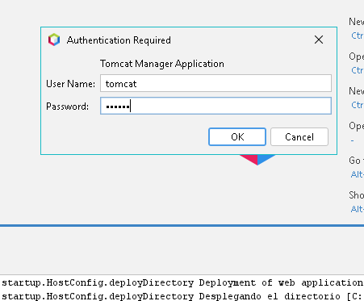  


### 2.7 Crear un Proyecto Web

1. Ir a **File > New Project**  
   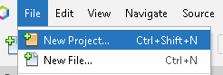   
2. Seleccionar **Java Web > Web Application**   
   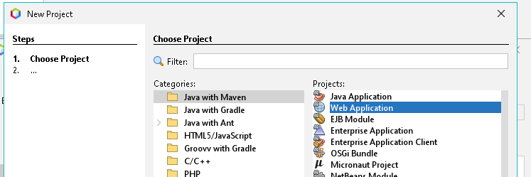  
3. Asignar un nombre al proyectoPrueba  
   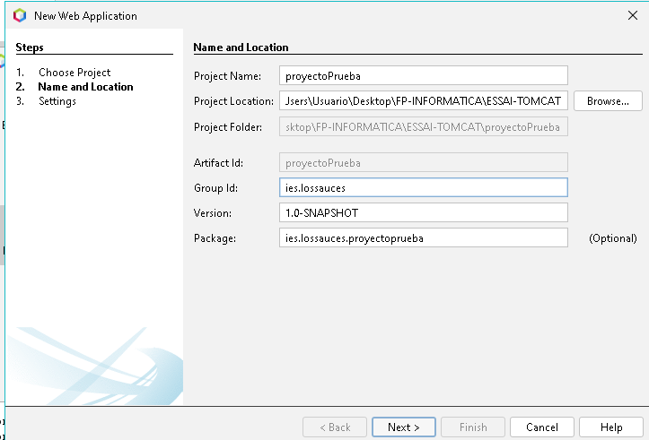  
4. En **Server and Settings**, seleccionar el servidor Tomcat  
   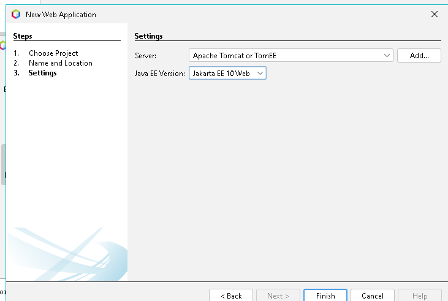  
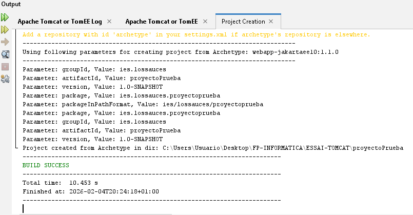    

Se puede ver que ha funcionado en localhost:8080  
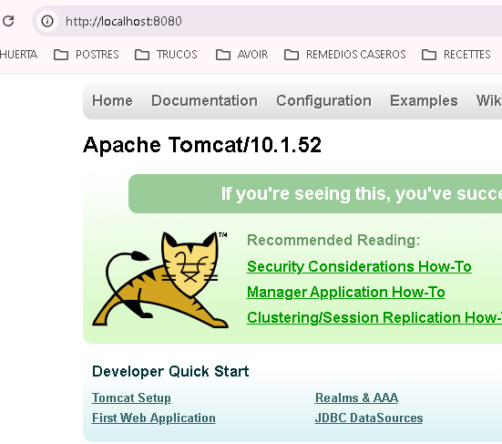  
   

### 2.8 Ejecutar la Aplicación

1. Hacer clic derecho en el proyecto  
2. Seleccionar **Run**  
    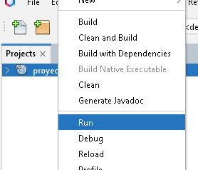  
3. NetBeans compilará, desplegará y abrirá la aplicación en el navegador  
   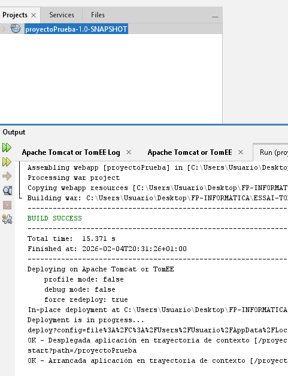  
   Se puede comprobar que ha funcionado.  
   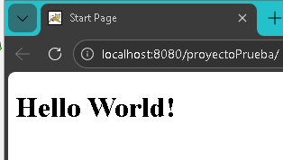  


## 3. Instalación en Windows para Visual Studio Code

### 3.1 Prerrequisitos

- Windows 10 o superior
- JDK 11 o superior instalado
- Visual Studio Code
- Apache Maven (opcional pero recomendado)


### 3.2 Instalar Extensiones Necesarias

Abrir VS Code e instalar las siguientes extensiones:

- **Extension Pack for Java** (Microsoft)    
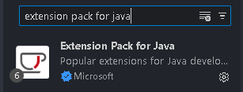  
- ** Tomcat** (Al-rimi)  
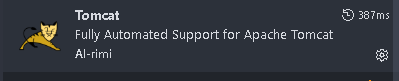  
- **Project Manager for Java** (Microsoft)   
  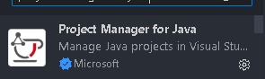  
- **Community Server Connectors** (Red Hat)  
  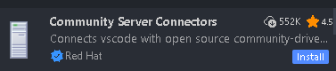  
- **Maven for Java** (Microsoft, opcional)  
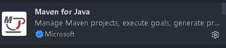  
- **Maven Dependency explorer** (Dhruvkumar Shah
)  
  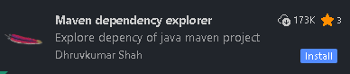  


### 3.3 Descargar e Instalar Tomcat

Si aún no se tiene Tomcat instalado:

1. Descargar el archivo ZIP de Tomcat desde https://tomcat.apache.org/
2. Extraer en una carpeta permanente (ejemplo: `C:\Tomcat10`)

### 3.4 Agregar Tomcat a VS Code

#### Opción A: Usando la extensión Tomcat for Java

1. Presionar `Ctrl+Shift+P` para abrir la paleta de comandos
2. Escribir **Tomcat: Add Tomcat Server**
3. Navegue a la carpeta donde instaló Tomcat
4. Confirme la selección

#### Opción B: Usando Community Server Connectors

1. Abra la vista **Servers** (barra lateral izquierda)
2. Haga clic en **Create New Server**
3. Seleccione **Download Server**
4. Elija **Apache Tomcat** y la versión deseada
5. O seleccione **Yes, I have already downloaded** si ya lo tiene

### 3.5 Crear Proyecto Web con Maven

e abre la carpeta donde quieres crear el proyecto con visual.

Abre terminal en VS Code:
Y se escribe este comando. Las comillas son para que powerShell no interprete mal el comando.

```bash
mvn "org.apache.maven.plugins:maven-archetype-plugin:3.2.1:generate" "-DgroupId=com.ieslossauces" "-DartifactId=miwebvisual" "-DarchetypeArtifactId=maven-archetype-webapp" "-DinteractiveMode=false"
```
 **org.apache.maven.plugins:maven-archetype-plugin:3.2.1:generate** : Es la llamada directa a un plugin de Maven indicando grupo, artefacto, versión y objetivo (goal) para generar un proyecto desde una plantilla (archetype), incluso cuando no existe todavía un proyecto.(si no llama el plugin da error al crearse el proyecto)
 **-DgroupId=com.ieslossauces** : nombre del grupo(package)
 **-DartifactId=miwebvisual** : nombre del proyecto(nombre de la carpeta, del .war, y el idetificador del artefacto Maven)
 **-DarchetypeArtifactId=maven-archetype-webapp** : Plantilla del proyecto : aplicación web java(estructura WAR)
 **-DinteractiveMode=false** : es para automatizar la creación (se usuarian los valores que se indican en el comando)  
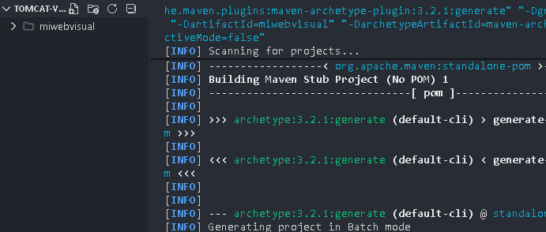  
El proyecto ya se ha creado  
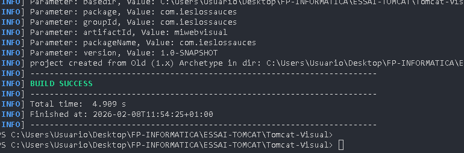  

- Crear la estructura
 Contrariamente a Netbeans que crea el proyecto completo, visual solo crea la estrucitura.

Estructura de carpetas :  
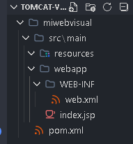  

Los servlets irán en esta caperta : src/main/com/ieslossauces/java que hay que crear(com/ieslossauces, es el  nombre del paquete que se elije al crear el proyecto).Al iniciar el proyecto solo se crea automaticamente la carpeta src/main/webapp
Se crea la carpeta
src/main/java  
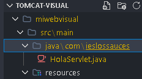  


### 3.6 Configurar pom.xml

Se edita el archivo `pom.xml` y se agrega las dependencias necesarias:

Hay que añadir dependencia de Servlets en pom.xml
´´´xml
<dependencies>
  <dependency>
    <groupId>jakarta.servlet</groupId>
    <artifactId>jakarta.servlet-api</artifactId>
    <version>6.0.0</version>
    <scope>provided</scope>
  </dependency>
</dependencies>

´´´
Comprobar que está este packaging en el pom.xml
<packaging>war</packaging>   
  
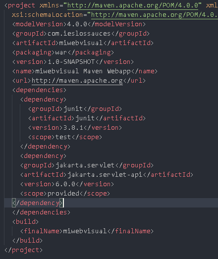  

### 3.7 Se crea un Servlet
Se crea el proyecto en la carpeta de java con este codigo de prueba
```java
package com.ieslossauces;

import java.io.IOException;
import jakarta.servlet.*;
import jakarta.servlet.http.*;
import jakarta.servlet.annotation.*;

@WebServlet("/hola")
public class HolaServlet extends HttpServlet {
    protected void doGet(HttpServletRequest req, HttpServletResponse resp) throws IOException {
        resp.getWriter().println("Hola desde un Servlet!");
    }
}

```

### 3.7 Compilar el Proyecto

Desde la terminal de VS Code:

```bash
mvn clean package
```

Esto generará un archivo WAR en la carpeta `target/`.


### 3.8 Generar el WAR

Generar el WAR
En la terminal de visual hay que entrar en la carpeta del proyecto. En mi caso: 
C:\Users\Usuario\Desktop\FP-INFORMATICA\ESSAI-TOMCAT\Tomcat-Visual\miwebvisual
y ejecutar
```bash
mvn package
```  
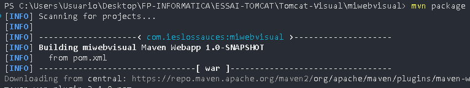  
  
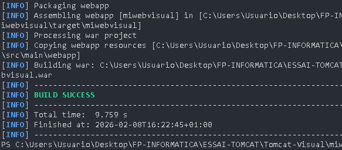  


Se crea:

target/miwebvisual.war  
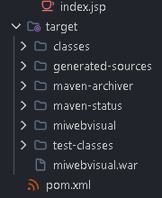  

### 3.9 Desplegar en Tomcat

Se copia miwebvisual.war en:

apache-tomcat-10.1.52/webapps/


Se arranca Tomcat
Se hace clic en el fichero apache-tomcat-10.1.52/bin/startup.bat 

Para ver el proyecto en el navegador   
http://localhost:8080/miwebvisual/hola 
/hola es el nombre que se le ha dado a la ruta en el archivo HolaServlet.  
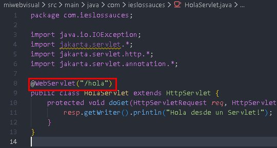  


---


## 4. Solución de Problemas Comunes

### 4.1 Puerto 8080 ya en uso

Si el puerto 8080 está ocupado, se edita el archivo `server.xml`:

- **Ubuntu**: `/opt/tomcat/conf/server.xml`
- **Windows**: `C:\apache-tomcat-x.x.x\conf\server.xml`

Se cambia el puerto del Connector:

```xml
<Connector port="8080" protocol="HTTP/1.1" ... />
```

### 4.2 Error JAVA_HOME no configurado

Se configura la variable de entorno:

**Windows:**

1. Botón derecho en Mi PC > Propiedades > Configuración avanzada
2. Variables de entorno > Nueva variable del sistema
3. Nombre: `JAVA_HOME`
4. Valor: `C:\Program Files\Java\jdk-17`

### 4.3 Tomcat no inicia en Ubuntu

Se verifica los logs:

```bash
sudo journalctl -u tomcat -n 50
```

---


