[Volver al menu principal](README.md)
[OTRO SERVIDOR DE DESARROLLO - APACHE TOMCAT]

# OTRO SERVIDOR DE DESARROLLO - APACHE TOMCAT
Apache Tomcat es un servidor de aplicaciones Java de código abierto que implementa las especificaciones Java Servlet, JavaServer Pages (JSP) y WebSocket. Esta guía proporciona instrucciones detalladas para instalar y configurar Tomcat en tres entornos diferentes:
•	Servidor Ubuntu Linux
•	Windows con NetBeans IDE
•	Windows con Visual Studio Code

- [OTRO SERVIDOR DE DESARROLLO - APACHE TOMCAT](#otro-servidor-de-desarrollo---apache-tomcat)
  - [¿Qué es Apache Tomcat?](#qué-es-apache-tomcat)
  - [1. Instalación en Ubuntu Server](#1-instalación-en-ubuntu-server)
    - [1.1 Prerrequisitos](#11-prerrequisitos)
    - [1.2 Actualizar el Sistema](#12-actualizar-el-sistema)
    - [1.3 Instalar Java JDK](#13-instalar-java-jdk)
    - [1.4 Descargar Apache Tomcat](#14-descargar-apache-tomcat)
    - [1.5 Crear Usuario para Tomcat](#15-crear-usuario-para-tomcat)
    - [1.6 Configurar Permisos](#16-configurar-permisos)
    - [1.7 Crear Servicio Systemd](#17-crear-servicio-systemd)
    - [1.8 Iniciar y Habilitar el Servicio](#18-iniciar-y-habilitar-el-servicio)
    - [1.9 Configurar Firewall](#19-configurar-firewall)
    - [1.10 Configurar Usuarios del Manager](#110-configurar-usuarios-del-manager)
    - [1.11 Permitir Acceso Remoto al Manager](#111-permitir-acceso-remoto-al-manager)
    - [1.12 Verificación](#112-verificación)
  - [2. Instalación en Windows para NetBeans](#2-instalación-en-windows-para-netbeans)
    - [2.1 Prerrequisitos](#21-prerrequisitos)
    - [2.2 Instalar Java JDK](#22-instalar-java-jdk)
    - [2.3 Descargar Apache Tomcat](#23-descargar-apache-tomcat)
    - [2.4 Instalar Apache NetBeans](#24-instalar-apache-netbeans)
    - [2.5 Agregar Tomcat a NetBeans](#25-agregar-tomcat-a-netbeans)
    - [2.6 Configurar Usuarios de Administración](#26-configurar-usuarios-de-administración)
    - [2.7 Iniciar Tomcat desde NetBeans](#27-iniciar-tomcat-desde-netbeans)
    - [2.8 Crear un Proyecto Web](#28-crear-un-proyecto-web)
    - [2.9 Ejecutar la Aplicación](#29-ejecutar-la-aplicación)
    - [2.10 Verificación](#210-verificación)
  - [3. Instalación en Windows para Visual Studio Code](#3-instalación-en-windows-para-visual-studio-code)
    - [3.1 Prerrequisitos](#31-prerrequisitos)
    - [3.2 Instalar Visual Studio Code](#32-instalar-visual-studio-code)
    - [3.3 Instalar Extensiones Necesarias](#33-instalar-extensiones-necesarias)
    - [3.4 Descargar e Instalar Tomcat](#34-descargar-e-instalar-tomcat)
    - [3.5 Agregar Tomcat a VS Code](#35-agregar-tomcat-a-vs-code)
      - [Opción A: Usando la extensión Tomcat for Java](#opción-a-usando-la-extensión-tomcat-for-java)
      - [Opción B: Usando Community Server Connectors](#opción-b-usando-community-server-connectors)
    - [3.6 Crear Proyecto Web con Maven](#36-crear-proyecto-web-con-maven)
    - [3.7 Configurar pom.xml](#37-configurar-pomxml)
    - [3.8 Compilar el Proyecto](#38-compilar-el-proyecto)
    - [3.9 Desplegar en Tomcat](#39-desplegar-en-tomcat)
      - [Método 1: Usando la extensión Tomcat for Java](#método-1-usando-la-extensión-tomcat-for-java)
      - [Método 2: Despliegue manual](#método-2-despliegue-manual)
    - [3.10 Gestionar Tomcat desde VS Code](#310-gestionar-tomcat-desde-vs-code)
    - [3.11 Depurar Aplicaciones](#311-depurar-aplicaciones)
    - [3.12 Verificación](#312-verificación)
  - [4. Solución de Problemas Comunes](#4-solución-de-problemas-comunes)
    - [4.1 Puerto 8080 ya en uso](#41-puerto-8080-ya-en-uso)
    - [4.2 Error JAVA\_HOME no configurado](#42-error-java_home-no-configurado)
    - [4.3 Tomcat no inicia en Ubuntu](#43-tomcat-no-inicia-en-ubuntu)
    - [4.4 Error 404 al acceder a la aplicación](#44-error-404-al-acceder-a-la-aplicación)
    - [4.5 Permisos denegados en Ubuntu](#45-permisos-denegados-en-ubuntu)


## ¿Qué es Apache Tomcat?
Apache Tomcat es un contenedor de servlets y servidor web de código abierto, desarrollado por Apache Software, diseñado para ejecutar aplicaciones Web Java (servlets y JavaServer Pages – JSP). Actúa como el motor que procesa contenido dinámico, funcionando en cualquier sistema operativo con Máquinas Virtual Java.


## 1. Instalación en Ubuntu Server

### 1.1 Prerrequisitos

- Ubuntu 20.04 o superior
- Acceso root o privilegios sudo
- Conexión a Internet

### 1.2 Actualizar el Sistema

Primero, se actualiza los paquetes del sistema:

```bash
sudo apt update && sudo apt upgrade -y
```

### 1.3 Instalar Java JDK

Tomcat requiere Java para funcionar. Si no está instalado hay que instalar OpenJDK 11 o superior, paquete del Kit de desarrollo de Java, es un paquete por defecto default-jdk: este paquete instala la máquina virtual de Java (JVM) y todos los componentes necesarios para compilar y ejecutar aplicaciones Java. Es más completo y adecuado si estás desarrollando aplicaciones Java y necesitas el compilador (“javac”) y otras herramientas de desarrollo.

```bash
sudo apt install default-jdk -y
```

Se verifica la instalación:

```bash
java -version
```  
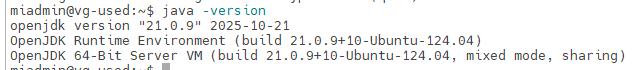  
Se puede comprobar en que directorio instalo JVM, usando el comando:

```bash
sudo update-java-alternatives -l
```
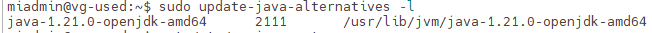

Se edita el fichero /etc/enviroment y establece las variables JAVA_HOME, que debe apuntar al directorio donde está instalado JDK, y la variable JRE_HOME, que apuntará al directorio donde está instalado la máquina virtual Java.
Valor Actual 
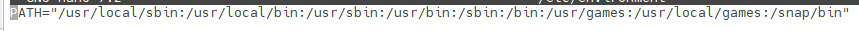
```bash
PATH="/usr/local/sbin:/usr/local/bin:/usr/sbin:/usr/bin:/sbin:/bin:/usr/games:/usr/local/games:/snap/bin"
```
Hay que camibarlo por este PATH
```bash
PATH="/usr/local/sbin:/usr/local/bin:/usr/sbin:/usr/bin:/sbin:/bin:/usr/games:/usr/local/games:/snap/bin"
JAVA_HOME="/usr/lib/jvm/java-1.21.0-openjdk-amd64"
```
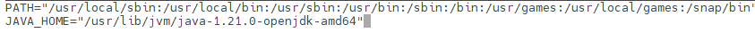  

Se hace rebootse comprueba el contenido de la variale $JAVA_HOME

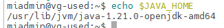


### 1.4 Descargar Apache Tomcat

Hay 2 opciones para descargar Apache Tomcat.
- Opción 1 : Se instala el servidor Tomcat desde los repositorios oficiales de Ubuntu: 
Se va a instalar usando los paquetes precompilados de Ubuntu (.deb). En este caso se va a instalar la versión 10 ya que la 9 ya no está en ubuntu 24.04, lo han sustituido por la 10 que utiliza JakartaEE (jakarta.*)
```bash
sudo apt-get install tomcat10
```
Se verifica el status
```bash
systemctl status tomcat10
```
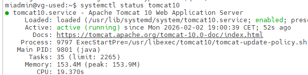  

Se comprueba desde el cliente que tenemos acceso a Tomcat escribiendo la ip del servidor y :8080

http://192.168.0.22:8080/

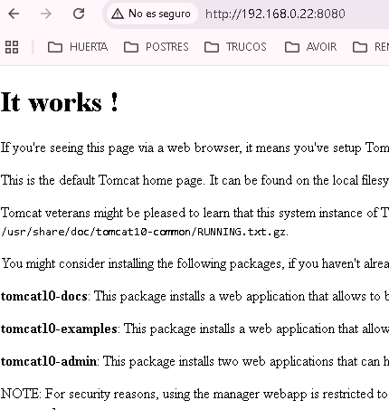  

Para completar la instalación se recomienda instalar estos paquetes:
La Documentación:
```bash
sudo apt install tomcat10-docs
```
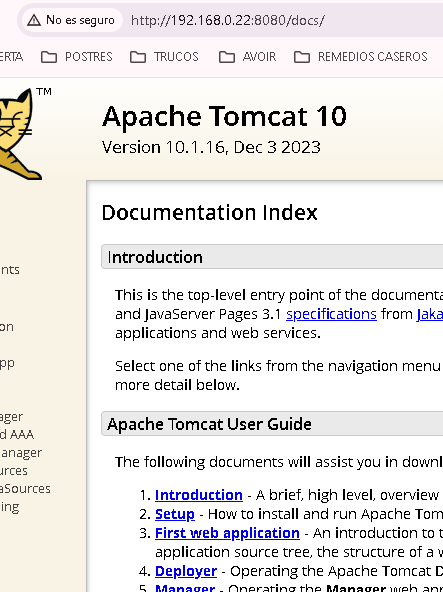
Los ejemplos:
```bash
sudo apt install tomcat10-examples  
```  
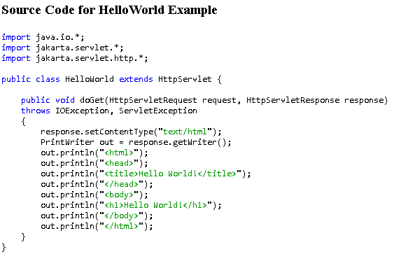
La Adminsitración
```bash
sudo apt install tomcat10-admin
```
El acceso a documentación y a los ejemplos es mediante el link de la página de inicio de http://IP:8080, pero para el acceso a la administración hay que registrar un usuario con el role de manager-gui , manager-gui y admin-script, admin-gui.
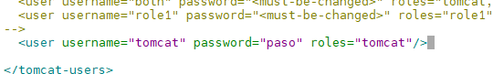
En el archivo  /etc/tomcat10/tomcat-users.xml

```bash
sudo nano /etc/tomcat10/tomcat-users.xml
```  
Se puede registrar un usuario tomcat y se añade permisos a tomcat
```bash
 <role rolename="manager-gui"/>
  <user username="tomcat" password="paso" roles="manager-gui,admin-gui"/>

```
y se hace restart del servicio tomcat
```bash
sudo service tomcat10 restart
```

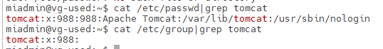
y se puede entrar en el manager webapp y en host-manager webapp desdehttp://IP:8080
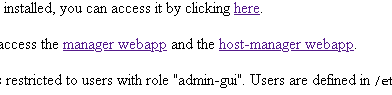  

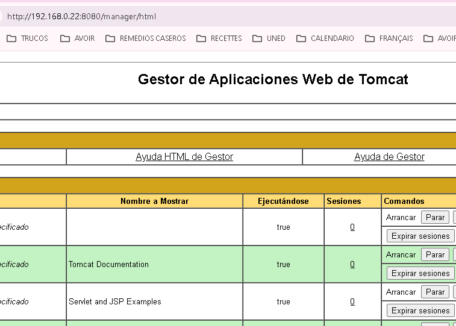  
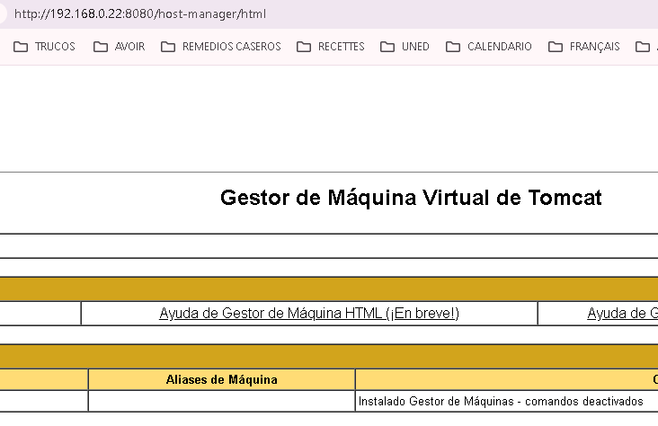  


- Directorios de Tomcat
Directorios de Tomcat
En la instalación los paquetes precompilados de Ubuntu (.deb) (la que hemos realizado) Tomcat se ha instalado usando las siguientes ubicaciones.

Ubicación de binarios:
```bash
cd /usr/share/tomcat10/bin
```
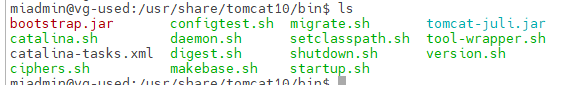

Esto  mostrará los archivos ejecutables de Tomcat, como “startup.sh”, “shutdown.sh” y otros scripts en el directorio bin.

- Directorio de configuración
```bash
cd /etc/tomcat10
```
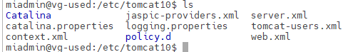
Aquí se encontrarás archivos de configuración, como “server.xml”, “web.xml”, entre otros.  

- Directorio de despliegue de aplicaciones
Las aplicaciones web desplegadas en Tomcat se encuentran en el directorio “webapps”
```bash
cd /var/lib/tomcat10/webapps
```


- Directorio de datos (logs, temp, work)
Los archivos de registro (logs), archivos temporales y el directorio de trabajo se encuentra en el directorio

```bash
cd /var/lib/tomcat10
```
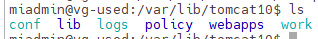  

- El servicio de Apache TomCat puede ser iniciado o detenido usando los scripts que viene incluidos dentro del paquete, para iniciar el servicio de nuestro Apache TomCat ingresaremos el comando:
```bash
sudo /usr/share/tomcat10/bin/startup.sh
```
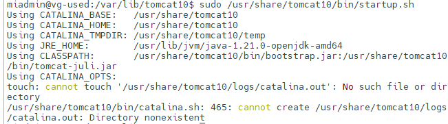  

- Vamos a verificar que el servicio está corriendo de manera correcta y a través del puerto 8080, para ello ejecutaremos el siguiente comando:
```bash
ss -punta |grep 8080
```
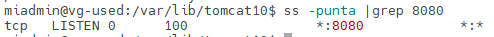


- Opción 2:

Se descarga la última versión de Tomcat (versión 10.1 en este ejemplo):

```bash
cd /tmp
wget https://archive.apache.org/dist/tomcat/tomcat-10/v10.1.34/bin/apache-tomcat-10.1.34.tar.gz
```
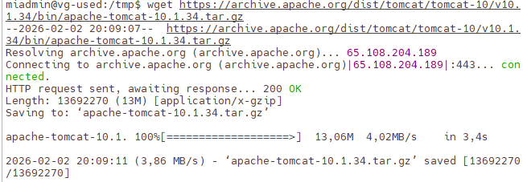
Se extrae el archivo y se mueve a /opt/tomcat:
Si no existe la carpeta se crea.
```bash
sudo mkdir -p /opt/tomcat
```

```bash
sudo tar xzvf apache-tomcat-10.1.34.tar.gz -C /opt/tomcat --strip-components=1
```
Se comprueba que se ha descomprimido  
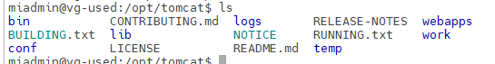  


### 1.5 Crear Usuario para Tomcat

Por seguridad, cree un usuario específico para ejecutar Tomcat(si no se ha creado antes):

```bash
sudo useradd -m -U -d /opt/tomcat -s /bin/false tomcat
```
### 1.6 Configurar Permisos

Asigne los permisos correctos:

```bash
sudo chown -R tomcat:tomcat /opt/tomcat/
sudo chmod -R u+x /opt/tomcat/bin
```

### 1.7 Crear Servicio Systemd

Cree un archivo de servicio para gestionar Tomcat:

```bash
sudo nano /etc/systemd/system/tomcat.service
```

Agregue el siguiente contenido:

```ini
[Unit] 
Description=Apache Tomcat Web Application Container After=network.target 

[Service] 
Type=forking 
Environment="JAVA_HOME=/usr/lib/jvm/java-1.21.0-openjdk-amd64" 
Environment="CATALINA_PID=/opt/tomcat/temp/tomcat.pid" Environment="CATALINA_HOME=/opt/tomcat" Environment="CATALINA_BASE=/opt/tomcat" Environment="CATALINA_OPTS=-Xms512M -Xmx1024M -server -XX:+UseParallelGC" Environment="JAVA_OPTS=-Djava.awt.headless=true -Djava.security.egd=file:/dev/urandom" ExecStart=/opt/tomcat/bin/startup.sh ExecStop=/opt/tomcat/bin/shutdown.sh User=tomcat Group=tomcat UMask=0007 RestartSec=10 Restart=always

[Install] 
WantedBy=multi-user.target
```
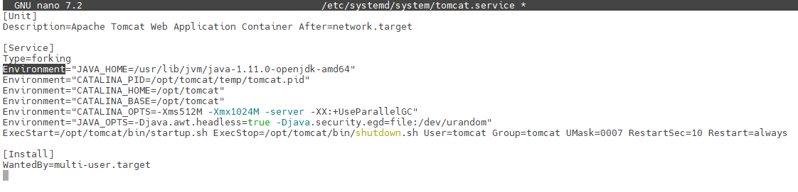  

### 1.8 Iniciar y Habilitar el Servicio

```bash
sudo systemctl daemon-reload
sudo systemctl start tomcat
sudo systemctl enable tomcat
sudo systemctl status tomcat
```

### 1.9 Configurar Firewall

Si usa UFW, permita el puerto 8080:

```bash
sudo ufw allow 8080/tcp
```

### 1.10 Configurar Usuarios del Manager

Edite el archivo de usuarios para acceder al administrador web si no está hecho:

```bash
sudo nano /opt/tomcat/conf/tomcat-users.xml
```

Antes de la etiqueta de cierre `</tomcat-users>`, agregue:

```xml
<role rolename="manager-gui"/>
<role rolename="admin-gui"/>
<user username="admin" password="TuPasswordSeguro" roles="manager-gui,admin-gui"/>
```

### 1.11 Permitir Acceso Remoto al Manager

Para acceder al Manager desde cualquier IP, edite:

```bash
sudo nano /opt/tomcat/webapps/manager/META-INF/context.xml
```

Comente o elimine la línea del Valve:

```xml
<!-- <Valve className="org.apache.catalina.valves.RemoteAddrValve"
         allow="127\.\d+\.\d+\.\d+|::1|0:0:0:0:0:0:0:1" /> -->
```
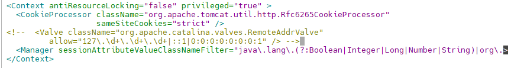
Reinicie Tomcat:

```bash
sudo systemctl restart tomcat
```

### 1.12 Verificación

Acceda a Tomcat desde su navegador en: `http://tu-servidor:8080`

---
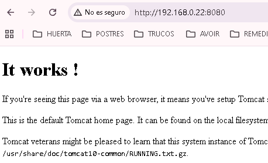  

## 2. Instalación en Windows para NetBeans

### 2.1 Prerrequisitos

- Windows 10 o superior
- JDK 11 o superior instalado
- NetBeans IDE (se recomienda Apache NetBeans 17 o superior)

### 2.2 Instalar Java JDK

1. Descargue el JDK desde https://www.oracle.com/java/technologies/downloads/ o https://adoptium.net/
2. Ejecute el instalador y siga el asistente
3. Anote la ruta de instalación (ejemplo: `C:\Program Files\Java\jdk-17`)
4. Configure la variable de entorno `JAVA_HOME` apuntando a esta ruta

### 2.3 Descargar Apache Tomcat

1. Visite https://tomcat.apache.org/
2. Descargue la versión Core: Windows zip (64-bit)
3. Extraiga el archivo ZIP en una ubicación permanente (ejemplo: `C:\apache-tomcat-10.1.18`)
4. Evite rutas con espacios o caracteres especiales

### 2.4 Instalar Apache NetBeans

1. Descargue Apache NetBeans desde https://netbeans.apache.org/
2. Ejecute el instalador y seleccione las herramientas para Java EE
3. Complete la instalación

### 2.5 Agregar Tomcat a NetBeans

1. Abra NetBeans
2. Vaya a **Tools > Servers** (Herramientas > Servidores)
3. Haga clic en **Add Server** (Agregar servidor)
4. Seleccione **Apache Tomcat** o **TomEE**
5. Asigne un nombre (ejemplo: Tomcat 10.1)
6. Haga clic en **Next**
7. En **Server Location**, navegue a la carpeta donde extrajo Tomcat
8. Haga clic en **Finish**

### 2.6 Configurar Usuarios de Administración

Edite el archivo `tomcat-users.xml` ubicado en la carpeta conf de Tomcat:

```
C:\apache-tomcat-10.1.18\conf\tomcat-users.xml
```

Agregue antes de `</tomcat-users>`:

```xml
<role rolename="manager-script"/>
<role rolename="manager-gui"/>
<user username="admin" password="admin" roles="manager-script,manager-gui"/>
```

### 2.7 Iniciar Tomcat desde NetBeans

1. En la pestaña **Services** (Servicios), expanda **Servers**
2. Haga clic derecho en su servidor Tomcat
3. Seleccione **Start**
4. Espere a que el servidor inicie (verá el estado en la consola)

### 2.8 Crear un Proyecto Web

1. Vaya a **File > New Project**
2. Seleccione **Java Web > Web Application**
3. Asigne un nombre al proyecto
4. En **Server and Settings**, seleccione su servidor Tomcat
5. Configure **Java EE Version** según su necesidad
6. Haga clic en **Finish**

### 2.9 Ejecutar la Aplicación

1. Haga clic derecho en el proyecto
2. Seleccione **Run**
3. NetBeans compilará, desplegará y abrirá la aplicación en el navegador

### 2.10 Verificación

La aplicación debe abrirse automáticamente en `http://localhost:8080/nombre-proyecto/`

---

## 3. Instalación en Windows para Visual Studio Code

### 3.1 Prerrequisitos

- Windows 10 o superior
- JDK 11 o superior instalado
- Visual Studio Code
- Apache Maven (opcional pero recomendado)

### 3.2 Instalar Visual Studio Code

1. Descargue VS Code desde https://code.visualstudio.com/
2. Ejecute el instalador y siga las instrucciones

### 3.3 Instalar Extensiones Necesarias

Abra VS Code e instale las siguientes extensiones:

- **Extension Pack for Java** (Microsoft)
- **Tomcat for Java** (Wei Shen)
- **Community Server Connectors** (Red Hat)
- **Maven for Java** (Microsoft, opcional)

Para instalar: haga clic en el ícono de extensiones (o presione `Ctrl+Shift+X`), busque cada extensión y haga clic en **Install**.

### 3.4 Descargar e Instalar Tomcat

Si aún no tiene Tomcat instalado:

1. Descargue el archivo ZIP de Tomcat desde https://tomcat.apache.org/
2. Extraiga en una carpeta permanente (ejemplo: `C:\Tomcat10`)
3. No use rutas con espacios

### 3.5 Agregar Tomcat a VS Code

#### Opción A: Usando la extensión Tomcat for Java

1. Presione `Ctrl+Shift+P` para abrir la paleta de comandos
2. Escriba **Tomcat: Add Tomcat Server**
3. Navegue a la carpeta donde instaló Tomcat
4. Confirme la selección

#### Opción B: Usando Community Server Connectors

1. Abra la vista **Servers** (barra lateral izquierda)
2. Haga clic en **Create New Server**
3. Seleccione **Download Server**
4. Elija **Apache Tomcat** y la versión deseada
5. O seleccione **Yes, I have already downloaded** si ya lo tiene

### 3.6 Crear Proyecto Web con Maven

Desde la terminal de VS Code, ejecute:

```bash
mvn archetype:generate -DgroupId=com.ejemplo \
  -DartifactId=mi-app-web \
  -DarchetypeArtifactId=maven-archetype-webapp \
  -DinteractiveMode=false
```

Abra el proyecto en VS Code:

```bash
cd mi-app-web
code .
```

### 3.7 Configurar pom.xml

Edite el archivo `pom.xml` y agregue las dependencias necesarias:

```xml
<dependencies>
  <dependency>
    <groupId>javax.servlet</groupId>
    <artifactId>javax.servlet-api</artifactId>
    <version>4.0.1</version>
    <scope>provided</scope>
  </dependency>
</dependencies>

<build>
  <finalName>mi-app-web</finalName>
  <plugins>
    <plugin>
      <groupId>org.apache.maven.plugins</groupId>
      <artifactId>maven-war-plugin</artifactId>
      <version>3.3.2</version>
    </plugin>
  </plugins>
</build>
```

### 3.8 Compilar el Proyecto

Desde la terminal de VS Code:

```bash
mvn clean package
```

Esto generará un archivo WAR en la carpeta `target/`.

### 3.9 Desplegar en Tomcat

#### Método 1: Usando la extensión Tomcat for Java

1. Haga clic derecho en el archivo WAR en el explorador
2. Seleccione **Run on Tomcat Server**
3. El servidor se iniciará y desplegará la aplicación

#### Método 2: Despliegue manual

1. Copie el archivo WAR a la carpeta webapps de Tomcat

```bash
copy target\mi-app-web.war C:\Tomcat10\webapps\
```

2. Inicie Tomcat desde la vista **Servers** en VS Code
3. Tomcat desplegará automáticamente el WAR

### 3.10 Gestionar Tomcat desde VS Code

En la vista **Servers** o **Tomcat Servers**:

- Haga clic derecho en el servidor
- Seleccione **Start**, **Stop**, **Restart** o **Debug**
- También puede abrir el navegador directamente desde el menú contextual

### 3.11 Depurar Aplicaciones

1. Establezca puntos de interrupción en su código Java
2. Haga clic derecho en el servidor Tomcat
3. Seleccione **Debug**
4. VS Code se detendrá en los puntos de interrupción cuando ejecute la aplicación

### 3.12 Verificación

Acceda a su aplicación en: `http://localhost:8080/mi-app-web/`

---

## 4. Solución de Problemas Comunes

### 4.1 Puerto 8080 ya en uso

Si el puerto 8080 está ocupado, edite el archivo `server.xml`:

- **Ubuntu**: `/opt/tomcat/conf/server.xml`
- **Windows**: `C:\apache-tomcat-x.x.x\conf\server.xml`

Cambie el puerto del Connector:

```xml
<Connector port="8080" protocol="HTTP/1.1" ... />
```

### 4.2 Error JAVA_HOME no configurado

Configure la variable de entorno:

**Windows:**

1. Botón derecho en Mi PC > Propiedades > Configuración avanzada
2. Variables de entorno > Nueva variable del sistema
3. Nombre: `JAVA_HOME`
4. Valor: `C:\Program Files\Java\jdk-17`

### 4.3 Tomcat no inicia en Ubuntu

Verifique los logs:

```bash
sudo journalctl -u tomcat -n 50
```

### 4.4 Error 404 al acceder a la aplicación

- Verifique que el contexto de la aplicación sea correcto
- Compruebe los logs de Tomcat en la carpeta `logs/`
- Asegúrese de que el archivo WAR se haya desplegado correctamente

### 4.5 Permisos denegados en Ubuntu

Verifique y corrija los permisos:

```bash
sudo chown -R tomcat:tomcat /opt/tomcat/
sudo chmod -R 755 /opt/tomcat/
```

---


